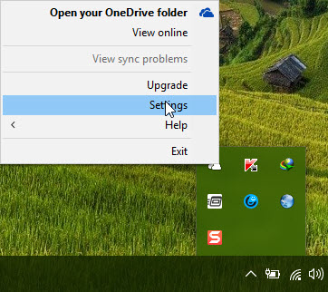
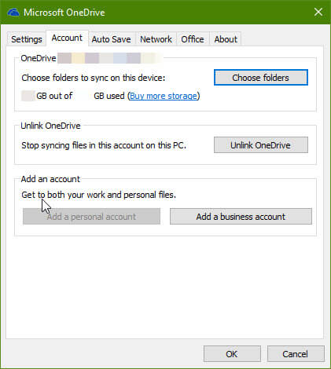
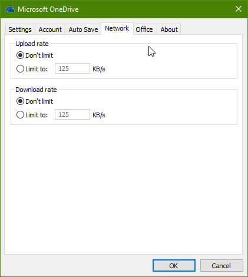

+++
title = "كيفية تحديد سرعة التحميل والرفع في OneDrive"
date = "2016-06-14"
description = "تحدثنا في العديد من الدروس السابقة عن خدمة OneDrive وخصوصا النسخة المدمجة مع ويندوز 10، في درس اليوم سنتعرف على طريقة تعيين حد لسرعة الانترنت التي يستخدمها OneDrive."
categories = ["ويندوز",]
series = ["ويندوز 10"]
tags = ["موقع لغة العصر"]
images = ["images/0.png"]
+++

تحدثنا في العديد من الدروس السابقة عن خدمة OneDrive وخصوصا النسخة المدمجة مع ويندوز 10، في درس اليوم سنتعرف على طريقة تعيين حد لسرعة الانترنت التي يستخدمها OneDrive.

تستخدم عملية المزامنة جزء كبير من سرعة الانترنت، ولمن يمتلك سعة انترنت محدودة، عليك بتطبيق هذه الخطوات:

1. قم بالضغط بزر الماوس الأيمن اعلى أيقونة OneDrive الموجودة بجانب الساعة، ثم اختر Settings.

2. ستظهر لك الإعدادات كما بالصورة.

3. انتقل إلى التبويب Network ستجد الاختيارات افتراضية كما بالصورة.

4. قم بوضع العلامة على الاختيار Limit to ثم قم بكتابة السرعة التي تريد تعيينها ب الكيلوبايت.

---
هذا الموضوع نٌشر باﻷصل على موقع مجلة لغة العصر.

http://aitmag.ahram.org.eg/News/52908.aspx