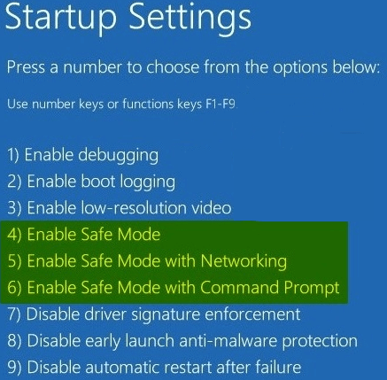

+++
title = "طريقة الدخول للوضع الآمن Safe Mode في ويندوز 10 (1)"
date = "2016-02-09"
description = "يعتبر الوضع الآمن عبارة عن أحد خيارات استكشاف الأخطاء وإصلاحها الخاصة بالويندوز، والذي يبدأ تشغيل الكمبيوتر في حالة محددة، حيث يتم فقط بدء تشغيل الملفات الضرورية لتشغيل الويندوز، إليك عزيزي القارئ كل طرق الوصول له"
categories = ["ويندوز",]
series = ["ويندوز 10"]
tags = ["موقع لغة العصر"]
+++

يعتبر الوضع الآمن عبارة عن أحد خيارات استكشاف الأخطاء وإصلاحها الخاصة بالويندوز، والذي يبدأ تشغيل الكمبيوتر في حالة محددة، حيث يتم فقط بدء تشغيل الملفات الأساسية وبرامج التشغيل الضرورية لتشغيل الويندوز، إليك عزيزي القارئ كل طرق الدخول للوضع الآمن Safe Mode.

أولا: الدخول للوضع الآمن عن طريق تطبيق الإعدادات:

1- قم بالدخول إلى تطبيق الإعدادات ثم القسم Update & security ثم التبويب Recovery.

2- اضغط على زر Advanced startup سيقوم جهازك بإعادة التشغيل في وضع الريكفرى Recovery Mode.

3- اختر Troubleshoot، سيظهر لك كما بالصورة، اضغط Advanced options.

4- ستجد العديد من الاختيارات، اضغط على Startup Settings.

5- اضغط زر Restart.

6- بعد إعادة التشغيل اضغط F4 للدخول على Safe Mode أو F5 للدخول على Safe Mode with Networking أو F6 للدخول على Safe Mode with Command Prompt.

---
هذا الموضوع نٌشر باﻷصل على موقع مجلة لغة العصر.

http://aitmag.ahram.org.eg/News/43315.aspx