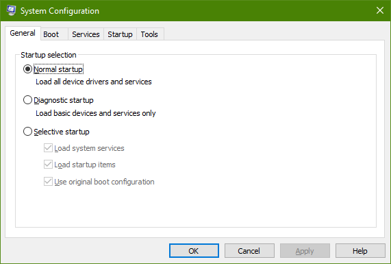
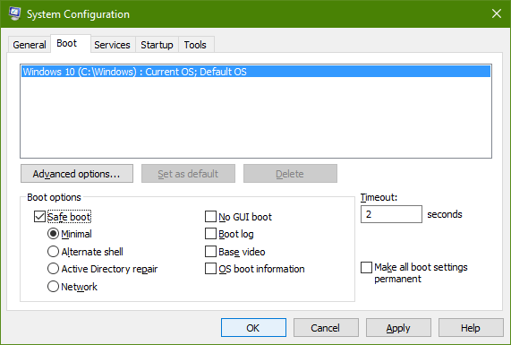
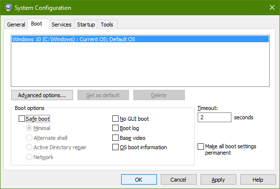

+++
title = "طريقة الدخول للوضع الآمن Safe Mode في ويندوز 10 (2)"
date = "2016-02-10"
description = "تحدثنا في الدرس السابق عن طريقة للدخول للوضع الآمن Safe Mode في ويندوز 10 وفي درس اليوم نتابع هذا الموضوع ومع طريقة أخري للوصول إلى الوضع الآمن في ويندوز 10"
categories = ["ويندوز",]
series = ["ويندوز 10"]
tags = ["موقع لغة العصر"]
images = ["images/2016-635907143368837044-883_thumb705x335.png"]

+++

تحدثنا في الدرس السابق عن طريقة للدخول للوضع الآمن Safe Mode في ويندوز 10
وفي درس اليوم نتابع هذا الموضوع ومع طريقة أخري للوصول إلى الوضع الآمن في ويندوز 10.

أولا: الدخول للوضع الآمن عن طريق System Configuration:

1- قم بالضغط على Windows + R لفتح مربع Run ثم اكتب msconfig.

2- أو يمكنك البحث عن msconfig ثم اختر System Configuration.

3- ستجد الإعدادات كما بالصورة.

4- اضغط على التبويب Boot.

5- للدخول إلى الوضع الآمن قم بوضع العلامة على الاختيار Safe boot ثم اضغط OK ليقوم الجهاز بإعادة التشغيل والدخول للوضع الآمن.

- لإرجاع الجهاز إلى الوضع الطبيعي، قم باتباع نفس الخطوات السابقة ثم أزل العلامة من الاختيار Safe boot واضغط OK

---
هذا الموضوع نٌشر باﻷصل على موقع مجلة لغة العصر.

http://aitmag.ahram.org.eg/News/43450.aspx