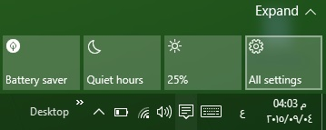

+++
title = "تعلم ويندوز 10 ..كل طرق تشغيل تطبيق الإعدادات"
date = "2015-09-04"
description = "في ويندوز 10، يعد تطبيق الإعدادات أكبر التغييرات التي نالت إعجاب جميع مستخدمي الويندوز، واستكمالا لسلسة دروس تعلم ويندوز 10 على موقع لغة العصر سنبدأ معا مجموعة دروس تتضمن شرحا وافيا لتطبيق الإعدادات في نظام ويندوز 10"
categories = ["ويندوز",]
series = ["ويندوز 10"]
tags = ["موقع لغة العصر"]
+++

في ويندوز 10، يعد تطبيق اﻹعدادات أكبر التغييرات التي نالت إعجاب جميع مستخدمي الويندوز، واستكمالا لسلسة دروس تعلم ويندوز 10 على موقع لغة العصر سنبدأ معا مجموعة دروس تتضمن شرحا وافيا لتطبيق اﻹعدادات في نظام ويندوز 10.

في الدرس الأول ستتعرف عزيزي القارئ على كل الطرق المختلفة لتشغيل تطبيق اﻹعدادات وعددها أربع طرق:

**أولا: تشغيل تطبيق اﻹعدادات عن طريق قائمة البداية:**

1. اضغط على زر Start في لوحة المفاتيح أو من على شريط المهام.
2. ستجد تطبيق اﻹعدادات موجودا فوق اختيارات الطاقة كما بالصورة:

**ثانيا: تشغيل تطبيق اﻹعدادات عن طريق** **Action Center:**

1. اضغط على زر ال Action Center الموجود يمين شريط المهام بجانب الساعة.
2. من بين أزرار ال Toggles الموجودة أمامك قم باختيار All settings.

**ثالثا: تشغيل تطبيق اﻹعدادات عن طريق** **File Explorer:**

1. قم بفتح This PC من سطح المكتب أو File Explorer من قائمة البداية.
2. ستجد زر تطبيق اﻹعدادات في القسم System من شريط الأدوات كما بالصورة:

**رابعا: تشغيل تطبيق اﻹعدادات عن طريق الاختصارات وأوامر** **RUN:**
سبق شرحها في موضوع تعرف على الاختصارات السحرية للإعدادات في ويندوز 10

في الدرس القادم غدا بمشيئة الله ستنعرف على التبويب System في تطبيق اﻹعدادات.

---

هذا الموضوع نٌشر باﻷصل على [موقع مجلة لغة العصر](http://aitmag.ahram.org.eg/News/24313/%D8%AF%D8%B1%D9%88%D8%B3/%D8%B4%D8%B1%D8%AD-%D9%88%D8%AA%D8%B9%D9%84%D9%8A%D9%85/%D8%AA%D8%B9%D9%84%D9%85-%D9%88%D9%8A%D9%86%D8%AF%D9%88%D8%B2--%D9%83%D9%84-%D8%B7%D8%B1%D9%82-%D8%AA%D8%B4%D8%BA%D9%8A%D9%84-%D8%AA%D8%B7%D8%A8%D9%8A%D9%82-%D8%A7%D9%84%D8%A5%D8%B9%D8%AF%D8%A7%D8%AF%D8%A7%D8%AA.aspx).
