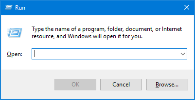
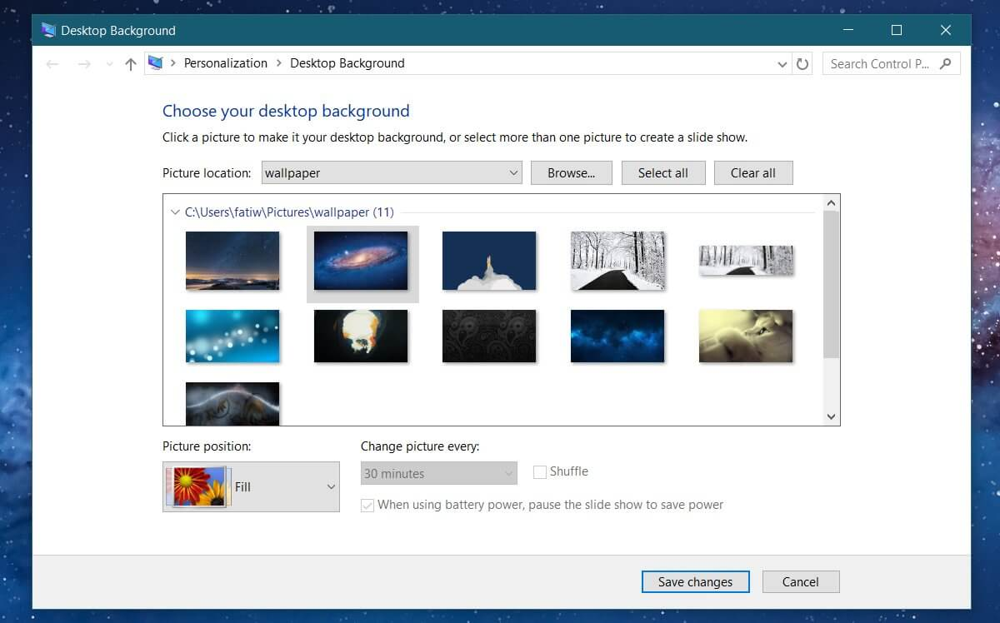

+++
title = "كيفية الوصول إلى إعدادات التخصيص في ويندوز 10"
date = "2017-08-03"
description = "بعد تحديثات ويندوز 10 الأخيرة أصبح من غير الممكن الوصول إلى الكثير من الإعدادات في لوحة التحكم، ومن ضمن هذه الإعدادات \"التخصيص\" التي تمكنك من تغيير الخلفيات والسمات، إليك طريقة استخدامها بعد التحديث."
categories = ["ويندوز",]
series = ["ويندوز 10"]
tags = ["موقع لغة العصر"]
images = ["images/0.png"]

+++

بعد تحديثات ويندوز 10 الأخيرة أصبح من غير الممكن الوصول إلى الكثير من الإعدادات في لوحة التحكم، ومن ضمن هذه الإعدادات "التخصيص" التي تمكنك من تغيير الخلفيات والسمات، إليك طريقة استخدامها بعد التحديث.

1- قم بفتح مربع Run عن طريق Win + R، ثم كتابة الأمر التالي إذا كنت تستخدم نسخة Anniversary Update أو أقدم:
`control /name Microsoft.Personalization /page pageWallpaper`

أو هذا الأمر في حالة كنت تستخدم نسخة Creators Update:

`shell:::{ED834ED6-4B5A-4bfe-8F11-A626DCB6A921} -Microsoft.Personalization\pageWallpaper`

2- ستظهر لك نافذة إعدادات التخصيص Personalization في لوحة التحكم Control Panel، ويمكنك تغيير الإعدادات كما تريد.

أما الطريقة التقليدية التي بوفرها ويندوز كبديل ل لوحة التحكم فهي عن طريق تطبيق الإعدادات من خلال القسم Personalization ثم التبويب Themes، ومن القائمة الجانبية تستطيع الوصول إلى نافذة إعدادات التخصيص.

---
هذا الموضوع نٌشر باﻷصل على موقع مجلة لغة العصر.

http://aitmag.ahram.org.eg/News/82391.aspx