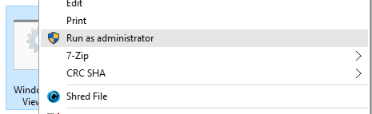
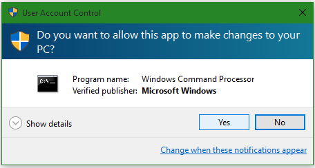
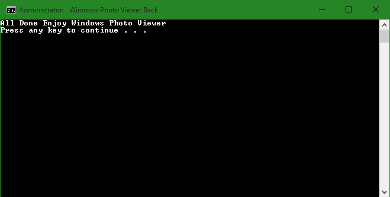
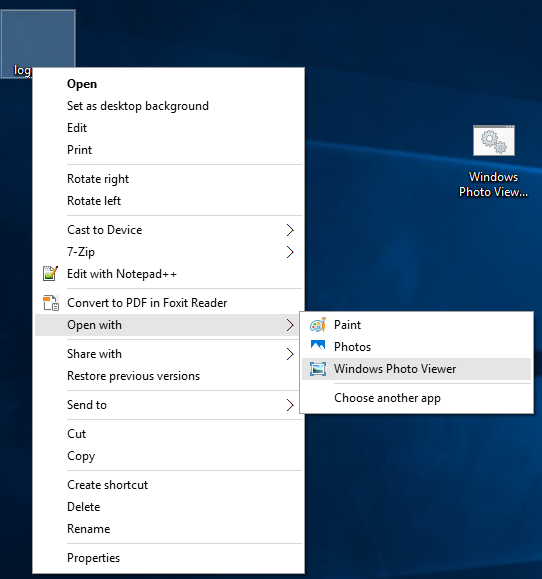

+++
title = "كيفية استعادة Windows Photo Viewer في ويندوز 10"
date = "2015-08-12"
description = "من التغيرات التي حدثت في ويندوز 10 والتي لم تعجب الكثير من مستخدمي الويندوز هي حذف مستعرض الصور الافتراضي Windows Photo Viewer والذي كان موجودا منذ ويندوز XP وحتى 8.1، إذا كنت ممن لم يعجبهم هذا التغيير أقدم لك في هذا الدرس طريقة إرجاع Windows Photo Viewer في ويندوز 10."
categories = ["ويندوز",]
series = ["ويندوز 10"]
tags = ["موقع لغة العصر"]

+++

من التغيرات التي حدثت في ويندوز 10 والتي لم تعجب الكثير من مستخدمي الويندوز هي حذف مستعرض الصور الافتراضي Windows Photo Viewer والذي كان موجودا منذ ويندوز XP وحتى 8.1، إذا كنت ممن لم يعجبهم هذا التغيير أقدم لك في هذا الدرس طريقة إرجاع Windows Photo Viewer في ويندوز 10.

التطبيق الجديد الذي جعلته مايكروسوفت يقوم بمهمة مستعرض الصور هو تطبيق Photos:

يأتي التطبيق بالعديد من المميزات الجديدة والواجهة المختلفة كليا عن Windows Photo Viewer ولكن كان من الأفضل أن تحتفظ مايكروسوفت بالمستعرضين كما فعلت في ويندوز 8.1.

1. قم بتحميل هذا الملف [من هنا](http://www.gulfup.com/?5QtFJB) أو [من هنا](https://onedrive.live.com/redir?resid=28AD8C89A6250722%2155054&authkey=%21AJ5pkZKz0adGwOg&ithint=file%2crar).
2. قم بفك ضغط الملف ثم قم بالضغط بزر الفأرة الأيمن ليه ثم اختر Run as administrator.

3. ستظهر لك رسالة تأكيد اضغط Yes.

4. انتظر حتى تظهر هذه الرسالة ثم اضغط أي زر للخروج.

5. اضغط بزر الفأرة الأيمن على أي صورة ثم من قائمة Open With اختر Windows Photo Viewer.

---
هذا الموضوع نٌشر باﻷصل على موقع مجلة لغة العصر.

http://aitmag.ahram.org.eg/News/22542.aspx