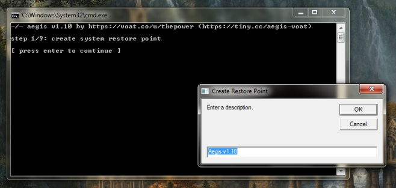
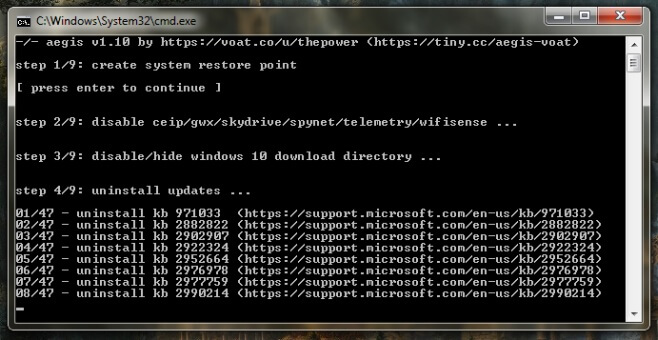

+++
title = "كيفية منع تحديث الترقية إلى ويندوز 10 من الوصول لجهازك؟"
date = "2016-02-07"
description = "تسعي مايكروسوفت إلى زيادة عدد مستخدمي ويندوز 10 بكافة الطرق، ولذلك تفاجئنا بقيام مايكروسوفت بإرسال تحديث الترقية إلى ويندوز 10 على أنه تحديث مستحسن لتثبيته على الأجهزة التي تعمل بويندوز أقل، إليك عزيزي القارئ طريقة منعه"
categories = ["ويندوز",]
series = ["ويندوز 10"]
tags = ["موقع لغة العصر"]

+++

تسعي مايكروسوفت إلى زيادة عدد مستخدمي ويندوز 10 بكافة الطرق، ولذلك تفاجئنا بقيام مايكروسوفت بإرسال تحديث الترقية إلى ويندوز 10 على أنه تحديث مستحسن لتثبيته على الأجهزة التي تعمل بويندوز أقل، إليك عزيزي القارئ طريقة منعه.

1- قم بتحميل أداة Aegis التي ستقوم بمنع التحديثات [من هنا](https://github.com/th3power/aegis-voat/archive/v1.10.zip).

2- قم بفك الضغط عن الملف قم اضغط بزر الماوس الأيمن على الملف aegis.cmd واختر run as administrator.

3- سيبدأ البرنامج بعمل نقطة استعادة Restore Point اضغط OK.

4- كل ما تحتاجه هو اكمال الخطوات التي يطلبها البرنامج، متابعة الضغط على Enter.

5- قد يتأخر البرنامج ويأخذ وقت طويلا في إزالة التحديثات.

6- لمعرفة التحديثات التي سيقوم البرنامج بإزالتها [من هنا](https://voat.co/v/technology/comments/459263).

---
هذا الموضوع نٌشر باﻷصل على موقع مجلة لغة العصر.

http://aitmag.ahram.org.eg/News/42895.aspx