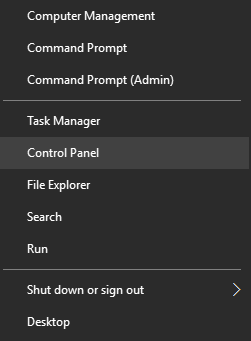
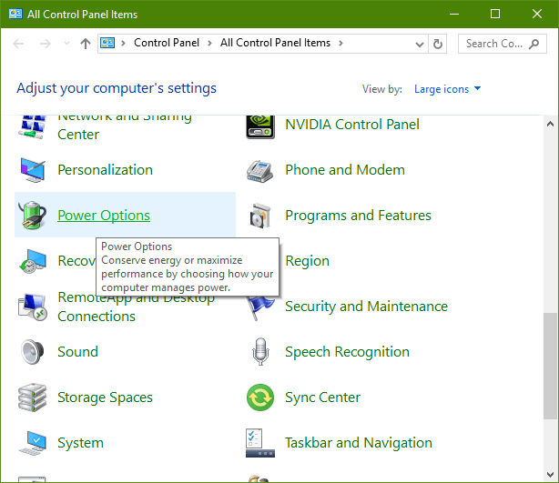
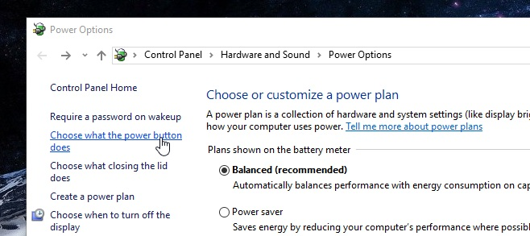
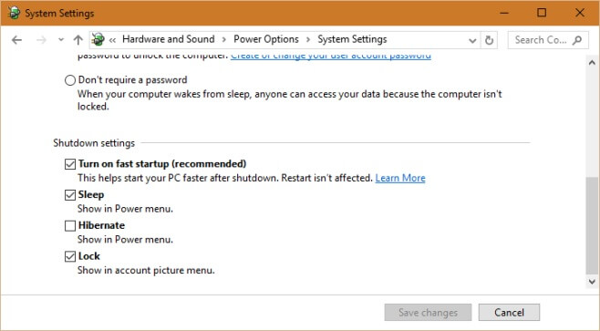

+++
title = "كيفية تمكين بدء التشغيل السريع في ويندوز 10"
date = "2016-02-19"
description = "يدعم ويندوز 10 بشكل افتراضي وضع التشغيل السريع وهو وضع مختلط بين السبات وإيقاف التشغيل يضمن للمستخدم السرعة الفائقة في تشغيل الجهاز، إليك طريقة تفعيل هذه الميزة"
categories = ["ويندوز",]
series = ["ويندوز 10"]
tags = ["موقع لغة العصر"]
images = ["images/2016-635914869757071373-707_thumb705x335.png"]
+++

يدعم ويندوز 10 بشكل افتراضي وضع التشغيل السريع وهو وضع مختلط بين السبات وإيقاف التشغيل يضمن للمستخدم السرعة الفائقة في تشغيل الجهاز، إليك طريقة تفعيل هذه الميزة.

1- قم بالدخول إلى لوحة التحكم Control Panel.

2- انتقل إلى إعدادات الطاقة Power Options.

أو يمكنك الدخول مباشرة إلى إعدادات الطاقة عن طريق الضغط بزر الماوس الأسمن على رمز البطارية من شريط المهام ثم اختر Power Options.

3- من القائمة على يسار الشاشة اضغط Choose what the power button does.

4- قم بالنزول إلى أسفل ثم تأكد من وضع علامة على الاختيار Turn on fast startup.

5- في حالة كانت هذه الاختيارات غير مفعلة، ستجد بالأعلى اختيار Change settings that are currently unavailable قم بالضغط عليه ثم قم بالخطوة السابقة مجددا.

---
هذا الموضوع نٌشر باﻷصل على موقع مجلة لغة العصر.

http://aitmag.ahram.org.eg/News/44400.aspx