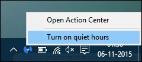
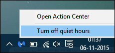
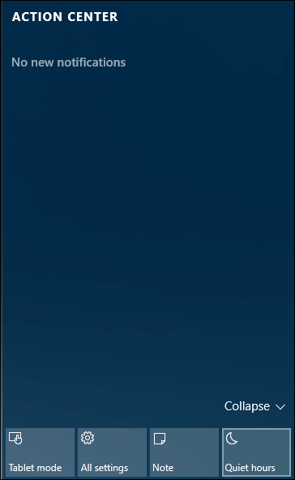

+++
title = "كيفية تفعيل وضع عدم الإزعاج في ويندوز 10"
date = "2015-12-18"
description = "من الإضافات المميزة في ويندوز 10 الإشعارات، ولكن هل تعلم عزيزي القارئ أن ويندوز 10 يوفر لك وضع خاص لإيقاف تشغيل الإشعارات لعدم ازعاجك، إليك طريقة كيفية تفعيل وضع عدم الإزعاج"
categories = ["ويندوز",]
series = ["ويندوز 10"]
tags = ["موقع لغة العصر"]
+++

من الإضافات المميزة في ويندوز 10 الإشعارات، ولكن هل تعلم عزيزي القارئ أن ويندوز 10 يوفر لك وضع خاص لإيقاف تشغيل الإشعارات لعدم ازعاجك، إليك طريقة كيفية تفعيل وضع عدم الإزعاج.

**أولا: عن طريق شريط المهام:**

قم بالضغط بزر الفأرة الأيمن على أيقونة الاشعارات كما بالصورة ثم من القائمة المختصرة اختر Turn On Quiet Hours.

ولإلغاء تفعيله بنفس الطريقة اختر Turn Off Quiet Hours.

**ثانيا: عن طريق** **Action Center:**

اضغط على زر Action Center ثم قم بتفعيل وضع Quiet Hours كما بالصورة، إذا لم تكن ظاهرة اضغط على Expand.

**ثالثا: التحكم في إشعارات التطبيقات:**

سبق تناول هذا الجزء بالتفصيل في درس كيف تتعامل مع إشعارات التطبيقات في ويندوز 10.

---
هذا الموضوع نٌشر باﻷصل على [موقع مجلة لغة العصر](http://aitmag.ahram.org.eg/News/40204/%D8%AF%D8%B1%D9%88%D8%B3/%D8%B4%D8%B1%D8%AD-%D9%88%D8%AA%D8%B9%D9%84%D9%8A%D9%85/%D9%83%D9%8A%D9%81%D9%8A%D8%A9-%D8%AA%D9%81%D8%B9%D9%8A%D9%84-%D9%88%D8%B6%D8%B9-%D8%B9%D8%AF%D9%85-%D8%A7%D9%84%D8%A5%D8%B2%D8%B9%D8%A7%D8%AC-%D9%81%D9%8A-%D9%88%D9%8A%D9%86%D8%AF%D9%88%D8%B2-.aspx).

