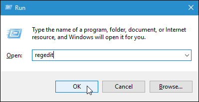
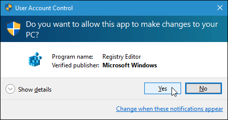
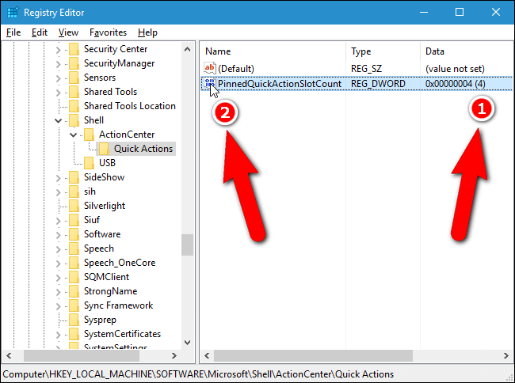
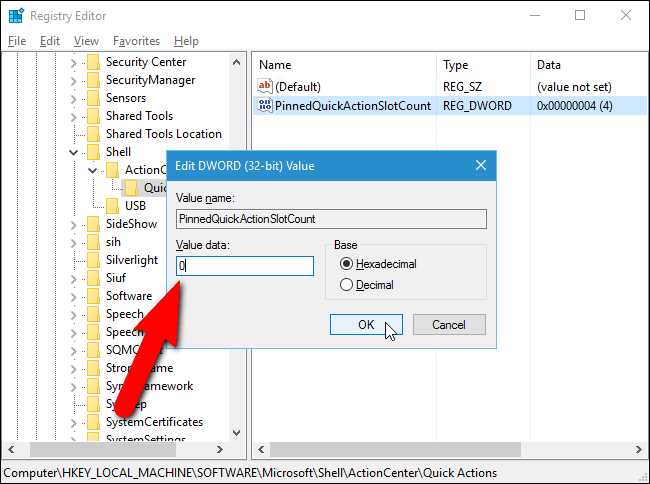
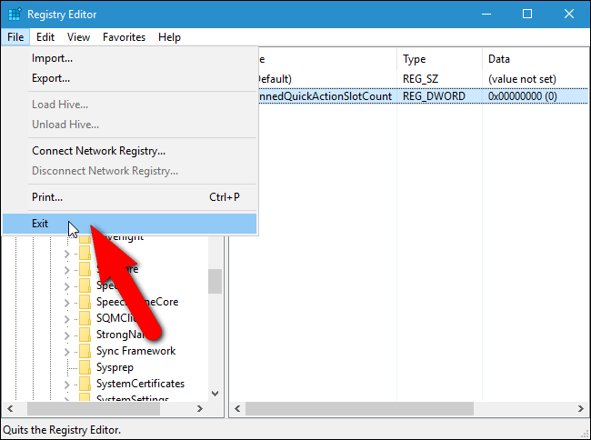
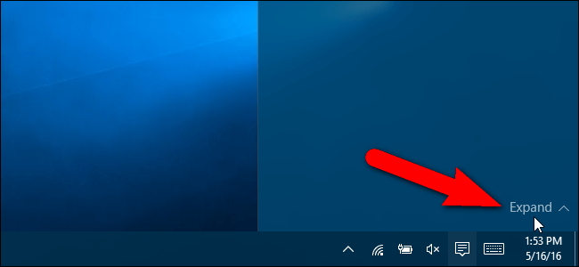

+++
title = "طريقة إزالة أزرار التحكم من Action Center في ويندوز 10"
date = "2016-06-02"
description = "تعتبر ميزة Action Center في ويندوز 10 من الخصائص التي ميزت ويندوز 10، فإلى جانب عرضها للإشعارات فإنها توفر أزرار للتحكم في بعض الإعدادات، ولكن قد لا يحبذ البعض وجود هذه الأزرار، إليكم طريقة ازالتها"
categories = ["ويندوز",]
series = ["ويندوز 10"]
tags = ["موقع لغة العصر"]
images = ["images/2016-636004727567349684-734_thumb705x335.png"]
+++

تعتبر ميزة Action Center في ويندوز 10 من الخصائص التي ميزت ويندوز 10، فإلى جانب عرضها للإشعارات فإنها توفر أزرار للتحكم في بعض الإعدادات، ولكن قد لا يحبذ البعض وجود هذه الأزرار، إليكم طريقة ازالتها.

1- قم بفتح مربع Run ثم اكتب regedit واضغط OK.

2- إذا ظهرت لك هذه النافذة اضغط Yes للاستمرار.

3- انتقل إلى المسار التالي:

`HKEY\_LOCAL\_MACHINE\SOFTWARE\Microsoft\Shell\ActionCenter\Quick Actions`

4- على الجانب الأيمن ستجد القيمة " PinnedQuickActionSlotCount " اضغط عليها بزر الماوس الأيسر مرتين لفتحها.

- - لاحظ أن العدد 4 الذي يظهر في العمود Data هو القيمة الافتراضية لعدد الأزرار التي تظهر في Action Center.

5- قم بتغيير القيمة من 4 إلى 0 ثم اضغط OK.

- لاحظ أنه يمكنك أن تضع القيمة التي تريدها من 1 إلى 3 للتحكم في عدد الأزرار التي ستظهر.
- 6- للخروج من Registry Editor اختر Exit من قائمة File.

7- قم بإعادة تشغيل explorer.exe أو قم بتسجيل الخروج والدخول مجددا لتطبيق التغييرات، بعد ذلك افتح Action Center لتجد أن جميع الأزرار قد اختفت كما بالصورة.

- ولتطبيق هذه الخطوات بشكل أسهل يمكنك تحميل [هذا الملف](http://www.howtogeek.com/wp-content/uploads/2016/05/Quick-Action-Button-Registry-Hacks.zip)، قم بفك الضغط عنه ثم شغل الملف Hide All Pinned Quick Action Buttons.reg.

---
هذا الموضوع نٌشر باﻷصل على موقع مجلة لغة العصر.

http://aitmag.ahram.org.eg/News/50384.aspx