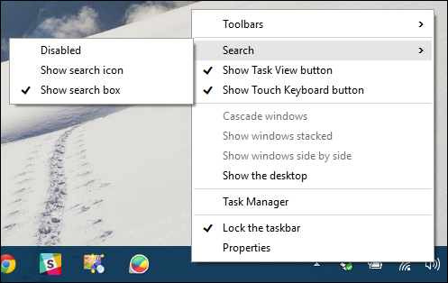
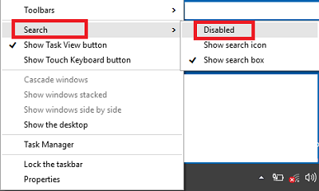

+++
title = "إزالة المساعدة الصوتية Cortana من شريط المهام في ويندوز 10"
date = "2015-08-10"
description = "قدمنا في موضوع سابق طريقة تفعيل المساعدة الصوتية Cortana على ويندوز 10 في أي مكان في العالم، وفى درس اليوم أيضا سنواصل كشف أسرار المساعدة الصوتية Cortana، إليك عزيزي القارئ كيفية إزالة المساعدة الصوتية Cortana من شريط المهام في ويندوز 10."
categories = ["ويندوز",]
series = ["ويندوز 10"]
tags = ["موقع لغة العصر"]
images = ["images/2015-635748120252833984-283.png"]

+++

قدمنا في موضوع سابق طريقة تفعيل المساعدة الصوتية Cortana على ويندوز 10 في أي مكان في العالم، وفى درس اليوم أيضا سنواصل كشف أسرار المساعدة الصوتية Cortana، إليك عزيزي القارئ كيفية إزالة المساعدة الصوتية Cortana من شريط المهام في ويندوز 10.

كثير من مستخدمين ويندوز 10 وبالأخص المستخدمين الذين لا يرغبون في استخدام المساعدة الصوتية لا يعجبهم أن يظل شريط البحث أو أيقونة Cortana موجودا (موجودة) على يسار شريط المهام بجانب زر Start، هذه طريقة إزالتها.

1. في البداية يظهر لك شريط البحث كما بالصورة:

2. اضغط بزر الفأرة الأيمن على أي مكان فارغ من شريط المهام، ثم من القائمة Cortana/Search اختر Show the search icon.

3. سيتحول شريط البحث إلى أيقونة دائرية صغيرة.

4. إذا كنت ترغب في إزالتها نهائيا اضغط بزر الفأرة الأيمن على أي مكان فارغ من شريط المهام، ثم من القائمة Cortana/Search اختر Disabled.

5. سيظهر شريط المهام كما بالصورة:

6. في حالة رغبت في إعادة تفعيل شريط البحث / أيقونة البحث اضغط بزر الفأرة الأيمن على أي مكان فارغ من شريط المهام، ثم من القائمة Cortana/Search اختر الاختيار الذي تريده.

---
هذا الموضوع نٌشر باﻷصل على موقع مجلة لغة العصر.

http://aitmag.ahram.org.eg/News/22385.aspx
