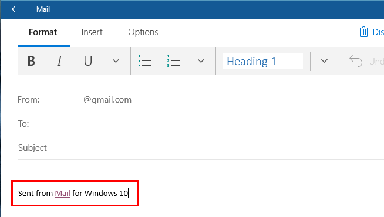
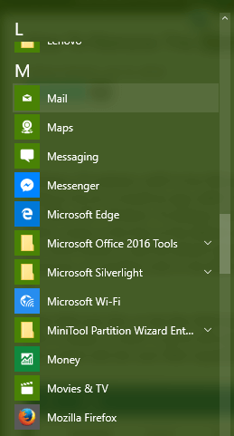
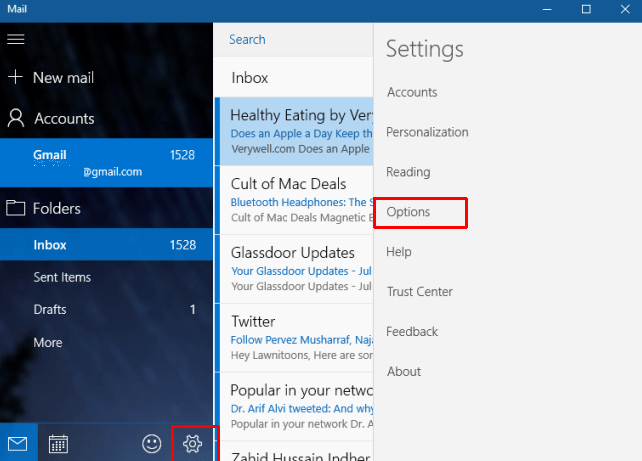
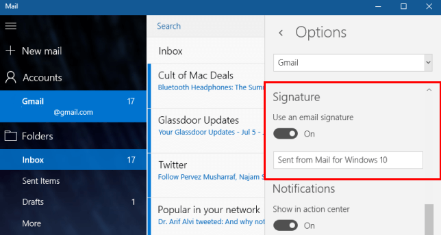
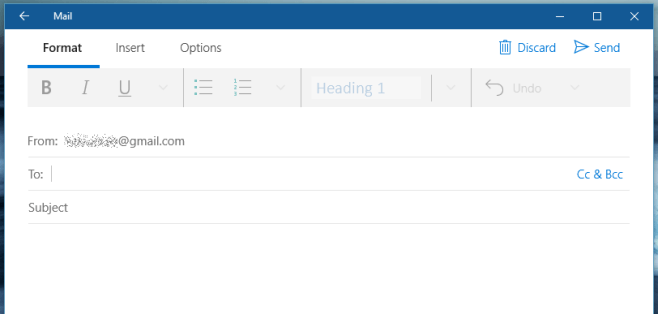
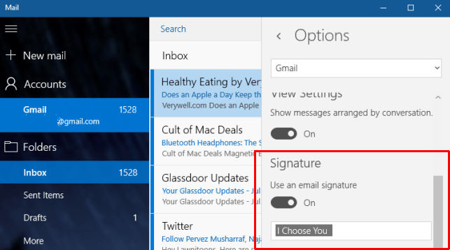

+++
title = "طريقة إزالة توقيع ويندوز 10 من البريد الصادر"
date = "2016-07-20"
description = "يقوم تطبيق البريد الإلكتروني Mail في ويندوز 10 بإضافة توقيع ‘Sent From Mail For Windows 10’ عند ارسالك لأي رسالة من خلاله، إليك عزيزي القارئ طريقة إيقاف هذا الإزعاج."
categories = ["ويندوز",]
series = ["ويندوز 10"]
tags = ["موقع لغة العصر"]
+++

يقوم تطبيق البريد الإلكتروني Mail في ويندوز 10 بإضافة توقيع ‘Sent From Mail For Windows 10’ عند ارسالك لأي رسالة من خلاله، إليك عزيزي القارئ طريقة إيقاف هذا الإزعاج.

عند إنشاء رسالة جديدة بواسطة تطبيق Mail ستلاحظ ظهور التوقيع بشكل تلقائي في آخر سطر من الرسالة كما بالصورة.

ولإزالة توقيع ويندوز 10 من البريد الصادر:

1. قم بفتح تطبيق البريد الإلكتروني Mail.

2. اضغط عل زر الإعدادات ثم اختر Options.

3. قم بالنزول لأسفل، ستجد الاختيار Use an email signature مفعلا والتوقيع المكتوب هو Sent From Mail For Windows 10، لحذف التوقيع قم بتغيير On إلى Off.

هكذا عند إرسالك لرسالة جديدة لن تجد التوقيع.

4. إذا كنت ترغب بتشغيل ميزة التوقيع، ولكن حذف توقيع الويندوز، يمكنك ذلك بواسطة تغيير توقيع الويندوز إلى التوقيع الذي تريده.

---
هذا الموضوع نٌشر باﻷصل على موقع مجلة لغة العصر.

http://aitmag.ahram.org.eg/News/55623.aspx