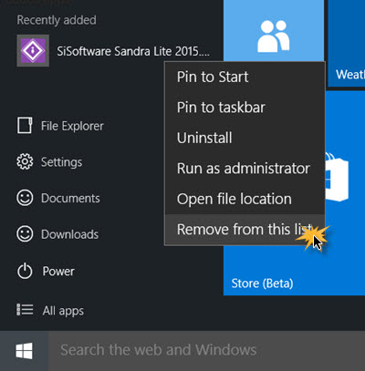
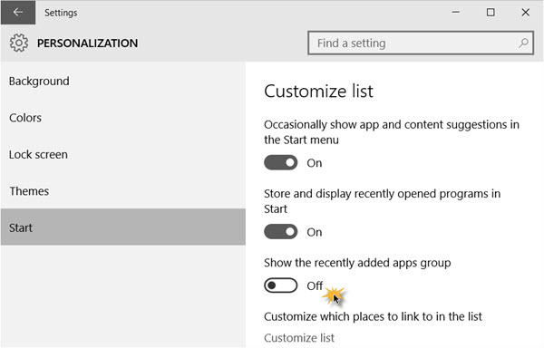

+++
title = "حذف قائمة Recently Added من قائمة البداية في ويندوز 10"
date = "2015-07-14"
description = "تعرفنا في الدرس السابق على طريقة حذف قائمة Most Used من قائمة البداية في ويندوز 10، وفى درس اليوم سنواصل استعراض خفايا قائمة البداية في ويندوز 10، وسنتعرف على طريقة حذف قائمة Recently Added من قائمة البداية في ويندوز 10"
categories = ["ويندوز",]
series = ["ويندوز 10"]
tags = ["موقع لغة العصر"]
+++

تعرفنا في الدرس السابق على طريقة حذف قائمة Most Used من قائمة البداية في ويندوز 10، وفى درس اليوم سنواصل استعراض خفايا قائمة البداية في ويندوز 10، وسنتعرف على طريقة حذف قائمة Recently Added من قائمة البداية في ويندوز 10.

**أولا: حذف تطبيق من قائمة البداية:**

قم بفتح قائمة البداية ثم اضغط بزر الفأرة الأيمن على التطبيق الذي تود حذفه من قائمة Recently Added، بعد ذلك قم باختيار Remove from this list.

1

**ثانيا: حذف قائمة** **Recently Added** **من قائمة البداية في ويندوز 10**

1. قم بالدخول إلى تطبيق الإعدادات ثم قسم Personalization.

2. انتقل الى التبويب Start ستجد العديد من الاختيارات.

3. قم بتعديل الاختيار Show the recently added apps group إلى Off.

4. إذ قمت بفتح قائمة البداية لن تجد قائمة Recently Added موجودة.

---

هذا الموضوع نٌشر باﻷصل على موقع مجلة لغة العصر.

http://aitmag.ahram.org.eg/News/20104.aspx