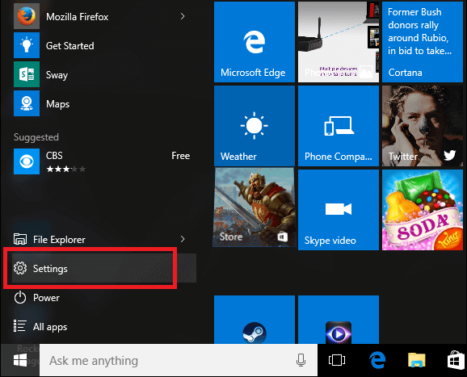
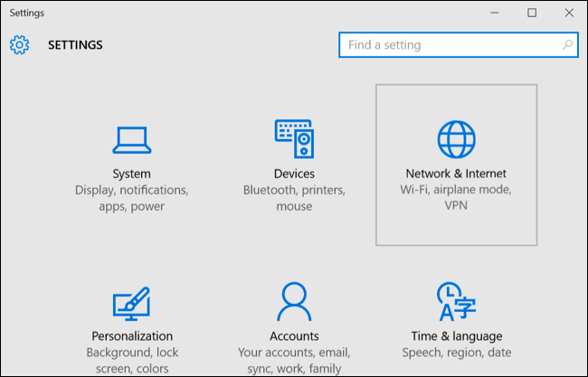
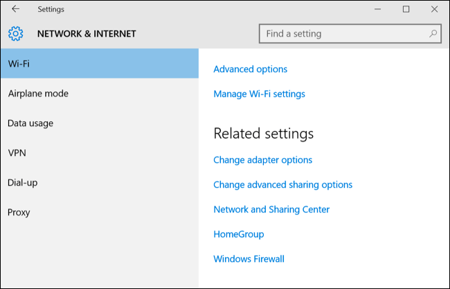
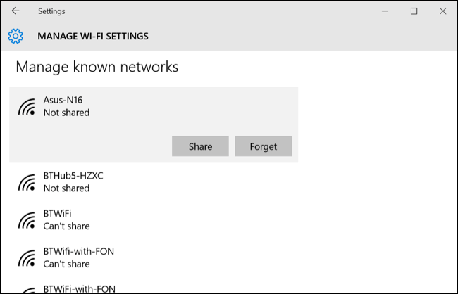

+++
title = "كيفية حذف كلمة مرور شبكة واى فاى محفوظة في ويندوز 10"
date = "2016-03-25"
description = "تحدثنا في درس سابق عن  كيفية عرض كلمات سر شبكات الواى فاى في ويندوز 10 وفى درس اليوم سنتعرف على طريقة إزالة شبكة محفوظة من خلال تطبيق الإعدادات"
categories = ["ويندوز",]
series = ["ويندوز 10"]
tags = ["موقع لغة العصر"]
images = ["images/2016-635945121148516839-851_thumb705x335.png"]
+++

تحدثنا في درس سابق عن " كيفية عرض كلمات سر شبكات الواى فاى في ويندوز 10" وفى درس اليوم سنتعرف على طريقة إزالة شبكة محفوظة من خلال تطبيق الإعدادات.

1- قم بالدخول إلى تطبيق الإعدادات.

2- انتقل إلى القسم Network & Internet.

3- من التبويب Wi-Fi قم بالنزول إلى أسفل ثم اضغط على Manage Wi-Fi settings.

4- قم بالنزول لأسفل هذه الصفحة، ستجد جميع شبكات الواى فاى التي قمت بالدخول إليها بواسطة جهازك.

5- اضغط على الشبكة التي تريد إزالتها، ثم اختر زر Forget.

6- في المرة القادمة التي تريد فيها الدخول إلى الشبكة يجب أن تقوم بإدخال كلمة السر مرة أخرى.

---
هذا الموضوع نٌشر باﻷصل على موقع مجلة لغة العصر.

http://aitmag.ahram.org.eg/News/46893.aspx