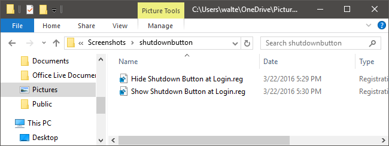
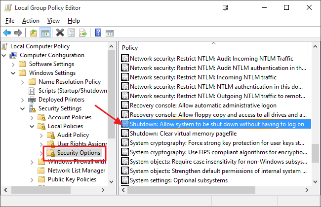
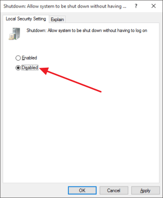

+++
title = "كيفية إزالة زر ايقاف التشغيل من شاشة تسجيل الدخول في ويندوز 10"
date = "2016-03-29"
description = "في ويندوز 10 يظهر زر إيقاف التشغيل افتراضيا في شاشة تسجيل الدخول، ولكن هل تعلم عزيزي القارئ أنه يمكنك إزالتها بحيلة بسيطة، إليك الطريقة"
categories = ["ويندوز",]
series = ["ويندوز 10"]
tags = ["موقع لغة العصر"]

+++

في ويندوز 10 يظهر زر إيقاف التشغيل افتراضيا في شاشة تسجيل الدخول، ولكن هل تعلم عزيزي القارئ أنه يمكنك إزالتها بحيلة بسيطة، إليك الطريقة.

لماذا قد تحتاج عزيزي القارئ إلى إزالة زر إيقاف التشغيل من شاشة تسجيل الدخول؟

إذا كان جهازك يقوم بتشغيل خدمات مهمة في الخلفية مثل سيرفر ملفات أو تحميل ملف، فباستخدامك لهذه الطريقة ستمنع أي شخص من إغلاق الجهاز إذا كان موجودا على شاشة تسجيل الدخول (وكذلك شاشة القفل).

**الطريقة الأولى: إزالة زر ايقاف التشغيل من شاشة تسجيل الدخول باستخدام ملف Registry:**

قم بتحميل [هذا الملف](http://www.howtogeek.com/wp-content/uploads/2016/03/Shutdown-Button-Hacks.zip) ثم قم بتشغيل الملف "Hide Shutdown Button at Login” واضغط yes ثم OK.

لإعادة اظهار زر ايقاف التشغيل من شاشة تسجيل الدخول قم بفتح الملف "Show Shutdown Button at Login”.

**الطريقة الثانية: ازالة زر ايقاف التشغيل من شاشة تسجيل الدخول باستخدام Local Group Policy Editor**:

1- قم بالبحث عن Group Policy ثم قم بفتحها.

2- انتقل إلى المسار التالي:

Computer Configuration > Windows Settings > Security Settings > Local Policies > Security Options.

3- قم بفتح الاختيار “Shutdown: Allow system to be shut down without having to log on” بالضغط عليه مرتين.

4- قم بتغيير الاختيار إلى Disabled.

---

هذا الموضوع نٌشر باﻷصل على موقع مجلة لغة العصر.

http://aitmag.ahram.org.eg/News/47065.aspx
