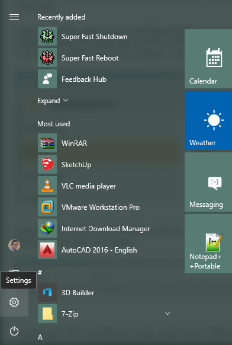
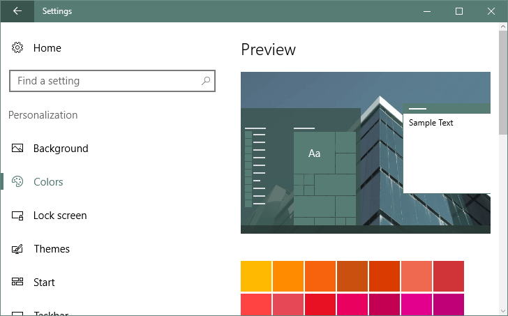
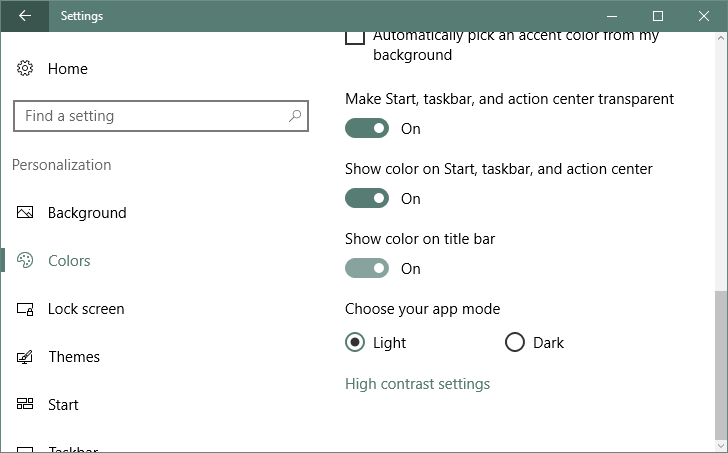

+++
title = "كيفية إزالة لون شريط العنوان في ويندوز 10"
date = "2016-08-17"
description = "من التغييرات التي اضافها تحديث Anniversary update إلى تطبيق الإعدادات هي ميزة التحكم في لون شريط العنوان لكل التطبيقات، دعونا نتعرف عليها."
categories = ["ويندوز",]
series = ["ويندوز 10"]
tags = ["موقع لغة العصر"]
+++

من التغييرات التي اضافها تحديث Anniversary update إلى تطبيق الإعدادات هي ميزة التحكم في لون شريط العنوان لكل التطبيقات، دعونا نتعرف عليها.

سابقا للتحكم في هذه الميزة كان يجب على المستخدم الدخول إلى الرجيستري وتعديل بعض القيم، ولكن بعد تحديث الذكري السنوية لا داعي لهذا فكل ما تحتاجه هو:

1. قم بفتح تطبيق الإعدادات.

2. انتقل إلى القسم Personalization ثم التبويب Colors.

3. قم بالنزول إلى الأسفل حتى تجد الاختيار Show color on title bar.

4. إذا قمت بتفعيله ستلاحظ ظهور اللون المحدد على شريط العنوان.

5. وفى حالة قمت بإلغاء تفعيله سيرجع لون شريط العنوان إلى الأبيض كما بالصورة.

---
هذا الموضوع نٌشر باﻷصل على موقع مجلة لغة العصر.

http://aitmag.ahram.org.eg/News/57999.aspx