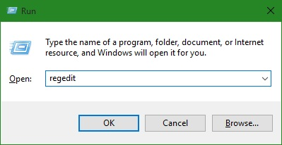
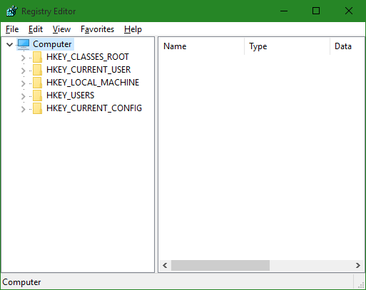
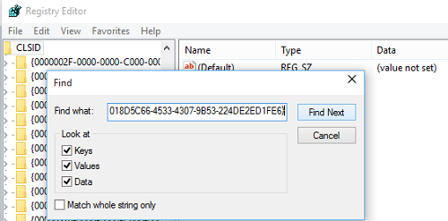
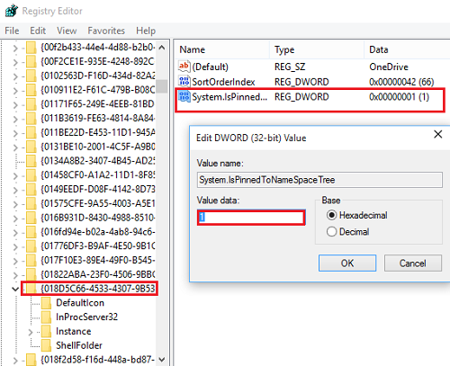
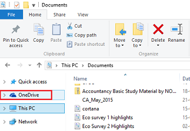

+++
title = "تعلم ويندوز 10.. كيفية إزالة OneDrive من مدير الملفات"
date = "2015-10-18"
description = "تحدثنا في الموضوع السابق عن طريقة إزالة تثبيت خدمة OneDrive من ويندوز 10، واستكمالا للدرس السابق سنتعلم في درس اليوم طريقة إزالة القسم الخاص ب OneDrive من مدير الملفات File Explorer باستخدام حيل الرجيستري"
categories = ["ويندوز",]
series = ["ويندوز 10"]
tags = ["موقع لغة العصر"]
+++

تحدثنا في الموضوع السابق عن طريقة إزالة تثبيت خدمة OneDrive من ويندوز 10، واستكمالا للدرس السابق سنتعلم في درس اليوم طريقة إزالة القسم الخاص ب OneDrive من مدير الملفات File Explorer باستخدام حيل الرجيستري.

1. اضغط على WinKey+R لفتح مربع Run.

2. قم بكتابة regedit، سيفتح محرر الرجيستري كما بالصورة:

3. من قائمة Edit قم باختيار Find ثم اكتب المسار التالي:
4. HKEY_CLASSES_ROOT\CLSID\{018D5C66-4533-4307-9B53-224DE2ED1FE6}

4. على الجانب الأيسر ستجد مفتاح DWORD اسمه System.IsPinnedToSpaceTree، قيمته الافتراضية هي 1، لإزالة OneDrive من مدير الملفات سنغير هذه القيمة إلى 0.

5. اضغط مرتين بزر الفأرة الأيسر على المفتاح وقم بتغيير القيمة كما بالصورة:

6. اضغط Ok ثم اخرج من المحرر.

تأكد من إغلاق مدير الملفات ثم قم بفتحه لتجد التعديلات التي قمنا بها قد تمت ولم تعد هناك أيقونة OneDrive على الجانب الأيسر مع باقي المجلدات كما بالصورة:

-   قبل التعديلات:

-   بعد التعديلات:

---

هذا الموضوع نٌشر باﻷصل على موقع مجلة لغة العصر.

http://aitmag.ahram.org.eg/News/34139.aspx
