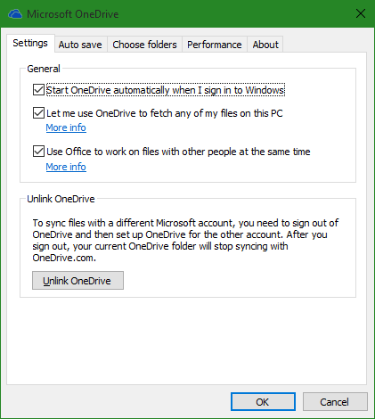
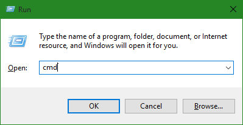
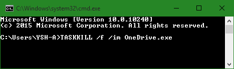
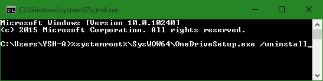
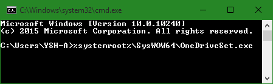

+++
title = "تعلم ويندوز 10.. كيفية إزالة خدمة OneDrive من الويندوز"
date = "2015-10-16"
description = "OneDrive هي خدمة مايكروسوفت الخاصة بالتخزين السحابى، وهي تأتي مثبتة بشكل افتراضي في ويندوز 10، ولكن المشكلة قد تتسبب الخدمة بمشاكل نظرا لعملها الدائم بالخلفية خصوصا فى الأجهزة الضعيفة، في درس اليوم أقدم لك حيلة لإزالة تثبيت OneDrive من ويندوز 10"
categories = ["ويندوز",]
series = ["ويندوز 10"]
tags = ["موقع لغة العصر"]
images = ["images/2015-635806167459860181-986.png"]
+++

خدمة OneDrive هي خدمة مايكروسوفت الخاصة بالتخزين السحابى، وهو يأتي مثبتا بشكل افتراضي في ويندوز 10، ولكن المشكلة تكمن في أصحاب الأجهزة ذات الإمكانيات المتوسطة والضعيفة، فقد تسبب الخدمة لهم بعض المشاكل نظرا لعملها الدائم بالخلفية، في درس اليوم أقدم لك حيلة لإزالة تثبيت OneDrive من ويندوز 10.

**أولا: إلغاء ارتباط ال** **OneDrive** **بدون إزالة تثبيته:**

1. من أيقونة OneDrive الموجودة بجانب الساعة اضغط بزر الفأرة الأيمن، ثم اختر من القائمة " Settings ".
2. اضغط على " Unlink OneDrive" كما بالصورة.

**ثانيا: إزالة تثبيت** **OneDrive:**

1. اضغط على WinKey+R لفتح مربع Run.
2. قم بكتابة cmd لفتح مُوجة الأوامر.

3. اكتب الأمر التالي لإيقاف تشغيل ال OneDrive:

**TASKKILL /f /im OneDrive.exe**

4. اكتب الأمر التالي لإزالة تثبيت OneDrive:

لأنظمة 32-بت:

**%systemroot%\System32\OneDriveSetup.exe /uninstall**

لأنظمة 64-بت:

**%systemroot%\SysWOW64\OneDriveSetup.exe /uninstall**

5. قم بحذف مجلدات OneDrive الموجودة في “%UserProfile%, “%LocalAppData% و “%ProgramData% لتتخلص منه بشكل نهائي.

**ثالثا: إعادة تثبيت** **OneDrive** **مرة أخري:**

قم بالدخول إلى CMD بنفس الخطوات السابقة، ثم اكتب الأمر التالي:

لأنظمة 32-بت:

**%systemroot%\System32\OneDriveSetup.exe**

لأنظمة 64-بت:

**%systemroot%\SysWOW64\OneDriveSet.exe**

---
هذا الموضوع نٌشر باﻷصل على موقع مجلة لغة العصر.

http://aitmag.ahram.org.eg/News/33942.aspx