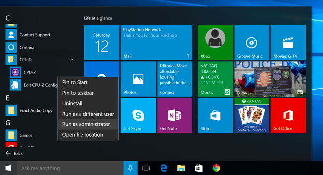
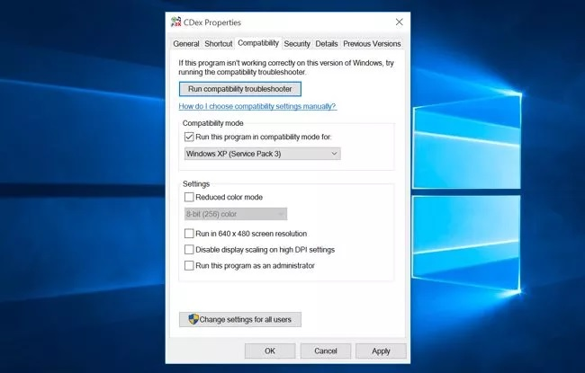

+++
title = "طريقة تشغيل البرامج القديمة على ويندوز 10"
date = "2015-10-27"
description = "زاد ويندوز 10 من توافقه مع البرامج بعد التحديثات الأخيرة من مايكروسوفت، وبالتأكيد كل النسخ الجديدة من البرامج الشهيرة تعمل بكفاءة، ولكن قد تصادفك مشكلة وجود بعض التطبيقات القديمة التي لا تعمل مع ويندوز 10، إليك عزيزي القارئ طريقة تشغيلها"
categories = ["ويندوز",]
series = ["ويندوز 10"]
tags = ["موقع لغة العصر"]
+++

زاد ويندوز 10 من توافقه مع البرامج بعد التحديثات الأخيرة من مايكروسوفت، وبالتأكيد كل النسخ الجديدة من البرامج الشهيرة تعمل بكفاءة، ولكن قد تصادفك مشكلة وجود بعض التطبيقات القديمة التي لا تعمل مع ويندوز 10، إليك عزيزي القارئ طريقة تشغيلها.

**الحل الأول: التشغيل كمسئول** **Run as Administrator:**

يعمل هذا الحل بكفاءة مع البرامج التي صممت خصيصا لويندوز XP.
- قم بالضغط بزر الفأرة الأيمن على البرنامج الذي لا يعمل ثم قم باختيار Run as Administrator..

- لتهيئة برنامج ما على العمل بصلاحيات المسئول دائما:
قم بالضغط بزر الفأرة الأيمن على الملف أو الاختصار Shortcut الخاص به ثم قم باختيار Properties، ثم من التبويب compatibility قم بتفعيل الاختيار run this program as administrator.

**الحل الثاني: إعدادات التوافق** **Run as Administrator:**

يمتلك ويندوز 10 نظام توافق مُحسن بشكل كبير عن الموجود في الأنظمة الأقدم، ولكن في بعض الأحيان يحتاج المستخدم إلى تفعيل وضع التوافق للبرنامج بشكل يدوي:

- قم بالضغط بزر الفأرة الأيمن على الملف أو الاختصار Shortcut الخاص به ثم قم باختيار Properties، ثم من التبويب compatibility قم بتفعيل الاختيار Run this program in compatibility mode ثم من القائمة المنسدلة اختر وضع التوافق الذي تريده.

**حلول أخري:**

- البحث عن نسخة أحدث من البرنامج الذي لا يعمل.
- استخدام بديل يقوم بنفس وظيفة البرنامج.
- تشغيل البرنامج في "ماكينة وهمية" مثل برنامج “VirtualBox” أو “VMWare”.
- تحديث الملحقات التي تحتاجها البرامج مثل " Java, Silverlight, ActiveX".

---
هذا الموضوع نٌشر باﻷصل على موقع مجلة لغة العصر.

http://aitmag.ahram.org.eg/News/32266.aspx