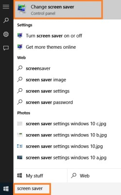
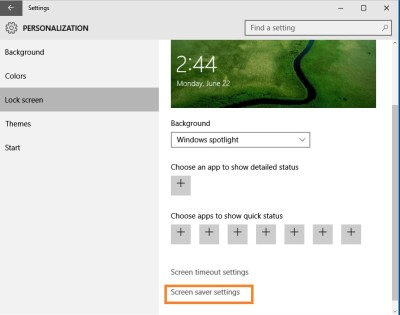
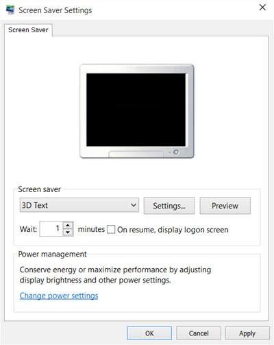
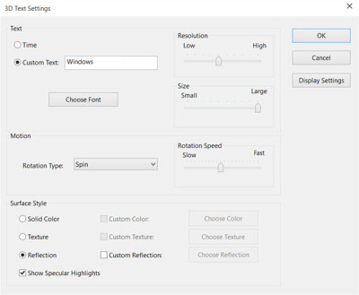

+++
title = "إعدادات شاشة التوقف Screen Saver في ويندوز 10"
date = "2015-07-16"
description = "ميزة شاشة التوقف أو Screen Saver من أقدم المميزات الموجودة في نظام الويندوز، وكما تعودنا منذ ويندوز XP فإن طريقة الوصول إعدادات شاشة التوقف ظلت كما هي، ولكن في ويندوز 10 حدث تغيير في الطريقة، في درس اليوم ستتعرف عزيزي القارئ على كل ما يخص ميزة شاشة التوقف في ويندوز 10"
categories = ["ويندوز",]
series = ["ويندوز 10"]
tags = ["موقع لغة العصر"]
images = ["images/2015-635726577675999556-599.jpg"]

+++

ميزة شاشة التوقف أو Screen Saver من أقدم المميزات الموجودة في نظام الويندوز، وكما تعودنا منذ ويندوز XP فإن طريقة الوصول إعدادات شاشة التوقف ظلت كما هي، ولكن في ويندوز 10 حدث تغيير في الطريقة، في درس اليوم ستتعرف عزيزي القارئ على كل ما يخص ميزة شاشة التوقف في ويندوز 10.

## أولا: طريقة الدخول إلى إعدادات شاشة التوقف Screen Saver:

1. عن طريق كتابة " Screen Saver" في البحث داخل شريط المهام، أو في قائمة البداية.

2. عن طريق الضغط بزر الفأرة الأيمن على سطح المكتب ثم اختيار Personalize، بعد ذلك قم بالدخول الى التبويب Lock screen، ثم ستجد الاختيار Screen saver settings بالأسفل.

## ثانيا: إعدادات شاشة التوقف Screen Saver:

ستظهر لك شاشة الإعدادات كما بالصورة:

يوفر ويندوز 10 لمستخدميه 6 خيارات لاستخدامها كشاشة توقف وهي 3D Text، Blank، Bubbles، Mystify، Photos وRibbons.

لتعيين واحدة منهم كشاشة توقف قم باختيار أي واحدة تريد من القائمة المنسدلة Screen saver، ثم اضغط Apply لتطبيق التغييرات.

تستطيع الدخول إلى الإعدادات المتقدمة لشاشة التوقف عن طريق الضغط على Settings.

## ثالثا: عمل اختصار لإعدادات شاشة التوقف Screen Saver:

1. اضغط بزر الفأرة الأيمن على سطح المكتب ثم قم باختيار Shortcut من قائمة New.
2. قم بكتابة control desk.cpl,,@screensaver في المربع الخاص بموقع الاختصار.
3. قم بالضغط على Next وامنح الاختصار الاسم الذي تريد.

---
هذا الموضوع نٌشر باﻷصل على موقع مجلة لغة العصر.

http://aitmag.ahram.org.eg/News/20321.aspx