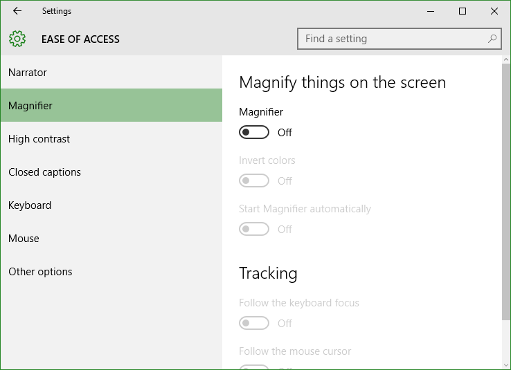
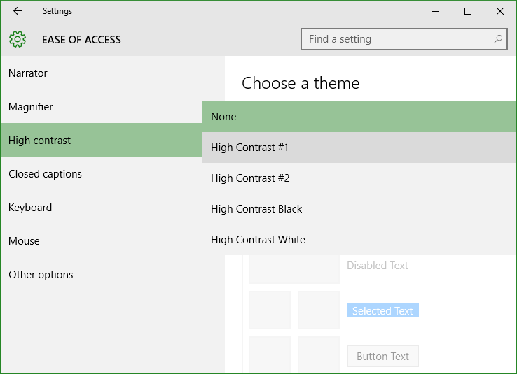
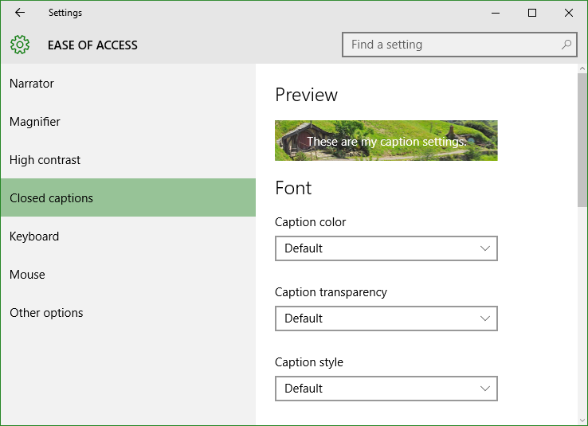
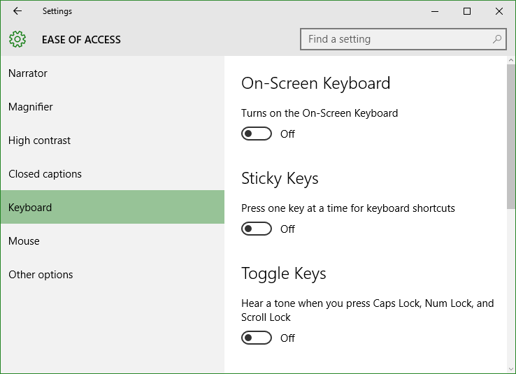
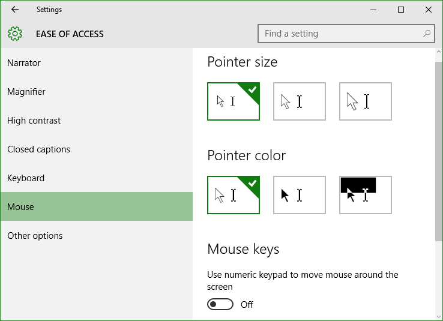
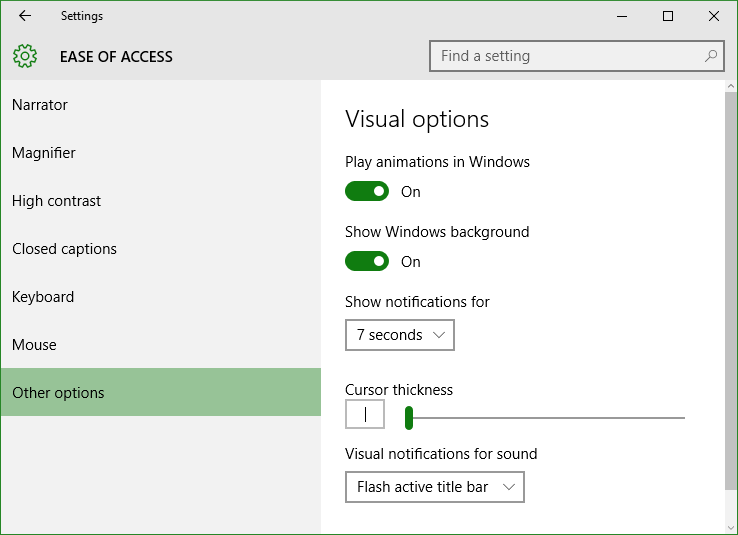

+++
title = "تعلم ويندوز 10 .. تطبيق الإعدادات: إعدادات إمكانية الوصول"
date = "2015-09-22"
description = "تحدثنا في الدرس السابق عن قسم إعدادات الوقت والتاريخ من تطبيق الإعدادات، وفى درس اليوم نتابع كشف أسرار تطبيق الإعدادات وسنتحدث عن إعدادات إمكانية الوصول في ويندوز 10"
categories = ["ويندوز",]
series = ["ويندوز 10"]
tags = ["موقع لغة العصر"]
images = ["images/2015-635785342781629133-162.png"]

+++

تحدثنا في الدرس السابق عن قسم إعدادات الوقت والتاريخ من تطبيق الإعدادات، وفى درس اليوم نتابع كشف أسرار تطبيق الإعدادات وسنتحدث عن إعدادات إمكانية الوصول في ويندوز 10.

- إمكانية الوصول هي مجموعة من الإعدادات التي تمكن ذوي الاحتياجات الخاصة وضعاف البصر من استخدام الويندوز بكفاءة أكبر.
- قم فتح تطبيق الإعدادات والدخول إلى القسم **Ease of Access**.

ستجد الإعدادات مقسمه كالتالي:

**1.** **Narrator:**

 هو المكان الذي تستطيع من خلاله التحكم في الراوي "قارئ الشاشة" بعد تفعيله ستجد العديد من الاختيارات مثل تغيير صوت النطق، تغيير السرعة والعديد من الاختيارات الأخرى كما بالصورة:

**2.** **Magnifier:**

في هذا القسم تجد الاختيار الخاص بالتحكم في تكبير حجم الشاشة، أيضا تستطيع الاختيار من الأنماط المختلفة لتكبير الشاشة (full screen, lens, docked).

**3.** **High contrast:**

بواسطة هذا القسم تستطيع استخدام التباين العالي وإعداده بما يناسب عينك، تحتاج إلى ضغط Apply لتطبيق الثيم.

**4.** **Closed captions:**

بواسطة هذا القسم تستطيع التحكم في طريقة ظهر النصوص في تطبيقات الويندوز مثل المتجر، يمكنك تغيير اللون، الشفافية، الحجم، الخلفية، لون النافذة.

**5.** **Keyboard:**

بواسطة هذا القسم تستطيع إعداد لوحة المفاتيح المرئية التي سبق شرحها هنا استخدام لوحة المفاتيح المرئية في ويندوز 10

أيضا تستطيع التحكم في إعدادات الأزرار Sticky Keys و Toggle Keys.

**6.** **Mouse:**

هنا يمكنك تغيير حجم وشكل مؤشر الفأرة كما يمكنك تشغيل خاصية Mouse keys التي تمكنك من التحكم في الماوس عن طريق لوحة المفاتيح.

**7.** **Other options:**

بواسطة هذا القسم تستطيع التحكم في إعدادات المؤثرات البصرية أتركك لتجربها، ستجدها كما بالصورة.

---
هذا الموضوع نٌشر باﻷصل على [موقع مجلة لغة العصر](http://aitmag.ahram.org.eg/News/28490/%D8%AF%D8%B1%D9%88%D8%B3/%D8%B4%D8%B1%D8%AD-%D9%88%D8%AA%D8%B9%D9%84%D9%8A%D9%85/%D8%AA%D8%B9%D9%84%D9%85-%D9%88%D9%8A%D9%86%D8%AF%D9%88%D8%B2---%D8%AA%D8%B7%D8%A8%D9%8A%D9%82-%D8%A7%D9%84%D8%A5%D8%B9%D8%AF%D8%A7%D8%AF%D8%A7%D8%AA-%D8%A5%D8%B9%D8%AF%D8%A7%D8%AF%D8%A7%D8%AA-%D8%A5%D9%85%D9%83%D8%A7%D9%86%D9%8A%D8%A9-%D8%A7%D9%84%D9%88%D8%B5.aspx).