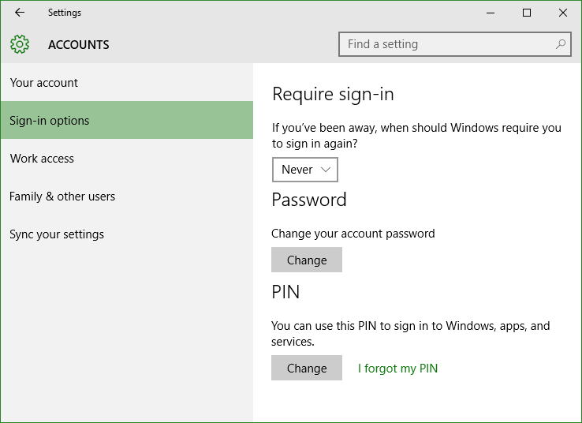
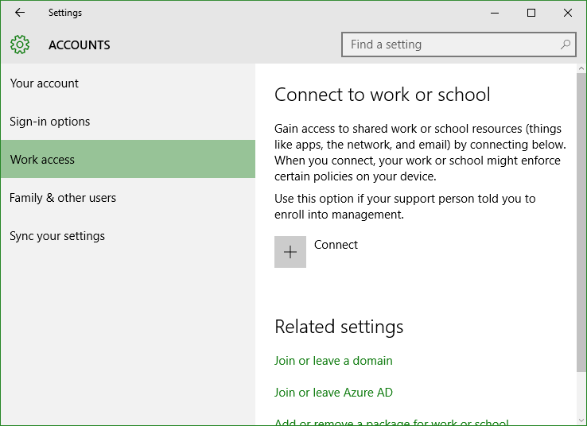
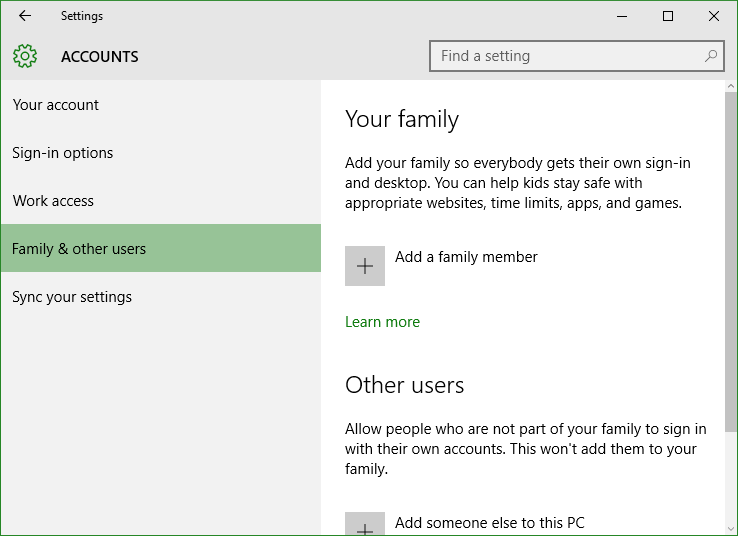
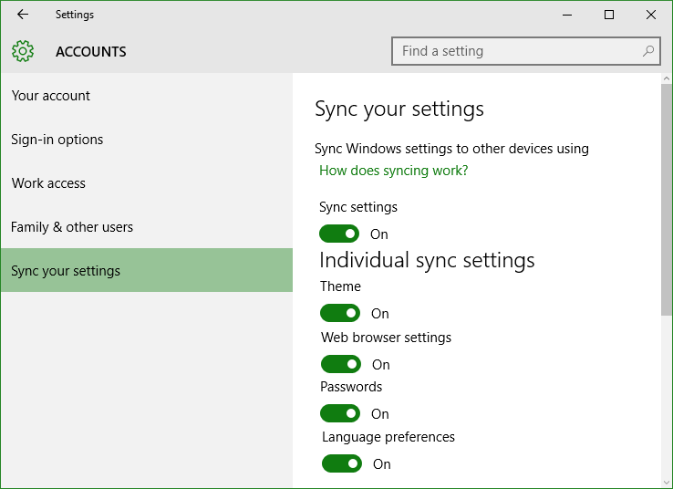

+++
title = "تعلم ويندوز 10 .. تطبيق الإعدادات: إعدادات الحسابات"
date = "2015-09-18"
description = "تحدثنا في الدرس السابق عن قسم إعدادات المظهر والتخصيص من تطبيق الإعدادات، وفى درس اليوم نتابع كشف أسرار تطبيق الإعدادات وسنتحدث عن إعدادات الحسابات في ويندوز 10"
categories = ["ويندوز",]
series = ["ويندوز 10"]
tags = ["موقع لغة العصر"]

+++

تحدثنا في الدرس السابق عن قسم إعدادات المظهر والتخصيص من تطبيق الإعدادات، وفى درس اليوم نتابع كشف أسرار تطبيق الإعدادات وسنتحدث عن إعدادات الحسابات في ويندوز 10.

-   قم فتح تطبيق الإعدادات والدخول إلى القسم **Accounts**.

ستجد الإعدادات مقسمه كالتالي:

**1.** **Your account:**

هو المكان الذي تستطيع من خلاله التحكم حسابك الذي تقوم بتسجيل الدخول من خلاله، أيضا تستطيع تغيير صورة الحساب، أو الارتباط مع حساب مايكروسوفت أو أي من خدماتها مثل الهوتميل.

**2.** **Sign-in options:**

في هذا القسم تجد الاختيار الخاص بالتحكم في أسلوب تسجيل الدخول، يمكنك تغيير كلمة السر، التسجيل باستخدام رقم PIN، صورة، أو باستخدام ميزة التعرف على الوجه Windows Hello الخاصة بأجهزة اللاب توب.

**3.** **Work access:**

بواسطة هذا القسم تستطيع الاتصال بعمل مشترك " shared work"، شبكة مدرسة أو " Azure AD".

**4.** **Family & other users:**

يتيح لك هذا القسم إضافة حسابات عائلتك فمثلا يمكنك إضافة حساب طفل ومنعه من الوصول لبعض المواقع وتحديد التطبيقات التي يستطيع الوصول إليها.

**5.** **Sync your settings:**
في هذا القسم تستطيع التحكم في إعدادات المزامنة بين أجهزتك التي تعمل بنفس حساب مايكروسوفت الخاص بك، يمكنك تشغيل أو إيقاف المزامنة أو منع بعض الإجراءات، يمكنك التعرف عليها كما بالصورة.

---

هذا الموضوع نٌشر باﻷصل على [موقع مجلة لغة العصر](http://aitmag.ahram.org.eg/News/26969/%D8%AF%D8%B1%D9%88%D8%B3/%D8%B4%D8%B1%D8%AD-%D9%88%D8%AA%D8%B9%D9%84%D9%8A%D9%85/%D8%AA%D8%B9%D9%84%D9%85-%D9%88%D9%8A%D9%86%D8%AF%D9%88%D8%B2---%D8%AA%D8%B7%D8%A8%D9%8A%D9%82-%D8%A7%D9%84%D8%A5%D8%B9%D8%AF%D8%A7%D8%AF%D8%A7%D8%AA-%D8%A5%D8%B9%D8%AF%D8%A7%D8%AF%D8%A7%D8%AA-%D8%A7%D9%84%D8%AD%D8%B3%D8%A7%D8%A8%D8%A7%D8%AA.aspx).
