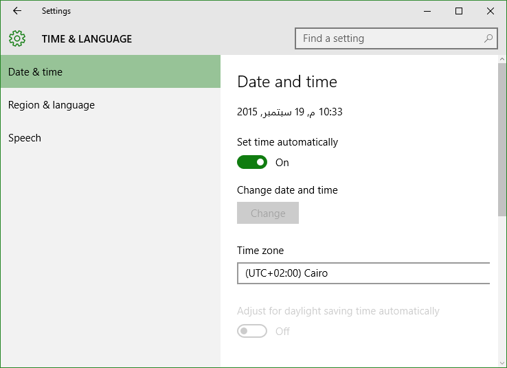
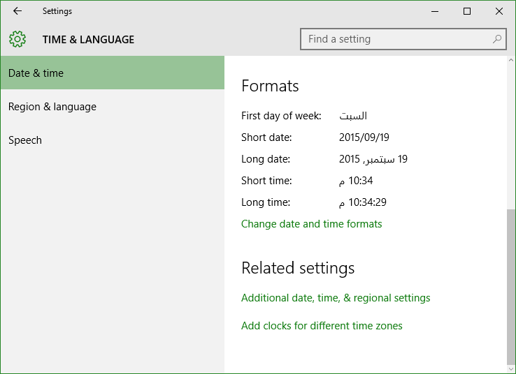
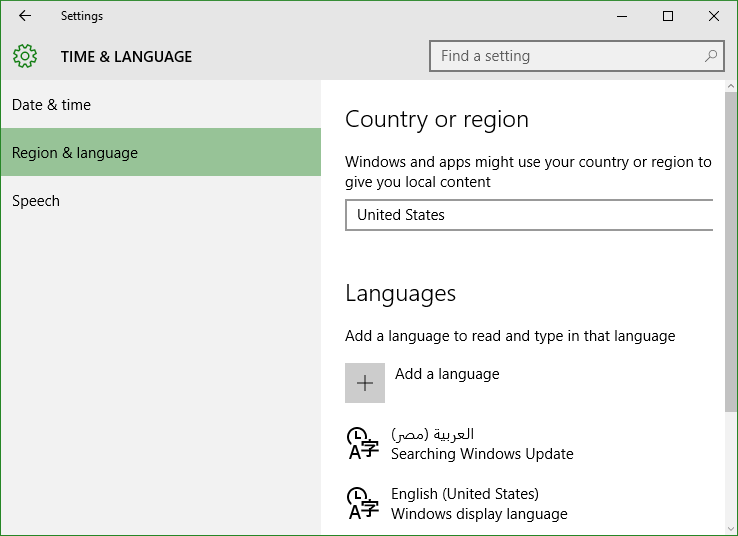
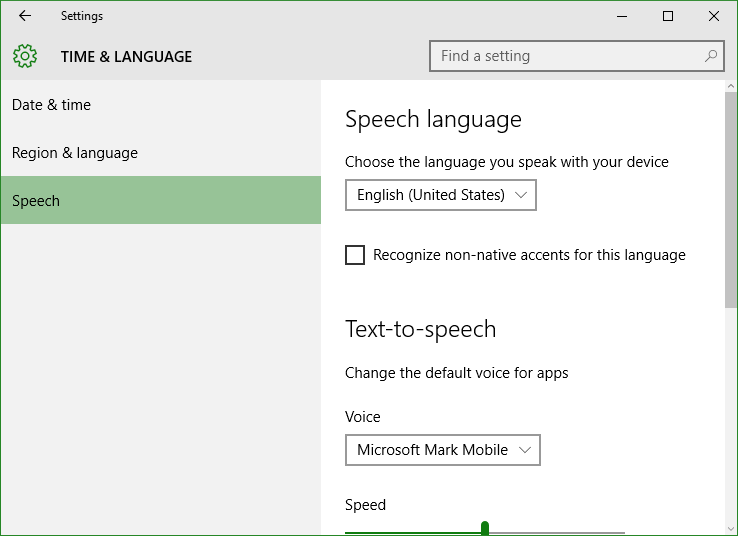

+++
title = "تعلم ويندوز 10 .. تطبيق الإعدادات: إعدادات الوقت والتاريخ"
date = "2015-09-20"
description = "تحدثنا في الدرس السابق عن قسم إعدادات الحسابات من تطبيق الإعدادات، وفى درس اليوم نتابع كشف أسرار تطبيق الإعدادات وسنتحدث عن إعدادات الوقت والتاريخ في ويندوز 10"
categories = ["ويندوز",]
series = ["ويندوز 10"]
tags = ["موقع لغة العصر"]
+++

تحدثنا في الدرس السابق عن قسم إعدادات الحسابات من تطبيق الإعدادات، وفى درس اليوم نتابع كشف أسرار تطبيق الإعدادات وسنتحدث عن إعدادات الوقت والتاريخ في ويندوز 10.

- قم فتح تطبيق الإعدادات والدخول إلى القسم **Time & language**.

ستجد الإعدادات مقسمه كالتالي:

**1.** **Date & time:**

 هو المكان الذي تستطيع من خلاله التحكم في إعدادات الوقت والتاريخ بطريقة بسيطة جدا كما بالصورة:

أيضا يمكنك الضغط على اختصار Additional date, time, & regional settings لتعديل التاريخ.

**2.** **Region & language:**

في هذا القسم تجد الاختيار الخاص بالتحكم في الموقع الجغرافي لك، أيضا إضافة اللغات المختلفة وتغيير واجهة الويندوز.

**3.** **Speech:**

بواسطة هذا القسم تستطيع إعداد خاصية النطق المتعلقة ب الراوي Narrator مثل اللغة وسرعة النطق.

---
هذا الموضوع نٌشر باﻷصل على [موقع مجلة لغة العصر](http://aitmag.ahram.org.eg/News/25477/%D8%AF%D8%B1%D9%88%D8%B3/%D8%B4%D8%B1%D8%AD-%D9%88%D8%AA%D8%B9%D9%84%D9%8A%D9%85/%D8%AA%D8%B9%D9%84%D9%85-%D9%88%D9%8A%D9%86%D8%AF%D9%88%D8%B2---%D8%AA%D8%B7%D8%A8%D9%8A%D9%82-%D8%A7%D9%84%D8%A5%D8%B9%D8%AF%D8%A7%D8%AF%D8%A7%D8%AA-%D8%A5%D8%B9%D8%AF%D8%A7%D8%AF%D8%A7%D8%AA-%D8%A7%D9%84%D8%AA%D8%AE%D8%B5%D9%8A%D8%B5.aspx).

