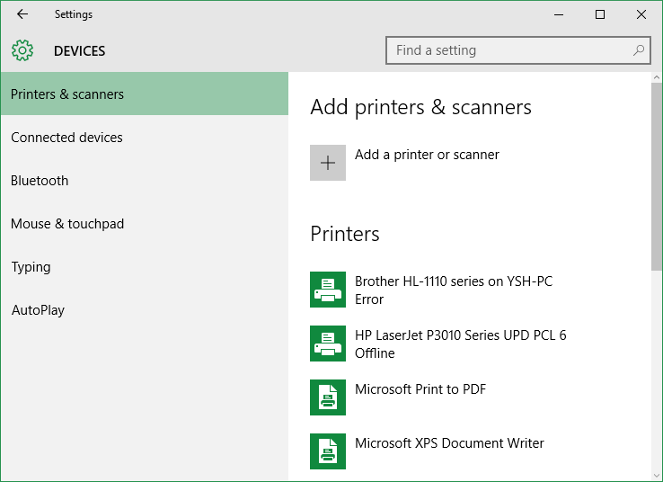
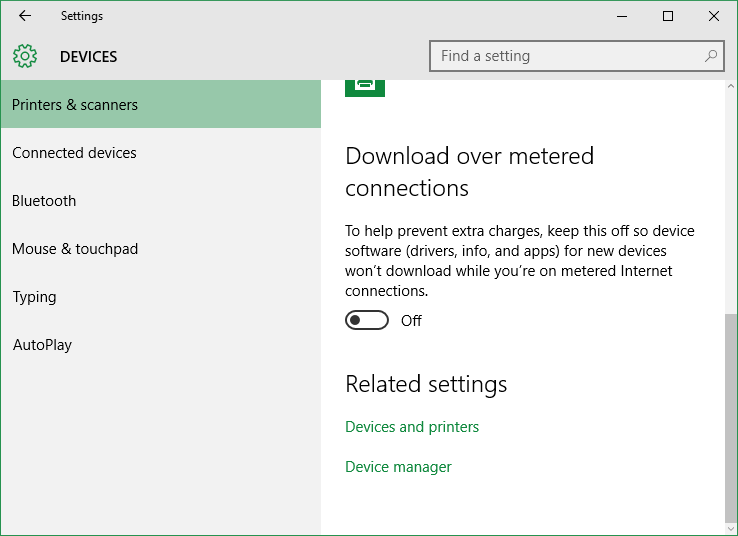
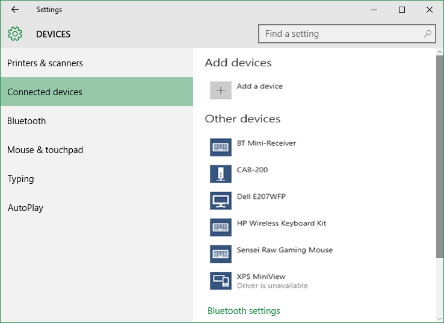
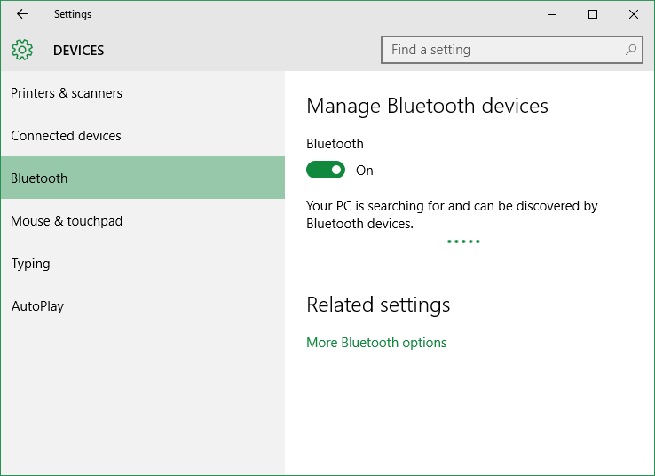
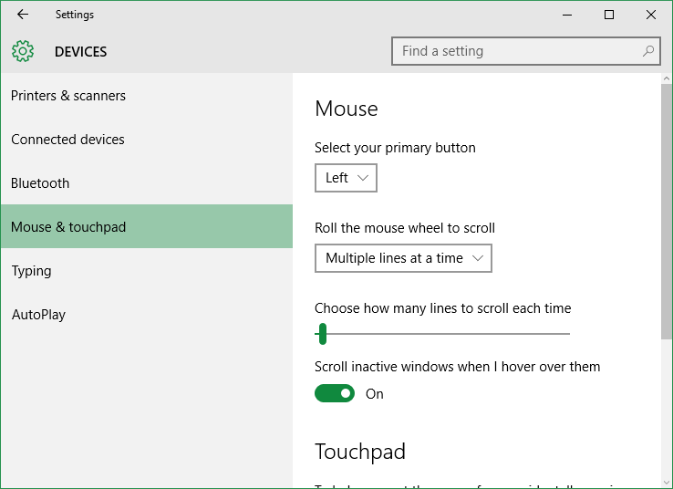
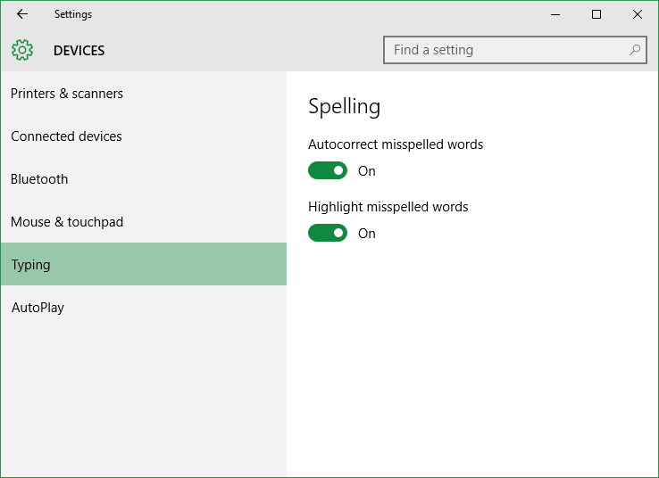
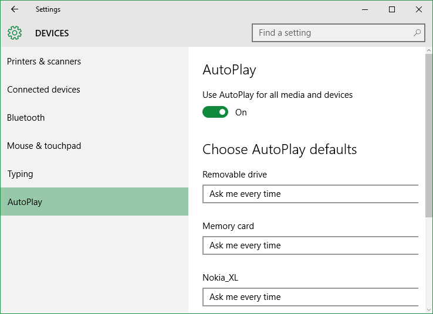

+++
title = "تعلم ويندوز 10 .. تطبيق الإعدادات: إعدادات الأجهزة"
date = "2015-09-09"
description = "تحدثنا في الدرس السابق عن قسم إعدادات النظام من تطبيق الإعدادات، وفى درس اليوم نتابع كشف أسرار تطبيق الإعدادات وسنتحدث عن إعدادات الأجهزة Device Settings في ويندوز 10"
categories = ["ويندوز",]
series = ["ويندوز 10"]
tags = ["موقع لغة العصر"]

+++

تحدثنا في الدرس السابق عن قسم إعدادات النظام من تطبيق الإعدادات، وفى درس اليوم نتابع كشف أسرار تطبيق الإعدادات وسنتحدث عن إعدادات الأجهزة Device Settings في ويندوز 10.

لتحقيق أقصى استفادة من هذا الدرس، أقترح عليك عزيزي القارئ مشاهدة الدرسين السابقين وهما:

تعلم ويندوز 10 ..كل طرق تشغيل تطبيق الإعدادات" و "تعلم ويندوز 10 .. تطبيق الإعدادات: إعدادات النظام".

قم فتح تطبيق الإعدادات والدخول إلى القسم Devices.

ستجد الإعدادات مقسمه كالتالي:
**1.** **Printers & scanners:**
من خلالها يمكنك التحكم في أجهزة الطابعات المتصلة بجهازك كما يمكنك إصافة أجهزة جديدة عن طريق Add a printer or scanner.

الإعدادات المتقدمة هنا هي:

-   Download over metered connections: هو الاختيار الخاص بتفعيل تحميل تعريفات الأجهزة حتى لو كان اتصال الانترنت الحالي مقيد بحدود.
-   Devices and printers: اختصار يقوم بفتح إعدادات الأجهزة في لوحة التحكم Control Panel.
-   Device manager: اختصار يقوم بفتح مدير الأجهزة.

**2.** **Connected devices:**
في هذا القسم تجد جميع الأجهزة المتصلة بجهازك مثل لوحة المفاتيح اللاسلكية، شاشة خارجية، إلخ.
التعامل معها مثل القسم السابق لا يوجد اختلاف

**3.** **Bluetooth:**
بواسطة هذا القسم تستطيع إدارة التعامل مع البلوتوث كما لو كنت تتعامل مع هاتفك، يمكنك التحكم في الأجهزة المقترنة، إمكانية ظهر الجهاز والعديد من الاختيارات الأخرى.

**4.** **Mouse & touchpad:**
يتيح لك هذا القسم التحكم في الفأرة أو لوحة اللمس، يمكنك تغيير الزر الرئيسي للفأرة، أسلوب التمرير بين السطور، مقدار التمرير.

**5.** **Typing:**
الاختيار autocorrect misspelled words: هو الخاص بتفعيل التصحيح التلقائي للكلمات الناقصة.
الاختيار highlighting misspelled words: هو الخاص بتفعيل تحديد الكلمات الناقصة.

**6.** **AutoPlay:**
وهو المكان الخاص بالتحكم في إجراءات التشغيل التلقائي لوسائط القابلة للإزالة مثل بطاقات الذاكرة، الاسطوانات، وأجهزة الهواتف المحمولة.

---

هذا الموضوع نٌشر باﻷصل على موقع مجلة لغة العصر.

http://aitmag.ahram.org.eg/News/24746/%D8%AF%D8%B1%D9%88%D8%B3/%D8%B4%D8%B1%D8%AD-%D9%88%D8%AA%D8%B9%D9%84%D9%8A%D9%85/%D8%AA%D8%B9%D9%84%D9%85-%D9%88%D9%8A%D9%86%D8%AF%D9%88%D8%B2---%D8%AA%D8%B7%D8%A8%D9%8A%D9%82-%D8%A7%D9%84%D8%A5%D8%B9%D8%AF%D8%A7%D8%AF%D8%A7%D8%AA-%D8%A5%D8%B9%D8%AF%D8%A7%D8%AF%D8%A7%D8%AA-%D8%A7%D9%84%D8%A3%D8%AC%D9%87%D8%B2%D8%A9.aspx
