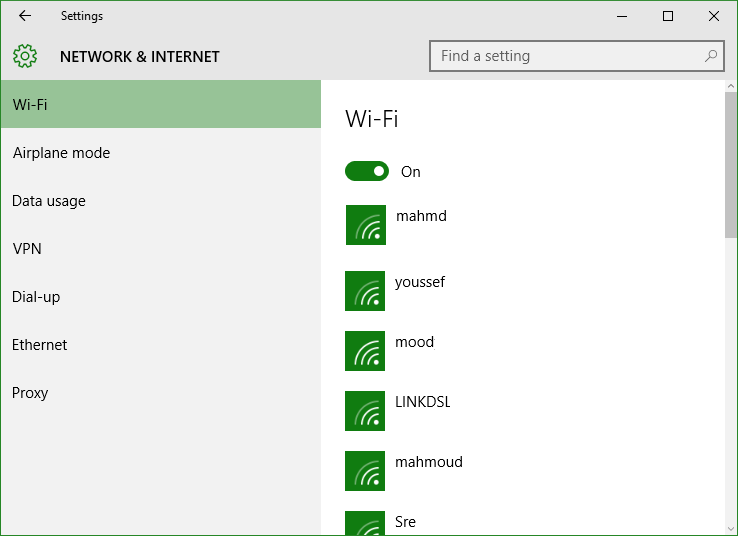
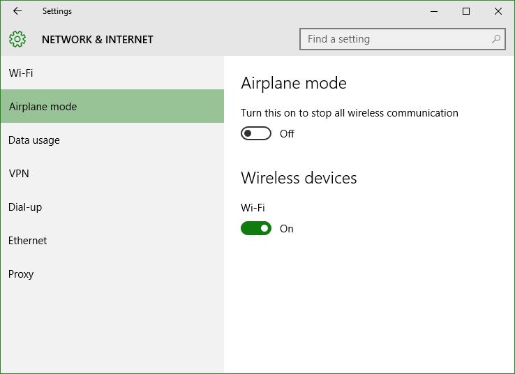
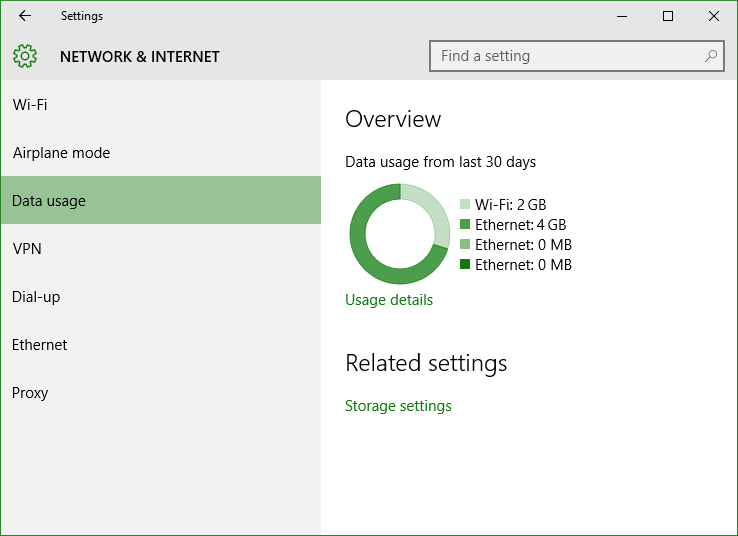
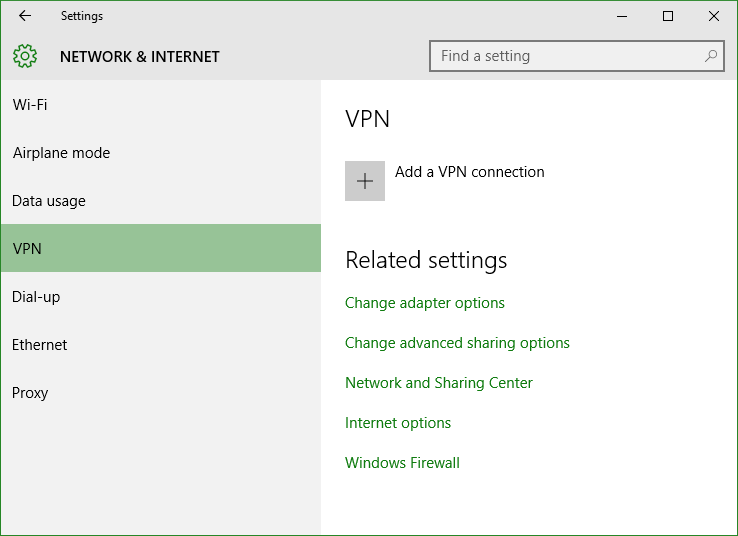
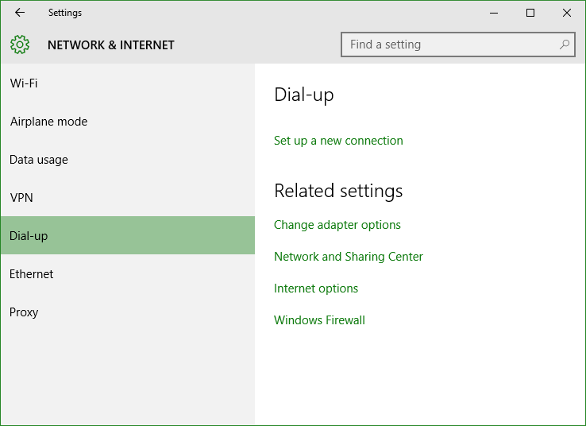
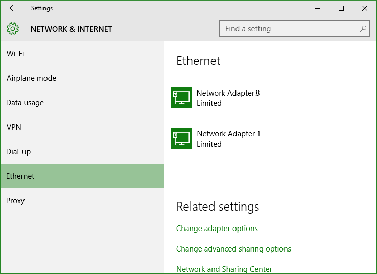
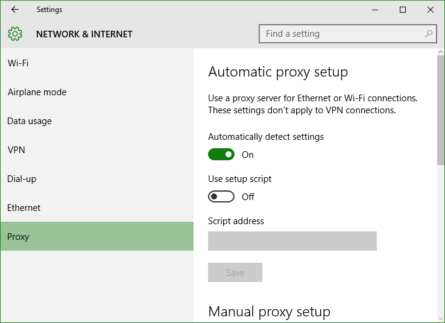

+++
title = "تعلم ويندوز 10 .. تطبيق الإعدادات: إعدادات الشبكات والإنترنت"
date = "2015-09-13"
description = "تحدثنا في الدرس السابق عن قسم إعدادات الأجهزة من تطبيق الإعدادات، وفى درس اليوم نتابع كشف أسرار تطبيق الإعدادات وسنتحدث عن إعدادات الشبكات والإنترنت في ويندوز 10"
categories = ["ويندوز",]
series = ["ويندوز 10"]
tags = ["موقع لغة العصر"]
images = ["images/2015-635777482994023043-402.png"]

+++

 تحدثنا في الدرس السابق عن قسم إعدادات الأجهزة من تطبيق الإعدادات، وفى درس اليوم نتابع كشف أسرار تطبيق الإعدادات وسنتحدث عن إعدادات الشبكات والإنترنت في ويندوز 10.

ولتحقيق أقصى استفادة من هذا الدرس، أقترح عليك عزيزي القارئ مشاهدة الدروس السابقة:

تعلم ويندوز 10 ..كل طرق تشغيل تطبيق الإعدادات" و " تعلم ويندوز 10 .. تطبيق الإعدادات: إعدادات النظام " و " تعلم ويندوز 10 .. تطبيق الإعدادات: إعدادات الأجهزة".

- قم فتح تطبيق الإعدادات والدخول إلى القسم Network & Internet.

ستجد الإعدادات مقسمه كالتالي:

**1. Wi-Fi:**
 من خلالها يمكنك التحكم في تشغيل أو إيقاف ال Wi-Fi، كما يمكنك رؤية الشبكات المتاحة والاتصال بها.

الإعدادات المتقدمة Advanced options يمكنك من خلالها التحكم في إيجاد الأجهزة عبر الشبكة الحالية أو تحديد الشبكة كـ (شبكة محددة بمدى بيانات معين).

**2. Airplane Mode:**
في هذا القسم تجد الاختيار الخاص بتفعيل وضع الطيران وإيقاف كافة الاتصالات اللاسلكية.

**3. Data usage:**
بواسطة هذا القسم الجديد تستطيع التعرف على استهلاكك من البيانات على كل من اتصال ال Ethernet وال Wi-Fi.

كما يمكنك الضغط على نوع الاتصال للحصول على مزيد من التفاصيل حول استهلاك كل برنامج منفصلا.

**4. VPN:**
يتيح لك هذا القسم التحكم في الشبكات الافتراضية Virtual Private Network، تستطيع إنشاء اتصال جديد وتغيير نوعه والعديد من الاختيارات الأخرى.

**5. Dial-up:**
في هذا القسم تستطيع إضافة اتصال Dial-up بالطريقة التقليدية.

**6. Ethernet:**
وهو المكان الخاص بالتحكم في الانترنت عن طريق كبل الـ Ethernet ستجد الكارت الخاص بك، والإعدادات الخاصة بالإنترنت على شكل روابط تذهب بك إلى Network and Sharing Center.

**7. Proxy:**
وهو المكان الخاص بالتحكم في البروكسى، إذا كان الانترنت لديك يستلزم بروكسى لتشغيله.

---
هذا الموضوع نٌشر باﻷصل على [موقع مجلة لغة العصر](http://aitmag.ahram.org.eg/News/25228/%D8%AF%D8%B1%D9%88%D8%B3/%D8%B4%D8%B1%D8%AD-%D9%88%D8%AA%D8%B9%D9%84%D9%8A%D9%85/%D8%AA%D8%B9%D9%84%D9%85-%D9%88%D9%8A%D9%86%D8%AF%D9%88%D8%B2---%D8%AA%D8%B7%D8%A8%D9%8A%D9%82-%D8%A7%D9%84%D8%A5%D8%B9%D8%AF%D8%A7%D8%AF%D8%A7%D8%AA-%D8%A5%D8%B9%D8%AF%D8%A7%D8%AF%D8%A7%D8%AA-%D8%A7%D9%84%D8%B4%D8%A8%D9%83%D8%A7%D8%AA-%D9%88%D8%A7%D9%84%D8%A5.aspx).

