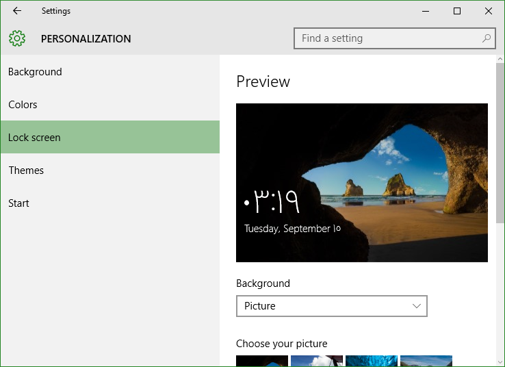

+++
title = "تعلم ويندوز 10 .. تطبيق الإعدادات: إعدادات التخصيص"
date = "2015-09-15"
description = "تحدثنا في الدرس السابق عن قسم إعدادات الانترنت من تطبيق الإعدادات، وفى درس اليوم نتابع كشف أسرار تطبيق الإعدادات وسنتحدث عن إعدادات المظهر والتخصيص في ويندوز 10"
categories = ["مهارات رقمية",]
tags = ["موقع لغة العصر"]
+++

تحدثنا في الدرس السابق عن قسم إعدادات الانترنت من تطبيق الإعدادات، وفى درس اليوم نتابع كشف أسرار تطبيق الإعدادات وسنتحدث عن إعدادات المظهر والتخصيص في ويندوز 10.

-   قم فتح تطبيق الإعدادات والدخول إلى القسم Personalization.

ستجد الإعدادات مقسمه كالتالي:

**1.** **Background:**

من خلالها يمكنك التحكم في خلفية سطح المكتب، تستطيع اختيار خلفية من خليفات النظام أو من على جهازك بالضغط على Browse، كما تستطيع اختيار نوع الخلفية (photo، slideshow، Solid color)، أيضا يمكنك اختيار محاذاة الصورة مع الشاشة (fill، fit، stretch، tile، center، وspan).

**2.** **Colors:\***

في هذا القسم تجد الاختيار الخاص بالتحكم في ألوان النظام، وقد سبق التحدث عنه في هذا الدرس طريقة التحكم في مظهر قائمة البداية في ويندوز 10.

**3.** **Lock screen:**

بواسطة هذا القسم تستطيع التحكم في شاشة القفل، تغيير خلفياتها والتحكم في التطبيقات التي تظهر عليها.

في الاختيارات الأخرى تجد اختصار Screen saver settings للتحكم في شاشة التوقف، سبق شرحه هنا إعدادات شاشة التوقف Screen Saver في ويندوز 10.

**4.** **Themes:**

يتيح لك هذا القسم التحكم في المظهر والثيمات الخاصة بالويندوز، كما يوفر اختصارات لتغيير اعدادات الصوت، أيقونات سطح المكتب، وإعدادات الفأرة (الماوس).

**5.** **Start:**

في هذا القسم تستطيع التحكم في قائمة البداية، وقد سبق تناوله في العديد من الموضوعات:

-   حذف قائمة Most Used من قائمة البداية في ويندوز 10
-   حذف قائمة Recently Added من قائمة البداية في ويندوز 10

-   طريقة التحكم في مظهر قائمة البداية في ويندوز 10.

---

هذا الموضوع نٌشر باﻷصل على [موقع مجلة لغة العصر](http://aitmag.ahram.org.eg/News/25477/%D8%AF%D8%B1%D9%88%D8%B3/%D8%B4%D8%B1%D8%AD-%D9%88%D8%AA%D8%B9%D9%84%D9%8A%D9%85/%D8%AA%D8%B9%D9%84%D9%85-%D9%88%D9%8A%D9%86%D8%AF%D9%88%D8%B2---%D8%AA%D8%B7%D8%A8%D9%8A%D9%82-%D8%A7%D9%84%D8%A5%D8%B9%D8%AF%D8%A7%D8%AF%D8%A7%D8%AA-%D8%A5%D8%B9%D8%AF%D8%A7%D8%AF%D8%A7%D8%AA-%D8%A7%D9%84%D8%AA%D8%AE%D8%B5%D9%8A%D8%B5.aspx).
