+++
title = "تعلم ويندوز 10 .. تطبيق الإعدادات: إعدادات الخصوصية"
date = "2015-09-26"
description = "تحدثنا في الدرس السابق عن قسم إعدادات إمكانية الوصول من تطبيق الإعدادات، وفى درس اليوم ننتقل إلى أهم جزء من تطبيق الإعدادات وسنتحدث عن إعدادات الخصوصية في ويندوز 10"
categories = ["ويندوز",]
series = ["ويندوز 10"]
tags = ["موقع لغة العصر"]
images = ["images/2015-635788749262055390-205.png"]
+++

تحدثنا في الدرس السابق عن قسم إعدادات إمكانية الوصول من تطبيق الإعدادات، وفى درس اليوم ننتقل إلى أهم جزء من تطبيق الإعدادات وسنتحدث عن إعدادات الخصوصية في ويندوز 10.

- في إعدادات الخصوصية ستتمكن عزيزي القارئ من التحكم في كل البيانات الصادرة من جهازك، كما ستتمكن من إيقاف تشغيل بعض المكونات مثل الكاميرا لمنع التطبيقات من استخدامها.
- قم فتح تطبيق الإعدادات والدخول إلى القسم**Privacy** .

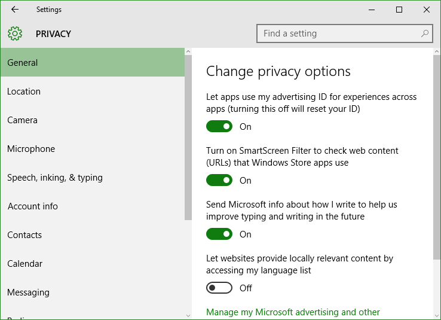

ستجد الإعدادات مقسمه كالتالي:

**1.** **General:**

 القسم الأول من إعدادات الخصوصية ومن خلاله تستطيع التحكم في الإعدادات العامة للخصوصية مثل "إغلاق المعرف الإعلاني لحسابك"، "منع مايكروسوفت من معرفة كيف تكتب".

**الإعدادات الموصي بها:** قم بتفعيل الاختيار الثاني فقط "Turn on SmartScreen Filter".

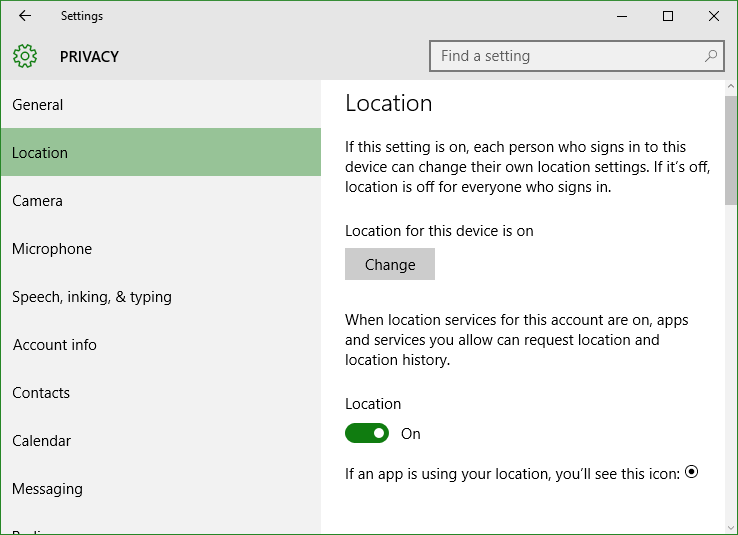

**2.** **Location:**

في هذا القسم تجد الاختيار الخاص بالتحكم في تخزين الموقع الجغرافي لجهازك، **يفضل أن يكون مغلقا** ولكن إذا كنت من مستخدمي المساعدة الصوتية Cortana تحتاج إلى تشغيل الموقع الجغرافي كما سبق وذكرت هذا الموضوع هنا "تفعيل المساعدة الصوتية Cortana على ويندوز 10 في أي مكان في العالم"

قم بالنزول إلى الأسفل ستجد Choose Apps that can use your location:

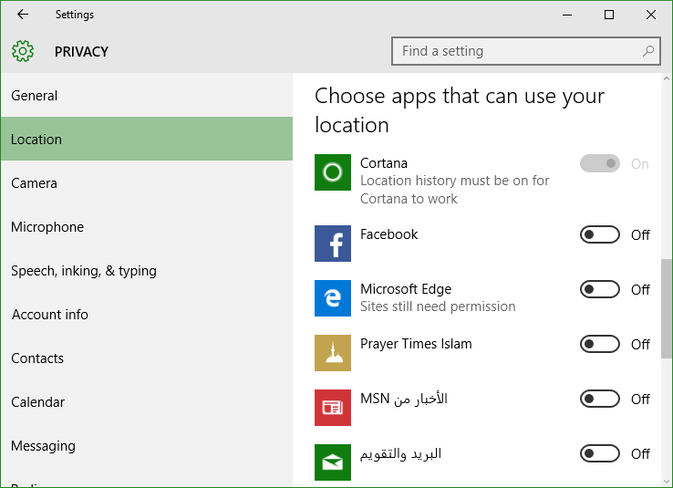

**الإعدادات الموصي بها:** قم بتفعيل ما ترى أنه يحتاج الموقع الجغرافي فعلا مثل تطبيق الطقس ما عدا ذلك قم بإيقافه للحفاظ على خصوصيتك.

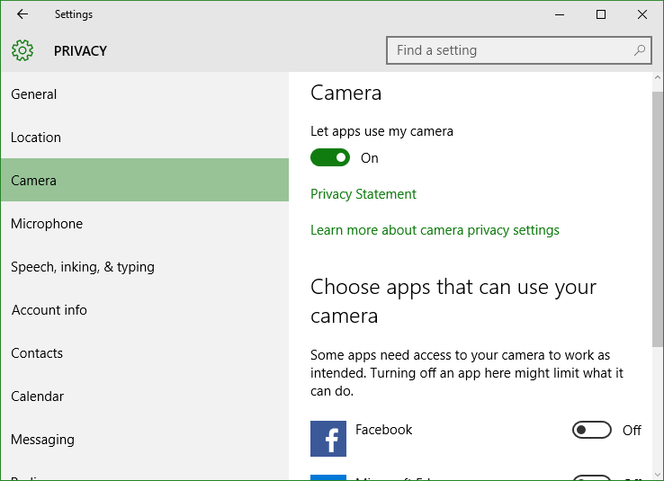

**3.** **Camera:**

بواسطة هذا القسم تستطيع التحكم في التطبيقات التي يمكنها استخدام الكاميرا، كما يمكنك تعطيل الكاميرا من العمل مع كل التطبيقات عن طريق إيقاف تشغيل الاختيار " Choose Apps that can use your camera".

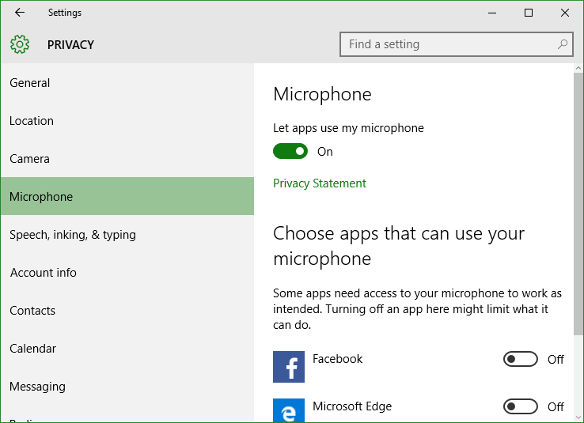

**4.** **Microphone:**

بواسطة هذا القسم تستطيع التحكم الميكروفون بنفس طريقة التحكم بالكاميرا.

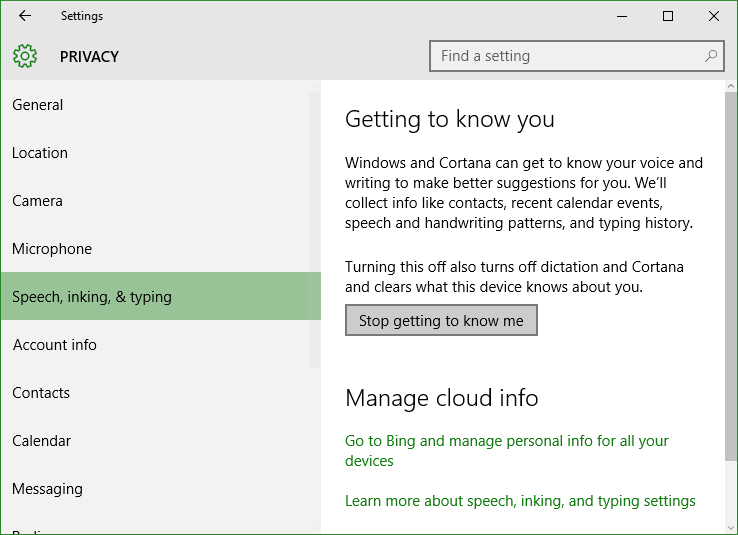

**5.** **Speech, inking, & typing:**

بواسطة هذا القسم تستطيع منع مايكروسفت من التعرف عليك وعلى أسلوب كتابتك بالضغط على "**Stop getting to know me"**.

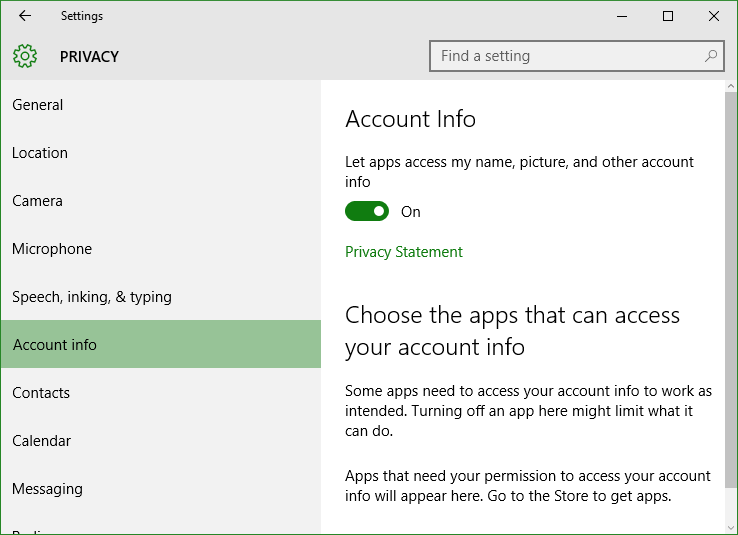

**6-10.** **Account info-Contacts-Calendar-Messaging-Radios:**

كل هذه الأقسام يمكنك التحكم فيها بنفس طريقة الكاميرا والميكروفون، قسم Account info هو الخاص بمعلومات حساب مايكروسوفت-قسم Contacts الخاص بالتحكم في جهات الاتصال، Calendar الخاص بالتحكم في التقويم-Messaging الخاص بالتحكم في الرسائل-Radios الخاص بالتحكم في الاتصالات اللاسلكية (الواى فاى والبلوتوث...الخ).

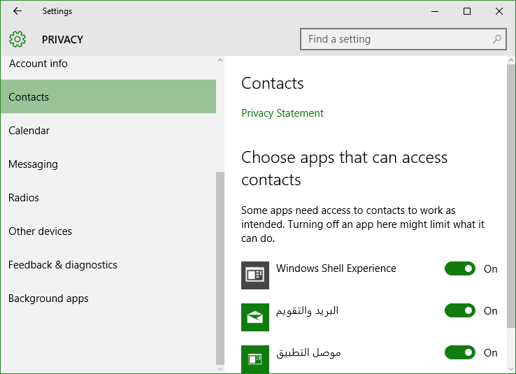

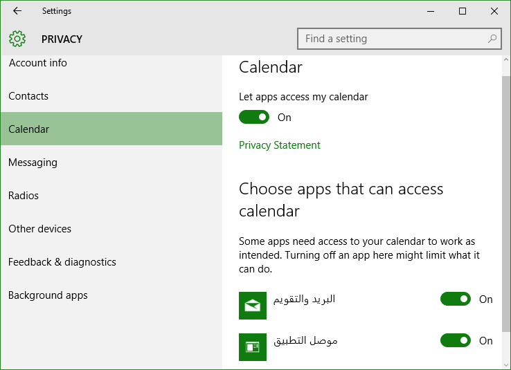

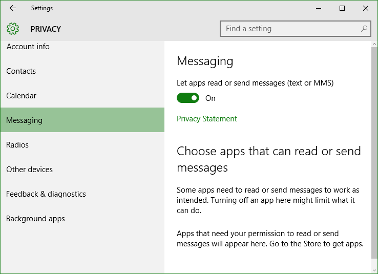

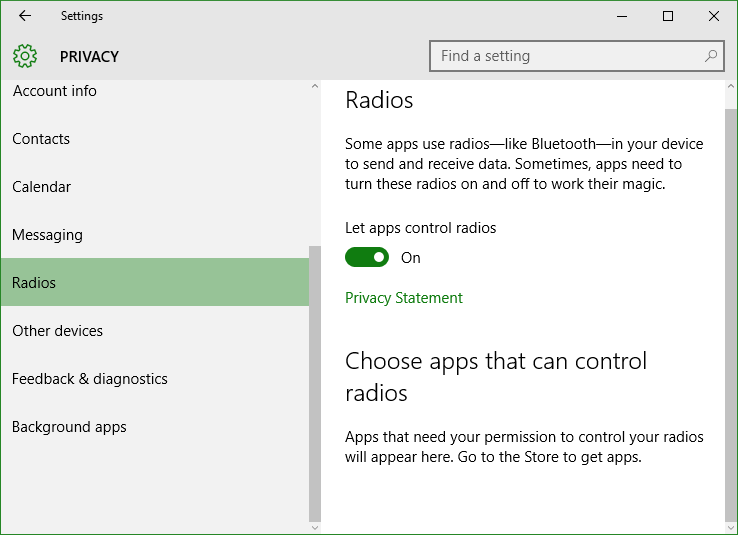

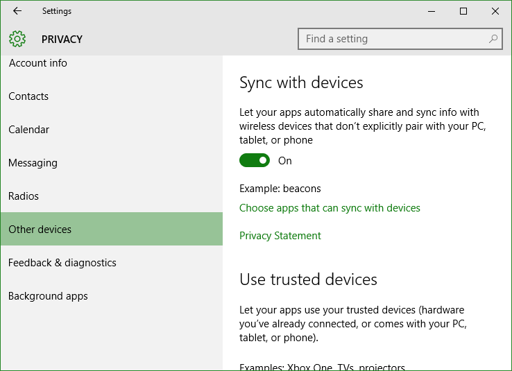

**11.** **Other devices:**

هنا يمكنك تغيير إعدادات السماح للمزامنة مع الأجهزة اللاسلكية مثل الهواتف المحمولة، التابلت، Xbox One.

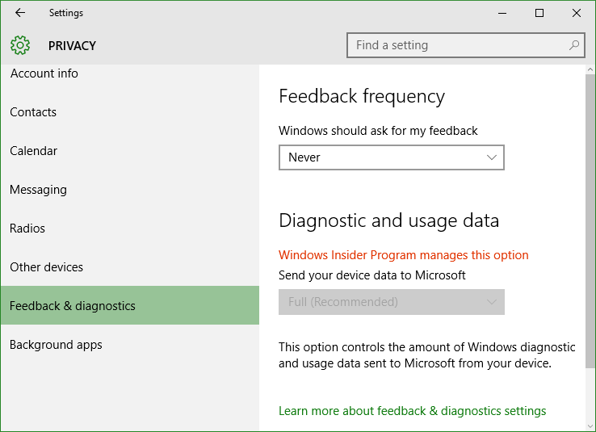

**12.** **Feedback:**

هنا يمكنك تغيير إعدادات الـ Feedback الخاص بالويندوز.

**الإعدادات الموصي بها:** قم بتغيير الاختيار Windows should ask for my feedback إلى **Never.**

أيضا قم بتغيير Send your device data to Microsoft إلى **Basic**.

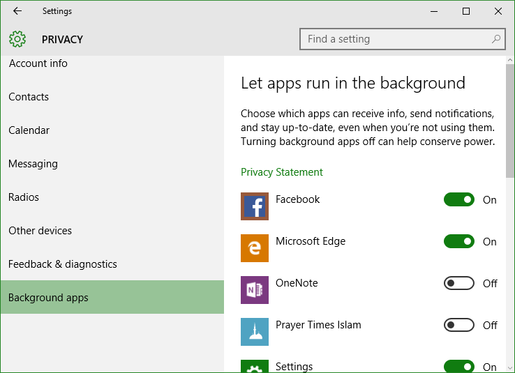

**13.** **Background apps:**

هنا يمكنك التحكم في التطبيقات التي تعمل في الخلفية حتى لو كانت مغلقة.

**الإعدادات الموصي بها:** بالتأكيد كلما قل عدد التطبيقات التي تعمل بالخلفية كلما زاد أداء الجهاز.

---
هذا الموضوع نٌشر باﻷصل على موقع مجلة لغة العصر.

http://aitmag.ahram.org.eg/News/28943.aspx