+++
title = "تعلم ويندوز 10 .. تطبيق الإعدادات: إعدادات النظام"
date = "2015-09-06"
description = "تحدثنا في الدرس السابق عن كل طرق تشغيل تطبيق الإعدادات، وفى درس اليوم نتابع استكشاف تطبيق الإعدادات وسنتحدث عن قسم إعدادات النظام System Settings في ويندوز 10"
categories = ["ويندوز",]
series = ["ويندوز 10"]
tags = ["موقع لغة العصر"]

+++

تحدثنا في الدرس السابق عن كل طرق تشغيل تطبيق الإعدادات، وفى درس اليوم نتابع استكشاف تطبيق الإعدادات وسنتحدث عن قسم إعدادات النظام System Settings في ويندوز 10.
بعد تشغيل تطبيق الإعدادات باستخدام أي من الطرق التي سبق ذكرها في درسكل طرق تشغيل تطبيق الإعدادات، اضغط على System كما بالصورة:

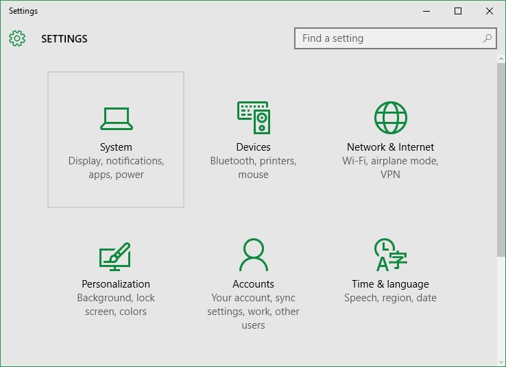

ستجد الإعدادات مقسمه كالتالي:

**1.** **Display:**

 من خلالها يمكنك التحكم في أبعاد الشاشة، مستوى الإضاءة والتعرف على معلومات عن كارت الشاشة الخاص بجهازك.
للمزيد راجع هذا الدرس: "طريقة تغيير أبعاد الشاشة في ويندوز 10".

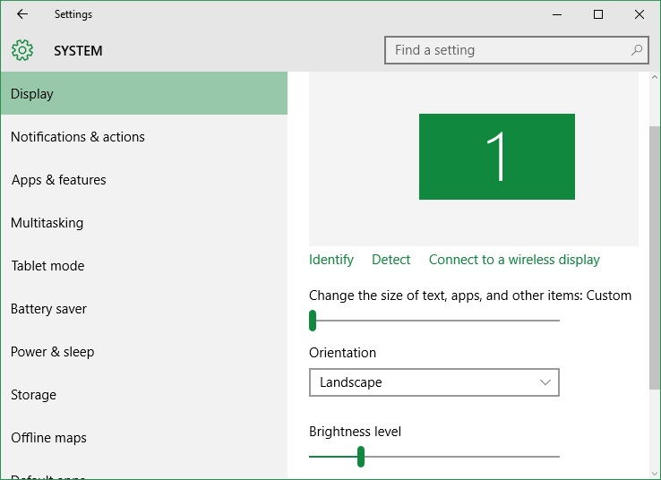

**2.** **Notification & actions:**

يمكنك من خلالها التحكم في وصول الإشعارات وتشغيلها أو إغلاقها لتطبيقات معينة.

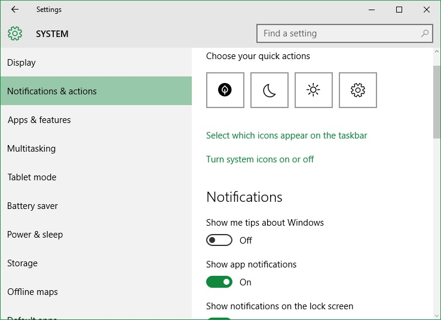

**3.** **Apps & features:**
بواسطة هذا القسم تستطيع إدارة جميع التطبيقات والبرامج التي قمت بتثبيتها على جهازك كما تستطيع أيضا نقل التطبيقات إلى أماكن أخرى.

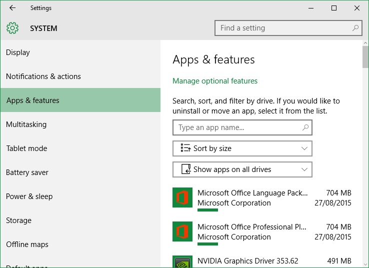

**4.** **Multitasking:**
يتيح لك هذا القسم التحكم في إعدادات التنقل بين أسطح المكتب، وترتيب النوافذ المفتوحة في Task View.

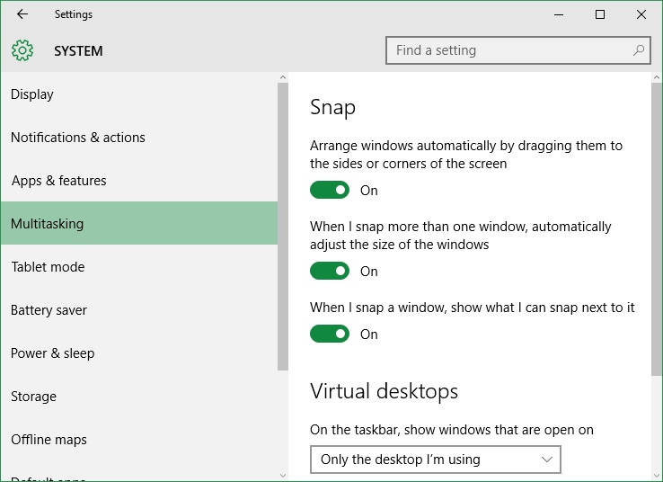

**5.** **Tablet Mode:**
من خلال هذا القسم تستطيع التحكم في وضع التابلت الذي سبق شرحه بالتفصيل في درس تعرف على Tablet Mode في ويندوز 10 ودرس الإعدادات المتقدمة لوضع التابلت في ويندوز 10.

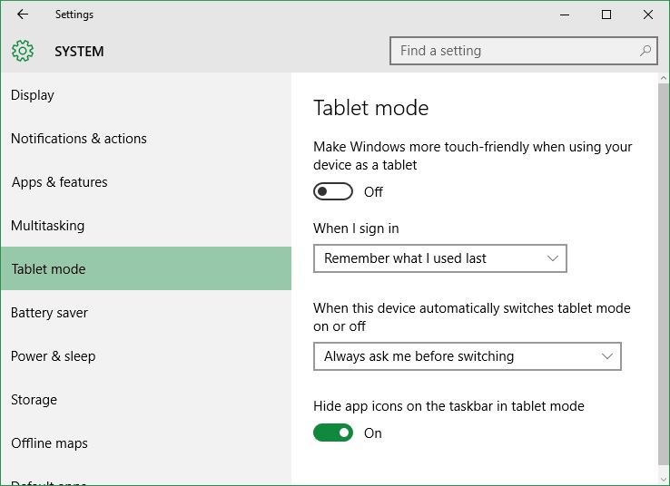

**6.** **Battery Saver:**
وهو المكان الخاص بالتحكم في وضع توفير الطاقة، سبق شرحه في هذا الدرس
"بالفيديو.. تعرف على وضع توفير الطاقة في ويندوز 10"

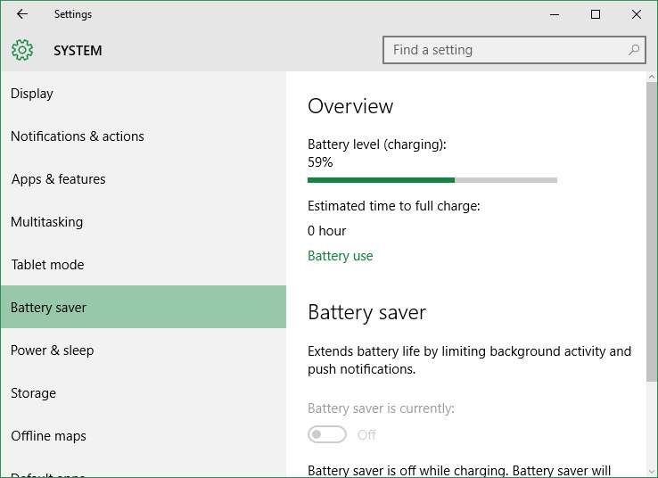

**7.** **Power & Sleep:**

من خلال هذا القسم تستطيع التحكم في إعدادات الطاقة وإغلاق الشاشة بعد مدة محددة أو تطبيق وضع Sleep بعد وقت محدد.
للمزيد تابع هذا الدرس "كيفية التحكم في وضع " Sleeping mode "

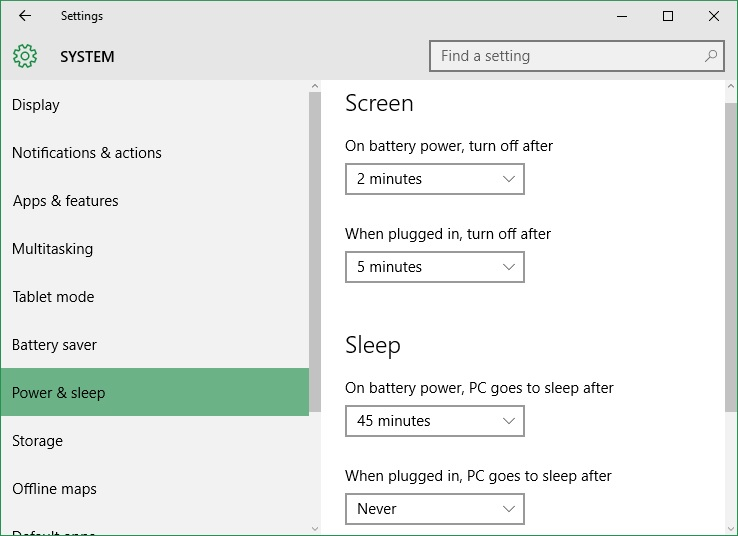

**8.** **Storage:**

هنا يمكنك التعرف على مساحة كل أقسام القرص الصلب الخاص بك، كما يمكنك أيضا الدخول إلى أي قسم لمعرفة تفاصيل المساحة، الجدير بالذكر هنا هو أنه يمكنك الدخول إلى القسم C وحذف الملفات المؤقتة Temporary Files بضغطة زر.

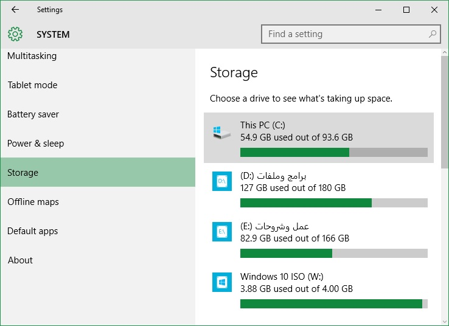

**9.** **Offline Maps**
هذه الميزة الجديدة في ويندوز 10 يمكنك من خلالها تحميل أي خريطة لأي مكان في العالم.

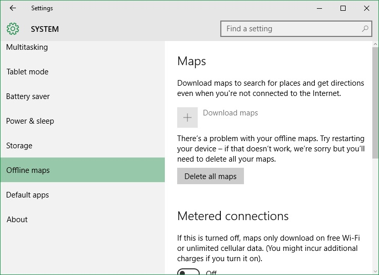

**10.** **Default apps:**

سبق شرح هذا الجزء الخاص ب تعديل التطبيقات الافتراضية في ويندوز 10 هنا "بالصور | كيفية تغيير واختيار التطبيقات الافتراضية في ويندوز 10".

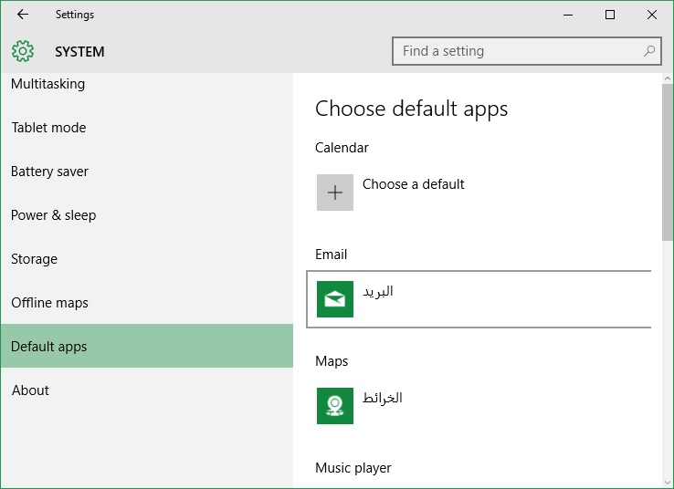

**11.** **About:**

في هذا الجزء تظهر لنا جميع المعلومات الخاصة بجهازك مثل اصدار الويندوز، معلومات الرام والمزيد.

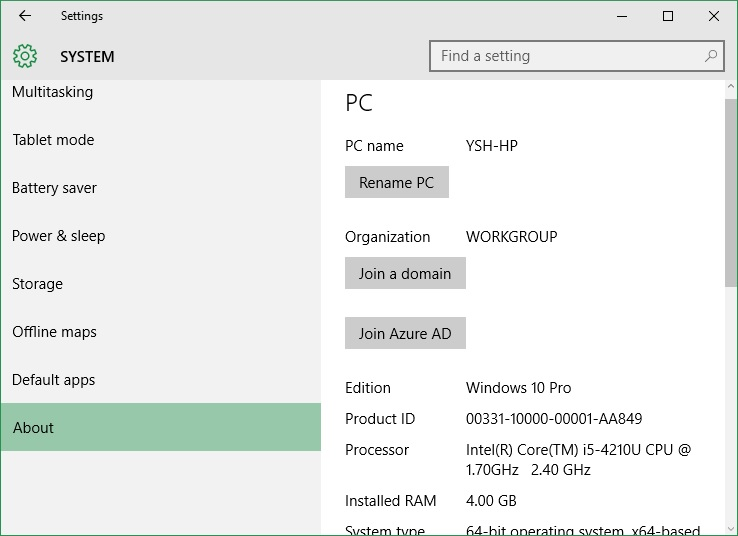

---
هذا الموضوع نٌشر باﻷصل على موقع مجلة لغة العصر.

http://aitmag.ahram.org.eg/News/24035.aspx