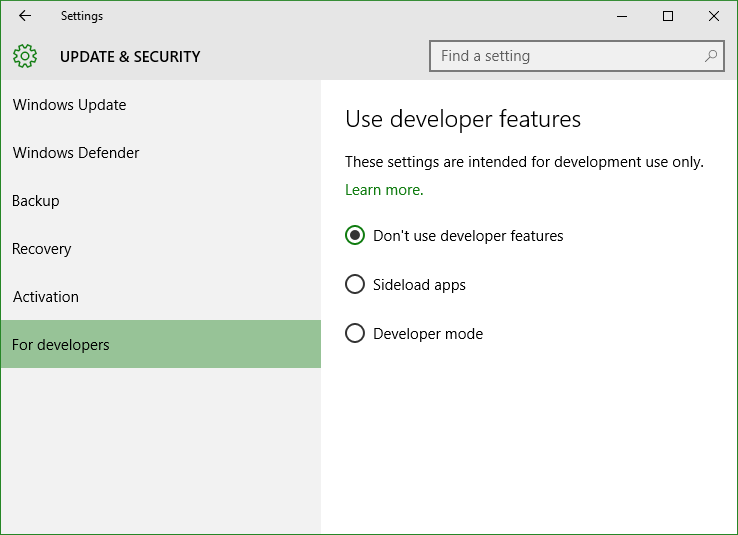

+++
title = "تعلم ويندوز 10 .. تطبيق الإعدادات: إعدادات التحديثات والأمان"
date = "2015-09-30"
description = "تحدثنا في الدرس السابق عن قسم إعدادات الخصوصية من تطبيق الإعدادات، وفى درس اليوم ننتقل إلى آخر جزء من تطبيق الإعدادات وسنتحدث عن إعدادات التحديثات والأمان في ويندوز 10"
categories = ["ويندوز",]
series = ["ويندوز 10"]
tags = ["موقع لغة العصر"]

+++

تحدثنا في الدرس السابق عن قسم إعدادات الخصوصية من تطبيق الإعدادات، وفى درس اليوم ننتقل إلى آخر جزء من تطبيق الإعدادات وسنتحدث عن إعدادات التحديثات والأمان في ويندوز 10.

- في إعدادات التحديثات والأمان ستتمكن عزيزي القارئ من التحكم في إعدادات تحديث الويندوز، كما ستتمكن من التحكم في مضاد الفيروسات المدمج في الويندوز **Windows Defender**.
- قم فتح تطبيق الإعدادات والدخول إلى القسم **Update & security**.

ستجد الإعدادات مقسمه كالتالي:

**1.** **Windows Update:**

القسم الأول من إعدادات التحديثات هو الخاص بالتحكم في التحديثات وطريقة وصولها وتثبيتها.

في الشاشة الرئيسية ستجد التحديثات التي يتم تحميلها ومؤشر التقدم.

**الإعدادات المتقدمة:

**-** **Choose how update are installed** قم بتفعيل الاختيار **Notify to schedule restart** لتأجيل تثبيت التحديثات ومنع الويندوز من إعادة التشغيل التلقائية لتثبيت التحديثات.

**-** **Choose how to download updates** قم بتغيير الإعدادات كما بالصورة لمنع الويندوز من ارسال التحديثات من جهازك إلى الأجهزة المتصلة بالإنترنت.

**-** **Get insider builds** هو الاختيار الخاص بتفعيل النسخ التجريبية من ويندوز 10 ويشترط لتفعيله وجود حساب مايكروسوفت قد سبق له الاشتراك في برنامج المجربين **Windows Insider**.

**2.** **Windows Defender:**

في هذا القسم تجد الاختيار الخاص بالتحكم في مضاد الفيروسات المدمج بالويندوز، 

**(هذا الاختيار غير متاح إذا قمت بتثبيت أي برنامج مضاد فايروسات آخر)**.

تستطيع تفعيل الحماية " **turn real-time protection**" والتحديثات السحابية " **cloud-based protection**"، كما يمنك وضع استثناء لأي ملف تريد إخراجه من الفحص " **add exclusions**".

**الإعدادات الموصي بها:** قم بتفعيل ما ترى أنه يحتاج الموقع الجغرافي فعلا مثل تطبيق الطقس ما عدا ذلك قم بإيقافه للحفاظ على خصوصيتك.

**3.** **Backup:**

بواسطة هذا القسم تستطيع عمل نسخة احتياطية من جهازك ولكن يجب وجود قرص صلب خارجي أو فلاشه للتخزين عليها.

**4.** **Recovery:**

بواسطة هذا القسم تستطيع عمل ضبط مصنع للويندوز من الاختيار **Reset this PC،** كما يمكنك إعادة تشغيل الجهاز في الوضع المتقدم عن طريق الضغط على **Advanced startup**.

**5.** **Activation:**

بواسطة هذا القسم تستطيع التحقق من تفعيل نسخة الويندوز لديك، أيضا يمكنك تغيير مفتاح النسخة من الاختيار **change your product key**.

**6.** **For developers:**

هذا القسم هو الخاص بخيارات المطور التي سبق التحدث عنها بالتفصيل في هذا الدرس كيفية فتح وضع المطور في ويندوز 10

وبهذا نكون قد وصلنا إلى نهاية سلسلة تطبيق الإعدادات في ويندوز 10، وإلى اللقاء في الدرس القادم.

---
هذا الموضوع نٌشر باﻷصل على موقع مجلة لغة العصر.

http://aitmag.ahram.org.eg/News/30414.aspx