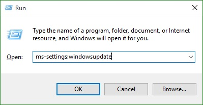
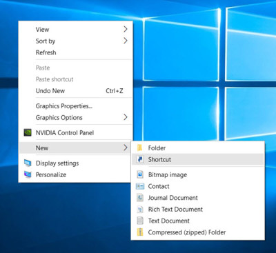
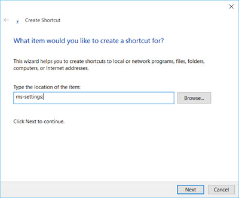
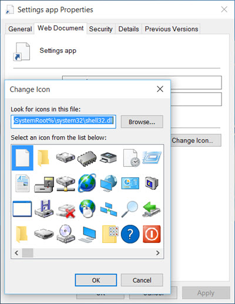

+++
title = "تعرف على الاختصارات السحرية للإعدادات في ويندوز 10"
date = "2015-08-04"
description = "في تطبيق الإعدادات في ويندوز 10 كل شيء قد تغير، ومع هذه التغييرات الجديدة يحتاج المستخدم إلى طرق تسهل له الوصول إلى الإعداد الذي يحتاجه بسرعة، وقد تحدثنا في درس سابق عن إضافة اختصارات الإعدادات لقائمة البداية في ويندوز 10، وفى درس اليوم ستتعرف عزيزي القارئ على كل اختصارات تطبيق الإعدادات وطريقة استخدامها."
categories = ["ويندوز",]
series = ["ويندوز 10"]
tags = ["موقع لغة العصر"]

+++

في تطبيق الإعدادات في ويندوز 10 كل شيء قد تغير، ومع هذه التغييرات الجديدة يحتاج المستخدم إلى طرق تسهل له الوصول إلى الإعداد الذي يحتاجه بسرعة، وقد تحدثنا في درس سابق عن إضافة اختصارات الإعدادات لقائمة البداية في ويندوز 10، وفى درس اليوم ستتعرف عزيزي القارئ على كل اختصارات تطبيق الإعدادات وطريقة استخدامها.

## أولا: قائمة اختصارات تطبيق الإعدادات في ويندوز 10:

| الإختصار                                     | صفحة الإعدادات           | التصنيف           |
| --------------------------------------------- | ------------------------- | ----------------- |
| ms-settings:                                  | Landing page for Settings | Home              |
| ms-settings:displayms-settings:screenrotation | Display                   | System            |
| ms-settings:notifications                     | Notifications             |                   |
| ms-settings:storagesense                      | Storage                   |                   |
| ms-settings:batterysaver                      | Battery Saver             |                   |
| ms-settings:batterysaver-settings             | Battery Saver             |                   |
| ms-settings:batterysaver-usagedetails         | Battery Saver             |                   |
| ms-settings:maps                              | Offline Maps              |                   |
| ms-settings:bluetooth                         | Bluetooth                 | Devices           |
| ms-settings:connecteddevices                  | Connected Devices         |                   |
| ms-settings:mousetouchpad                     | Mouse & Touchpad          |                   |
| ms-settings:powersleep                        | Power & Sleep             | Network and Wi-fi |
| ms-settings:network-airplanemode              | Airplane mode             |                   |
| ms-settings:network-cellular                  | Cellular                  |                   |
| ms-settings:network-dialup                    | Dial-up                   |                   |
| ms-settings:network-ethernet                  | Ethernet                  |                   |
| ms-settings:network-proxy                     | Proxy                     |                   |
| ms-settings:datausage                         | Data Sense                |                   |
| ms-settings:network-wifi                      | Wi-Fi                     |                   |
| ms-settings:network-mobilehotspot             | Mobile Hotspot            |                   |
| ms-settings:personalization-start             | Start                     |                   |
| ms-settings:lockscreen                        | Lock screen               | Personalization   |
| ms-settings:personalization                   | Personalization           |                   |
| ms-settings:emailandaccounts                  | Your account              | Accounts          |
| ms-settings:workplace                         | Your workplace            |                   |
| ms-settings:dateandtime                       | Date & time               | Time and language |
| ms-settings:regionlanguage                    | Region & language         |                   |
| ms-settings:speech                            | Speech                    |                   |
| ms-settings:privacy-calendar                  | Calendar                  | Privacy           |
| ms-settings:privacy-contacts                  | Contacts                  |                   |
| ms-settings:privacy-feedback                  | Feedback & diagnostics    |                   |
| ms-settings:privacy-location                  | Location                  |                   |
| ms-settings:privacy-messaging                 | Messaging                 |                   |
| ms-settings:privacy-microphone                | Microphone                |                   |
| ms-settings:privacy-customdevices             | Other                     |                   |
| ms-settings:privacy-radios                    | Radio                     |                   |
| ms-settings:privacy-speechtyping              | Speech                    |                   |
| ms-settings:privacy-webcam                    | Webcam                    |                   |
| ms-settings:windowsupdate                     | Windows update            | Update & Security |

## ثانيا: الوصول السريع إلى الإعدادات عن طريق RUN:

1. قم بالضغط على Windows+R لفتح مربع RUN.

2. قم بكتابة أي من الاختصارات الموجودة بالأعلى ثم اضغط OK.

ثالثا: الوصول السريع إلى الإعدادات عن طريق إنشاء اختصار Shortcut:

1. اضغط بزر الفأرة الأيمن على سطح المكتب، من قائمة New اختر Shortcut.

2. قم بكتابة أي من الاختصارات الموجودة بالأعلى كما بالصورة ثم اضغط Next.

3. اختر اسما مناسبا للاختصار ثم اضغط Next.

4. تم عمل الاختصار، الآن اضغط بزر الفأرة الأيمن على الاختصار ثم انتقل إلى التبويب Web document واختر Change Icon.

5. قم باختيار الأيقونة التي تريد وضعها لهذا الاختصار ثم اضغط OK/Apply.
6. عند فتحك لهذا الاختصار سيظهر تطبيق الإعدادات مباشرة كما وضعت مسار الاختصار.

---

هذا الموضوع نٌشر باﻷصل على موقع مجلة لغة العصر.

http://aitmag.ahram.org.eg/News/21928.aspx
