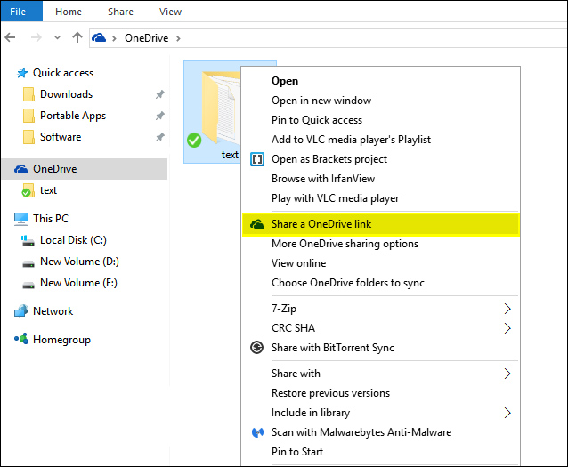
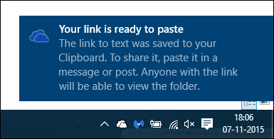
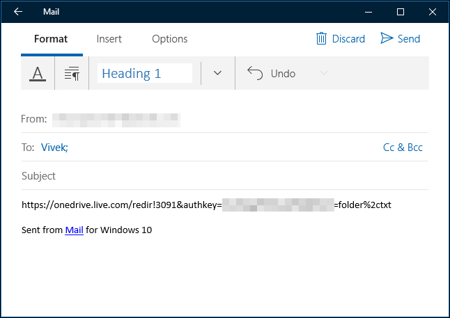

+++
title = "كيفية مشاركة المجلدات والملفات من OneDrive في ويندوز 10"
date = "2015-11-30"
description = "مع تكامل OneDrive في ويندوز من السهل مشاركة الملفات والمجلدات بشكل آمن وبسهولة مع الآخرين، لا تحتاج إلى تثبيت تطبيقات أو أي شيء آخر، في درس اليوم ستعرف عزيزي القارئ على أسهل طريقة لمشاركة ملفاتك الموجودة على OneDrive"
categories = ["ويندوز",]
series = ["ويندوز 10"]
tags = ["موقع لغة العصر"]
images = ["images/0.jpg"]

+++

 مع تكامل OneDrive في ويندوز من السهل مشاركة الملفات والمجلدات بشكل آمن وبسهولة مع الآخرين، لا تحتاج إلى تثبيت تطبيقات أو أي شيء آخر، في درس اليوم ستعرف عزيزي القارئ على أسهل طريقة لمشاركة ملفاتك الموجودة على OneDrive.

**مشاركة ملف من سطح المكتب:**

يتيح تكامل OneDrive مشاركة الملفات والمجلدات بطريقة مباشرة من مجلد OneDrive الموجود على جهازك عن طريق الحصول على رابط الملف أو المجلد وارساله لمن تريد عن طريق البريد الالكتروني، الفيس بوك أو حتى لصق الرابط في موقعك.

1. افتح مجلد OneDrive الخاص بك من الأيقونة الموجودة بجوار الساعة.

2. انتقل إلى الملف/المجلد الذي تريد مشاركته ثم اضغط بزر الفأرة الأيمن عليه.

3. اختر " Share a OneDrive Link" من القائمة كما بالصورة.

4. خلال ثواني سيظهر اشعار يعلمك بأن رابط الملف جاهز للمشاركة.

5. الآن يمكنك لصق الرابط وارساله لأصدقائك كما تريد.

---
هذا الموضوع نٌشر باﻷصل على موقع مجلة لغة العصر.

http://aitmag.ahram.org.eg/News/38353.aspx
