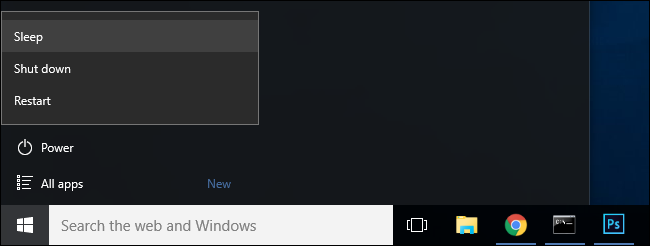
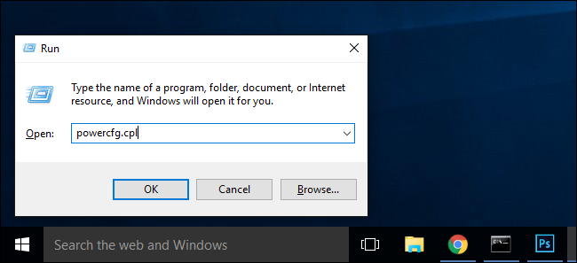
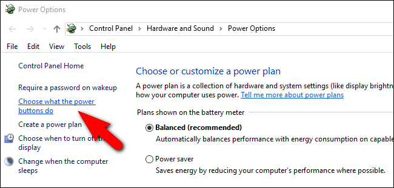
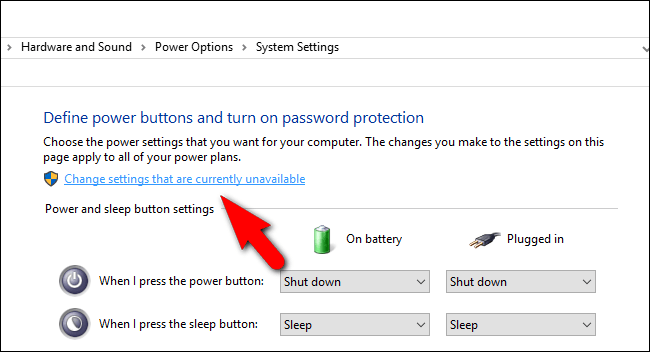
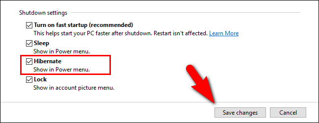
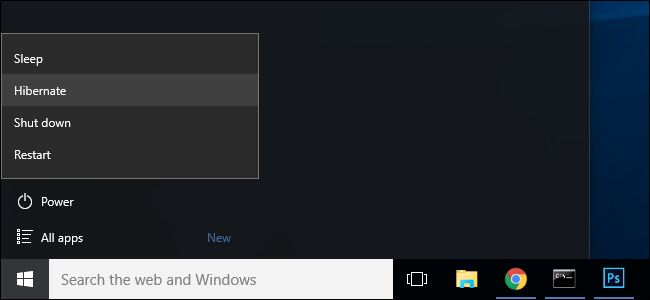

+++
title = "كيفية إعادة تفعيل وضع السبات في ويندوز 10"
date = "2016-05-24"
description = "إذا كنت من مستخدمي وضع السبات Hibernation في ويندوز 10، فلا بد أنك لاحظت أنه لا يظهر في قائمة الطاقة، إليك طريقة ارجاع زر السبات الى قائمة البداية"
categories = ["ويندوز",]
series = ["ويندوز 10"]
tags = ["موقع لغة العصر"]

+++

إذا كنت من مستخدمي وضع السبات Hibernation في ويندوز 10، فلا بد أنك لاحظت أنه لا يظهر في قائمة الطاقة، إليك طريقة ارجاع زر السبات الى قائمة البداية.

- إذا قمت بفتح خيارات الطاقة في قائمة البداية فستجدها كما بالصورة:

ولا يوجد زر الدخول إلى وضع السبات.

**ولتفعيل وضع السبات قم بالخطوات التالية:**

1- قم بفتح مربع Run عن طريق الضغط على WIN+R ثم قم بكتابة powercfg.cpl واضغط OK.

2- بعد أن دخلنا إلى إعدادات الطاقة، من القائمة الجانبية قم بالضغط على Choose what the power buttons down.

3- ستجد في أعلى النافذة اختيار Change settings that are currently unavailable قم بالضغط عليه.

4- قم بالنزول إلى الاسفل ثم قم بوضع العلامة على Hibernate: Show in Power menu واضغط زر Save changes.

5- الان أغلق إعدادات الطاقة ثم افتح قائمة البداية واضغط على زر الطاقة لتجد الخيار Hibernate قد أصبح متاحا.

---
هذا الموضوع نٌشر باﻷصل على موقع مجلة لغة العصر.

http://aitmag.ahram.org.eg/News/49897.aspx