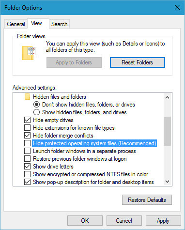

+++
title = "كيفية اظهار المجلدات والملفات المخفية في ويندوز 10"
date = "2016-05-21"
description = "في هذا الدرس سنتعرف عزيزي القارئ على طريقة اظهار الملفات والمجلدات المخفية في ويندوز 10، وأيضا اظهار ملفات النظام المحمية، يمكنك تطبيق هذا الدرس على ويندوز 7 أو 8 أيضا"
categories = ["ويندوز",]
series = ["ويندوز 10"]
tags = ["موقع لغة العصر"]
images = ["images/2016-635994324339102618-910_thumb705x335.jpg"]

+++

في هذا الدرس سنتعرف عزيزي القارئ على طريقة اظهار الملفات والمجلدات المخفية في ويندوز 10، وأيضا اظهار ملفات النظام المحمية، يمكنك تطبيق هذا الدرس على ويندوز 7 أو 8 أيضا.

1- قم بالدخول إلى لوحة التحكم Control Panel.

2- اختر File Explorer Options أو (Folder Options) في ويندوز 7.

3- أو يمكنك الوصول إلى هذا الاختيار عن طريق فتح This PC ثم من التبويب View اضغط على Options.

4- ستفتح لك نافذة الإعدادات كما بالصورة.

5- انتقل إلى التبويب View، ستجد خيارات التحكم في اظهار الملفات المخفية تحت Hidden Files & Folders.

6- قم باختيار Show Hidden Files, Folders and Drives، ثم اضغط Apply لتجد أن الملفات المخفية قد ظهرت.

لإظهار ملفات النظام المحمية:

قم بإلغاء التحديد عن الاختيار Hide protected operating system files (Recommended) ثم اضغط Apply.

---
هذا الموضوع نٌشر باﻷصل على موقع مجلة لغة العصر.

http://aitmag.ahram.org.eg/News/49673.aspx