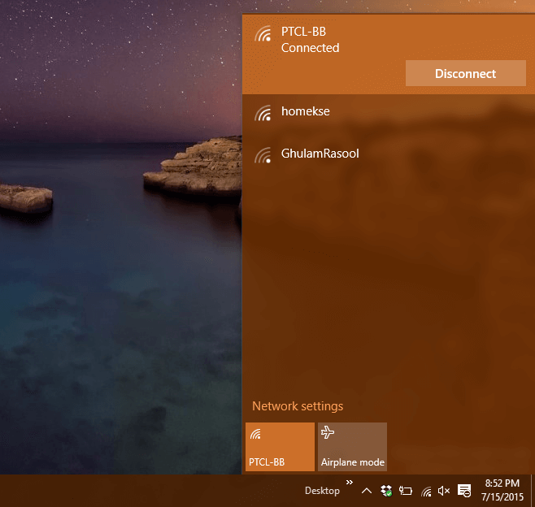
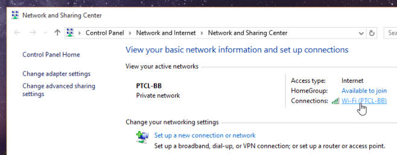
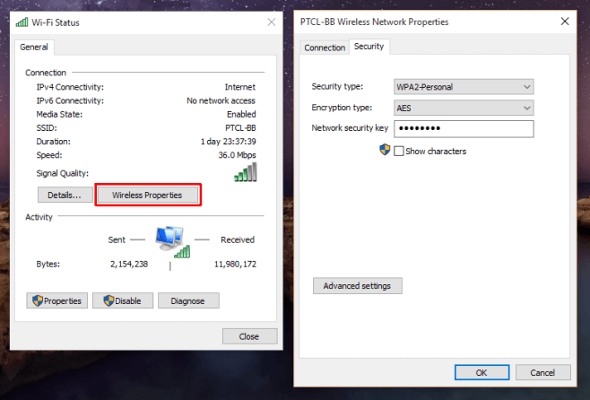

+++
title = "كيفية عرض كلمات سر شبكات الواى فاى في ويندوز 10"
date = "2016-03-10"
description = "تغيرت طريقة الوصول إلى كلمات مرور الشبكات المحفوظة في ويندوز 10 عن الطريقة المعروفة المستخدمة في ويندوز 7، فصارت تتطلب خطوات أكثر، في درس اليوم ستتعرف عزيزي القارئ على طريقة عرض كلمات سر شبكات الواى فاى في ويندوز 10"
categories = ["ويندوز",]
series = ["ويندوز 10"]
tags = ["موقع لغة العصر"]
+++

تغيرت طريقة الوصول إلى كلمات مرور الشبكات المحفوظة في ويندوز 10 عن الطريقة المعروفة المستخدمة في ويندوز 7، فصارت تتطلب خطوات أكثر، في درس اليوم ستتعرف عزيزي القارئ على طريقة عرض كلمات سر شبكات الواى فاى في ويندوز 10.
عندما تضغط على أيقونة الواى فاى الموجودة بجانب الساعة، تظهر لك الشبكات المتاحة وعلى رأسها الشبكة المتصل بها جهازك، لكن لا يوجد اختيارات سوى الاتصال بالشبكة أو الغاء الاتصال:

ولمعرفة كلمة سر الشبكة:

1- اضغط بزر الماوس الأيمن على أيقونة الواى فاى ثم اختر Open Network and Sharing Center.

2- سيتم نقلك إلى لوحة التحكم، اضغط على اسم الشبكة المتصل بها جهازك كما بالصورة.

3- سيظهر مربع معلومات الشبكة، اضغط على الزر Wireless Properties.

4- انتقل إلى التبويب Security ثم ضع علامة على Show characters لعرض كلمة السر.

---
هذا الموضوع نٌشر باﻷصل على موقع مجلة لغة العصر.

http://aitmag.ahram.org.eg/News/45969.aspx