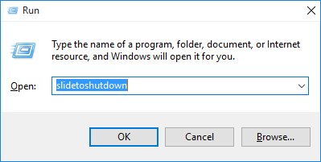
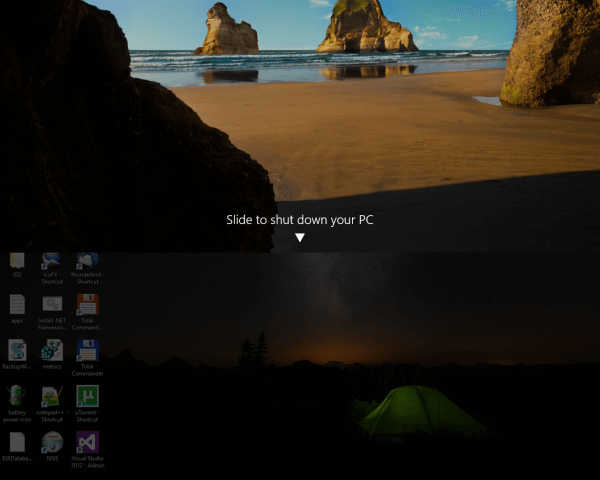
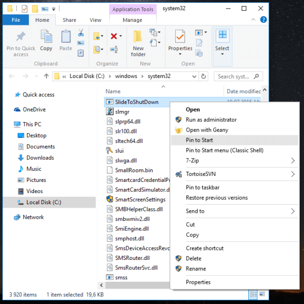

+++
title = "تعرف على ميزة Slide to shutdown المخفية في ويندوز 10"
date = "2016-06-10"
description = "قامت مايكروسوفت بإضافة ميزة خفية هي السحب للإغلاق من إصدار ويندوز 8.1، وتعمل هذه الميزة أيضا على ويندوز 10، دعونا نتعرف على كيفية استخدامها."
categories = ["ويندوز",]
series = ["ويندوز 10"]
tags = ["موقع لغة العصر"]

+++

قامت مايكروسوفت بإضافة ميزة خفية هي "السحب للإغلاق" من إصدار ويندوز 8.1، وتعمل هذه الميزة أيضا على ويندوز 10، دعونا نتعرف على كيفية استخدامها.

صممت هذه الميزة في الأساس للأجهزة اللوحية التي تعمل بنظام الويندوز، ومع ذلك يمكن استخدامها على الأجهزة الشخصية، إليك الطريقة:

1. قم بفتح مربع Run عن طريق الضغط على Win + R، ثم قم بكتابة هذا الأمر slidetoshutdown.

2. قم بالسحب لأسفل لإغلاق الجهاز أو السحب لأعلى للإلغاء.

- للوصول لملف slidetoshutdown.exe:

قم بالدخول إلى المسار C:\windows\system32، ستجد الملف slidetoshutdown.exe>

تستطيع تثبيته في قائمة البداية أو شريط المهام، كما يمكنك أيضا الضغط على الزر Alt وسحبه وافلاته على سطح المكتب لإنشاء اختصار يمكنك من استخدام هذه الميزة وقتا تريد.

---
هذا الموضوع نٌشر باﻷصل على موقع مجلة لغة العصر.

http://aitmag.ahram.org.eg/News/52719.aspx