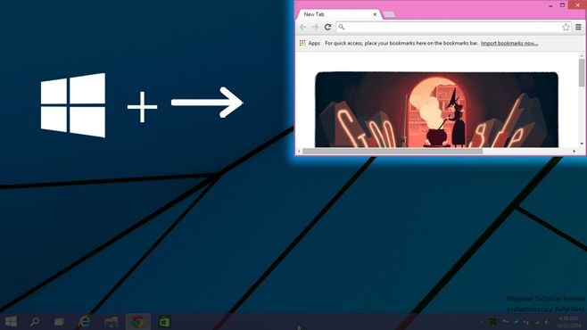

+++
title = "كيفية استخدام خاصية Snap بواسطة الاختصارات على ويندوز 10"
date = "2016-03-08"
description = "تحدثنا في الدرس السابق عن خاصية Snap في ويندوز 10 وطريقة التحكم في حجم النوافذ، وفى هذا الدرس نكمل حديثنا عن هذه الخاصية ومع طريقة استخدام خاصية Snap بواسطة الاختصارات"
categories = ["ويندوز",]
series = ["ويندوز 10"]
tags = ["موقع لغة العصر"]
images = ["images/2016-635930434557156082-715_thumb705x335.png"]

+++

تحدثنا في الدرس السابق عن خاصية Snap في ويندوز 10 وطريقة التحكم في حجم النوافذ، وفى هذا الدرس نكمل حديثنا عن هذه الخاصية ومع طريقة استخدام خاصية Snap بواسطة الاختصارات.

كما يظهر في هذه الصورة:

هذه هي الأوضاع المختلفة للنوافذ من خلال خاصية Snap، بالطبع يمكن استخدامها عن طريق الماوس كما أوضحت في الدرس السابق، ولكن لاستخدامها بأعلى كفائه وأسرع وقت سنقوم باستخدامها باستخدام الاختصارات:

- الاختصار Windows والسهم الأيمن أو Windows والسهم الأيسر: سوف يقوم بإزاحة النافذة إلى نصف الشاشة بشكل أفقي.

- الاختصار Windows والسهم لأعلى أو Windows والسهم لأسفل: سوف يقوم بإزاحة النافذة إلى نصف الشاشة بشكل رأسي.

- عند استخدام الاختصار Windows والسهم الأيمن (أو اليسار) ثم Windows والسهم لأعلى (أو لأسفل): سوف يقوم بإزاحة النافذة إلى جانب الشاشة.

وعند استخدامك لأخر طريقة تستطيع وضع أربعة نوافذ على الشاشة موزعين على الجوانب الأربعة.

---
هذا الموضوع نٌشر باﻷصل على موقع مجلة لغة العصر.

http://aitmag.ahram.org.eg/News/45672.aspx