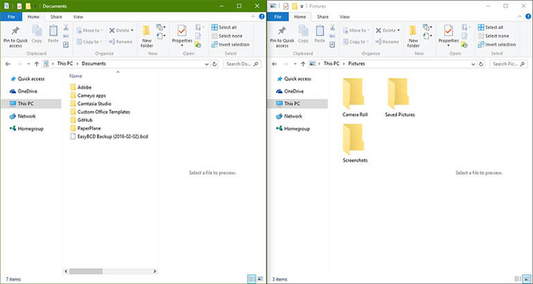
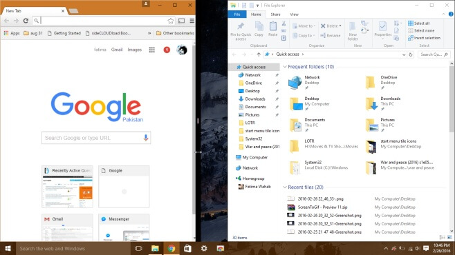
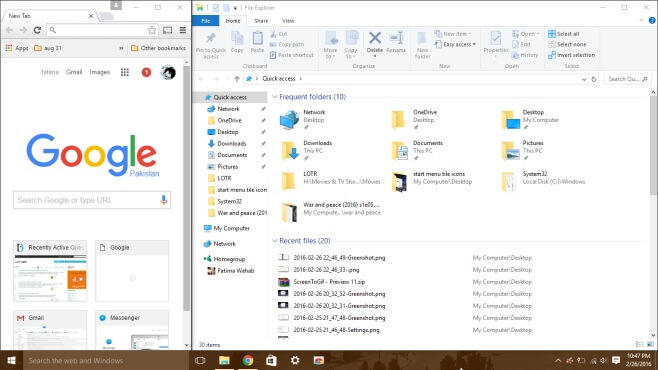

+++
title = "حيلة للتحكم في حجم النوافذ في خاصية Snap على ويندوز 10"
date = "2016-03-06"
description = "تحدثنا في الدرس السابق عن خاصية Snap في ويندوز 10 وطريقة تعطيل اقتراحاتها، وفى هذا الدرس نكمل حديثنا عن هذه الخاصية ومع سر رائع للتحكم في حجم النوافذ في خاصية Snap"
categories = ["ويندوز",]
series = ["ويندوز 10"]
tags = ["موقع لغة العصر"]
images = ["images/2016-635928112127728430-772_thumb705x335.png"]
+++

تحدثنا في الدرس السابق عن خاصية Snap في ويندوز 10 وطريقة تعطيل اقتراحاتها، وفى هذا الدرس نكمل حديثنا عن هذه الخاصية ومع سر رائع للتحكم في حجم النوافذ في خاصية Snap.

1- قم بفتح أي نافذتين بجانب بعضهما عن طريق خاصية Snap أو عن طريق استخدام الاختصار Windows والسهم اليمين أو اليسار.

2- قم بوضع الماوس بين مماس النافذتين حتى يظهر الظل ويتغير شكل الماوس، كما بالصورة.

3- قم بسحب شريط تغيير الحجم (باللون الأسود)، إلى أن تنتهي من تغيير حجم النافذة.

4- اترك الماوس لتطبيق تغيير الحجم.

- ملاحظة يجب أن تكون على ويندوز 10 البناء 1511 لتطبيق هذه الحيلة، ولن تعمل على أقل من هذا البناء.

---
هذا الموضوع نٌشر باﻷصل على موقع مجلة لغة العصر.

http://aitmag.ahram.org.eg/News/45672.aspx