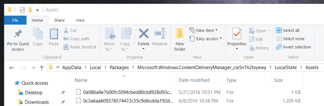
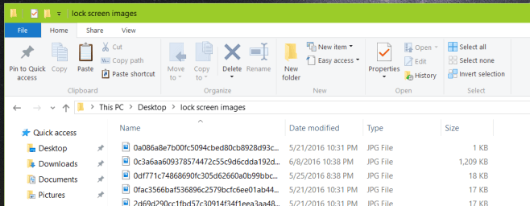
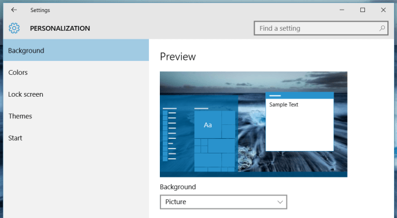

+++
title = "كيفية تعيين خلفية من Windows 10 Spotlight كخلفية سطح المكتب"
date = "2016-09-18"
description = "بالتأكيد تعرف عزيزي القارئ عن ميزة Windows 10 Spotlight التي تعرض صورا عالية الدقة كخلفية لشاشة القفل، ولكن هل تعرف أته يمكنك استخدام هذه الصور كخلفية لسطح المكتب أيضا، إليك الطريقة."
categories = ["ويندوز",]
series = ["ويندوز 10"]
tags = ["موقع لغة العصر"]
+++

بالتأكيد تعرف عزيزي القارئ عن ميزة Windows 10 Spotlight التي تعرض صورا عالية الدقة كخلفية لشاشة القفل، ولكن هل تعرف أته يمكنك استخدام هذه الصور كخلفية لسطح المكتب أيضا، إليك الطريقة.

1. قم بالدخول إلى المسار الذي يتم حفظ صور Windows 10 Spotlight به وهو

`C:\Users\User Name\AppData\Local\Packages\Microsoft.Windows.ContentDeliveryManager\_cw5n1h2txyewy\LocalState\Assets`

مع تغيير User Name باسم المستخدم الخاص بك.

2. ستجد العديد من الملفات بهذا الشكل.

3. قم بنسخها إلى أي مكان مختلف ثم أعد تسمية الصور وغير الامتداد الخاص بها إلى .JPG

4. هذه الصور هي مجموعة الخلفيات والمصغرات وبعض إعلانات شاشة القفل أيضا، بالتأكيد الخلفيات ستكون الصور ذات الحجم الأكبر.

5. لتعيين أي من هذه الصور كخلفية سطح المكتب قم بالتوجه إلى تطبيق الإعدادات ثم القسم Personalization، ومن التبويب Background اضغط Browse واختر الصورة التي تريدها.

---
هذا الموضوع نٌشر باﻷصل على موقع مجلة لغة العصر.

http://aitmag.ahram.org.eg/News/60961.aspx