+++
title = "تحديث ويندوز 10 ربيع المبدعين: تغييرات تستحق التجربة"
date = "2018-04-01"
description = "تحديث جديد لويندوز 10 قادم في شهر مارس، يحمل الاسم الرمزي Redstone 4 والرقم 1803، وكعادة مايكروسوفت توجد العديد من التغييرات المختلفة التي اتضحت للمستخدمين من خلال نسخ ويندوز Insider المتوفرة للتجربة، دعونا نتعرف على التغييرات الجديد في هذا التحديث."
categories = ["ويندوز",]
tags = ["مجلة لغة العصر"]
images = ["images/0.jpg"]

+++
تحديث جديد لويندوز 10 قادم في شهر مارس، يحمل الاسم الرمزي Redstone 4 والرقم 1803، وكعادة مايكروسوفت توجد العديد من التغييرات المختلفة التي اتضحت للمستخدمين من خلال نسخ ويندوز Insider المتوفرة للتجربة، دعونا نتعرف على التغييرات الجديد في هذا التحديث.

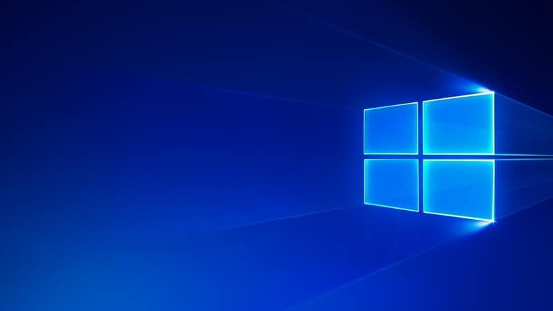

ظهرت العديد من التغييرات في الفترة القريبة السابقة عن طريق Windows Insider وكان أبرز هذه النسخ الإصدار 17083 والذي اشتمل على مجموعة كبيرة من التغييرات ما بين التغييرات في التصميم ومميزات النظام وإضافة ميزات جديدة، وحذف ميزات حالية والعديد من الأشياء الأخرى.

## التغييرات الرئيسية

### ميزة الجدول الزمني Timeline

من المميزات التي تم الإعلان سابقا، قبل تحديث خريف المبدعين هي ميزة الجدول الزمني، لكن تم تأجيلها ولم تر النور حتى إصدار قريب من Insider، ومن المفترض أن تكون موجودة في التحديث الجديد هذه المرة إلا في حالة حدوث تغييرات مجددا.
ومن خلال Timeline تستطيع بكل سهولة العودة لما كنت تعمل عليه سابقا، فحتى بعد أن تغلق برنامج أو ملف ما يمكنك العودة لفتحه مرة أخري والاستكمال من حيث توقفت، وأضف إلى ذلك أن النشاطات تتم مزامنتها مع كل أجهزتك التي قم بتسجيل الدخول عليها بنفس الحساب.
وذلك عن طريق الضغط على زر Task View الذي تم تغيير تصميمه، ستجد في النصف العلوي من الشاشة النوافذ المفتوحة حاليا تحت عنوان Now، والمفتوحة سابقا في الأسفل.

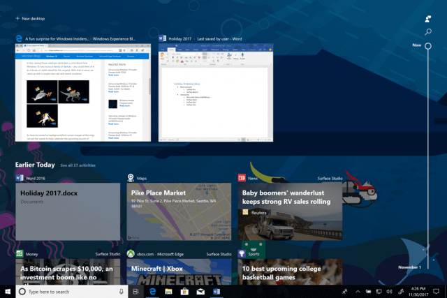

كما يمكنك البحث عن نشاط معين بكل سهولة من زر البحث أعلى يمين الشاشة.

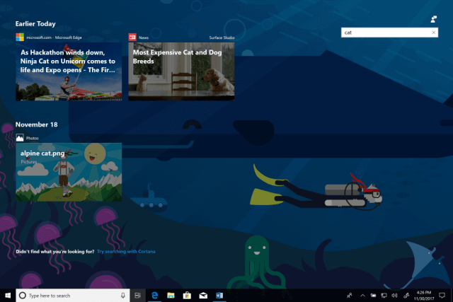

وبالضغط على See all بجانب تاريخ اليوم يمكنك الرجوع إلى السجل الكامل للنشاطات خلال ذلك التاريخ.

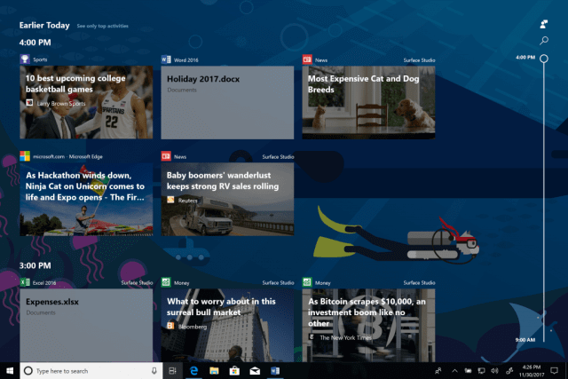

أما إذا كنت قلقا من خصوصية أي من نشاطاتك يمكنك بكل سهولة الضغط بزر الماوس الأيمن على النشاط وحذفه، ويمكنك أيضا التحكم في إعدادات هذه الميزة كما تريد من خلال تطبيق الإعدادات ثم القسم Privacy ثم التبويب Activity History.

### ميزة المشاركة القريبة Near Share

ميزة جديدة تُضاف إلى ويندوز 10 تشبه كثيرا ميزة أبل AirDrop، فتستطيع من خلال Near Share مشاركة الملفات والصور والروابط مع الأجهزة القريبة منك لاسلكيا. فمثلا لمشاركة رابط تأكد أولا من تفعيل هذه الخاصية منAction Center ثم اضغط على زر Share في متصفح Edge وستجد الأجهزة القريبة قد ظهرت أمامك، اختر منها ما تريد.

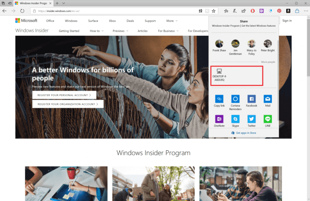

### متصفح Edge يحصل على تحسينات جديدة

لا يزال الرهان على متصفح Edge قائما، ولا تزال الميزات الجديدة تضاف إليه تحديثا بعد تحديث، وهذه المرة حصل على العديد من التغييرات أبرزها التالي:
• إعادة تصميم طريقة عرض المحفوظات وسجل الزيارات والتحميلات لتعرض محتوياتها بطريقة أفضل. 

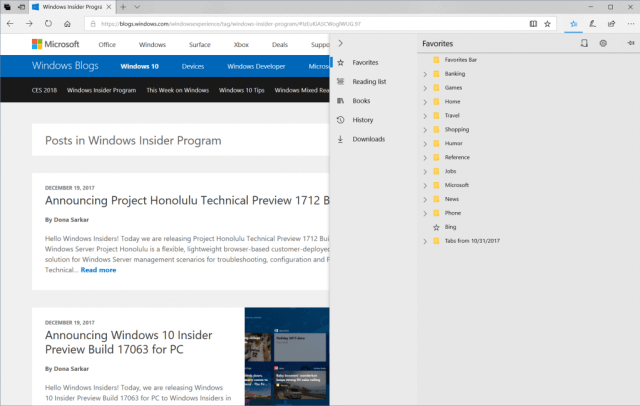

• وضع الطباعة بدون الفوضى لطباعة صفحات الويب دون الإعلانات والمحتويات الغير هامة.

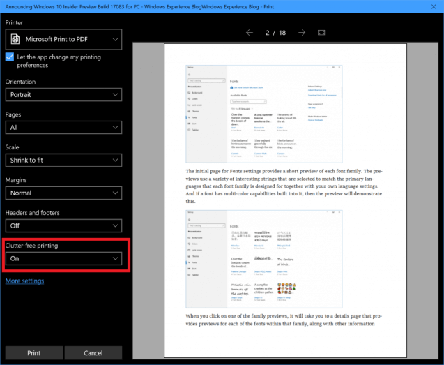

• دعم الملء التلقائي للبيانات مثل اسم المستخدم والبريد الالكتروني والعنوان وما إلى ذلك، كما يدعم حفظ بيانات بطاقات الائتمان ما عدا رقم ال CVV فتحتاج إلى إدخاله بنفسك لضمان الأمان.
• خيارات جديدة لوضع القراءة ودعم كامل لملفات الكتب الإلكترونية.

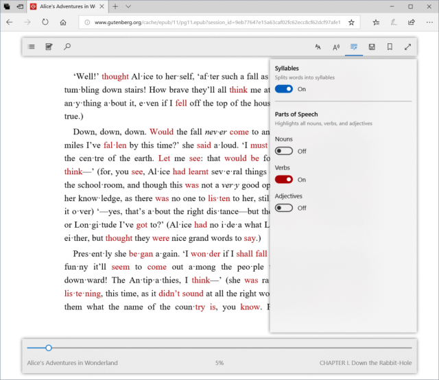

### Cortana وميزات جديدة

إلى جانب ميزة استكمال النشاطات السابقة بالتكامل مع ميزة الجدول الزمنى، حصلت المساعدة الصوتية كورتانا على نصيبها من التغييرات، فهناك واجهة المفكرة Organizer والتي تجد فيها كل قوائم الأعمال والتذكير بالمواعيد الخاصة بك التي قم بإنشائها.
كما تم إضافة العديد من الأوامر الصوتية الجديدة مثل تشغيل ملفات الصوت بواسطة الأمر Play my tracks.

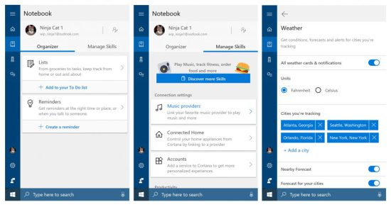

### مزيد من التخصيص لميزة My People

ميزة My People ظهرت لأول مرة في تحديث خريف المبدعين، وحصلت في هذا التحديث على عدد من التحسينات، فتم إضافة دعم السحب والإفلات، وأصبح بإمكانك اختيار عدد جهات الاتصال التي تظهر على شريط المهام، وإضافة مزيد من إعدادات التخصيص في تطبيق الإعدادات القسم Personalization ثم التبويب Taskbar.

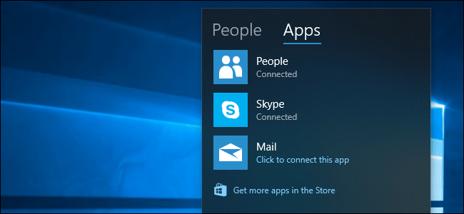

### التغييرات في تطبيق الإعدادات

شمل التحديث العديد من الإضافات الجديدة في تطبيق الإعدادات منها: 
• إمكانية التحكم في صلاحيات البرامج والتطبيقات، فمثلا عند الدخول إلى إعدادات الكاميرا من إعدادات الخصوصية، يمكنك تغيير الاختيار " Let apps use my camera hardware" إلى Off وبهذا لن يستطيع أي من البرامج أو التطبيقات الوصول للكاميرا.

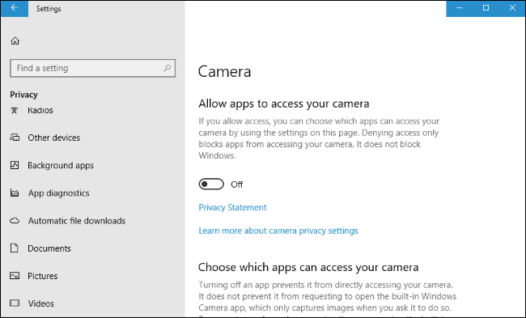

• إزالة وضع ساعات الهدوء Quiet Hours واستبداله بوضع مُساعد التركيز Focus Assist، حيث يمكنك إعداده ليعمل خلال أوقات أو حالات معينة يتم خلالها منع الإشعارات من إزعاجك، قم بالدخول إلى القسم System ثم Focus Assist لتغيير إعداداته كما تريد.

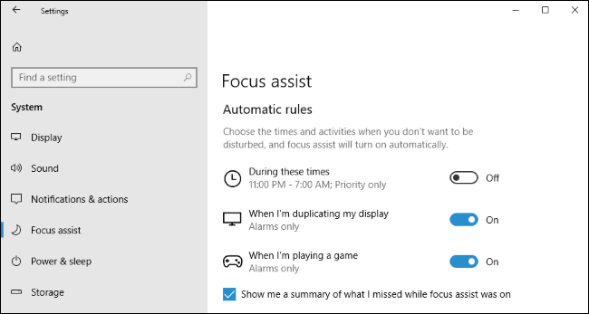

• إضافة إعدادات التحكم في ال DPIلحل مشكلة ظهور البرامج بحجم صغير على الشاشات عالية الوضوح، ويمكنك الوصول إليها عن طريق Settings > System > Display > Advanced display settings وتفعيل الاختيار كما بالصورة.

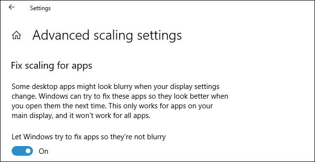

• واجهة جديدة لإعدادات التشغيل مع بدء النظام Startup، فبدلا من الوصول إليها عن طريق مدير المهام، ستجدها في القسم Apps ثم التبويب Startup.
• تغيير واجهة تطبيق الإعدادات الرئيسية لتتلاءم مع تصميم الويندوز Fluent Design.

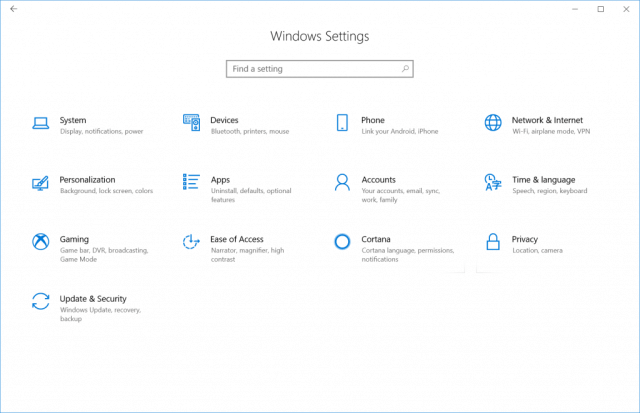

• إمكانية إضافة أسئلة أمان لحماية الحساب المحلى للمستخدم، حيث كانت هذه الميزة متاحة فقط لمن يسجل الدخول بحساب مايكروسوفت أو هوت ميل.
• إمكانية تحميل حزم اللغات من داخل الإعدادات مباشرة.
• دعم تغيير وتثبيت الخطوط مباشرة من الإعدادات وتحميل المزيد من خلال المتجر.

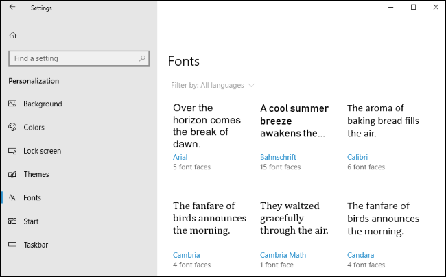

• تطبيق Diagnostic Data Viewer لعرض البيانات التي يرسلها الويندوز لمايكروسوفت:
حتى تنهي مايكروسوفت كل الشكوك حول الخصوصية والبيانات التي يقوم الويندوز بجمعها عن المستخدمين قامت بدمج هذا التطبيق الجديد مع التحديث، فهو يخبرك بكل بساطة بكل البيانات التي جمعها، لكن تحتاج لتفعيله بنفسك حتى تري، قم بالدخول إلى Settings > Privacy > Diagnostics & feedback ثم فّعل الاختيار Diagnostic data viewer.

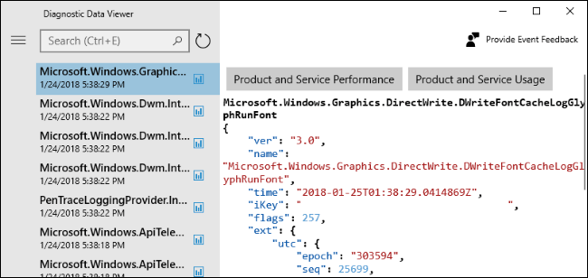

## التغييرات الأخرى

كالعادة مع كل تحديث، يوجد عدد من التغييرات الصغيرة التي توجد في الويندوز ومنها:
• حالة مزامنة OneDrive تظهر في الجزء الخاص بالتنقل Navigation Pane.

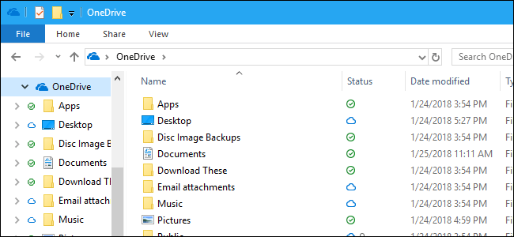

• اضافة أيقونة جديدة بجانب الساعة لتحديثات الويندوز.
• إمكانية استرجاع كلمة السر لحسابات المستخدمين المحلية.
• التحكم في إخفاء شريط التمرير تلقائيا.
• ميزة اقتراح الكلمات عند الكتابة بلوحة المفاتيح (باللغة الإنجليزية)

## المزايا التي تم إزالتها

• ميزة HomeGroup:
هل تذكر طريقة HomeGroup لمشاركة الملفات عبر شبكتك المحلية؟ للأسف تم إزالة هذه الميزة، حيث تشجع مايكروسوفت الانتقال إلى حلول مثل OneDrive أو مشاركة الملفات من داخل الويندوز.

## تغييرات للمطورين

أيضا هناك العديد من التغييرات التي تهم مطوري البرامج ومستخدمي لينكس على الويندوز، أهمهما:
• دعم أوامر curl وtar الموجودة في لينكس.
• اضافة دعم الأجهزة التسلسلية (COM ports) لبرامج لينكس.
• اضافة دعم العمل في الخلفية لبرامج لينكس.
• اضافة دعم التحكم عن بعد Remote Connection لبرامج لينكس.
• اضافة أيقونة جديدة بجانب الساعة لتحديثات الويندوز.

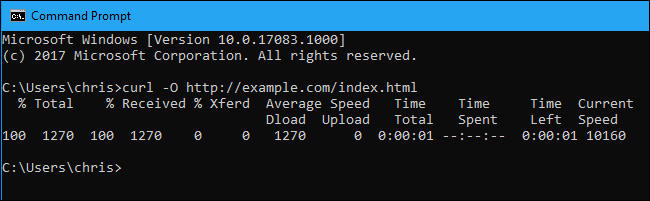

## التغييرات المؤجلة

• ميزة Sets
تعمل مايكروسوفت على ميزة جديدة باسم Sets، والتي ستمكن المستخدم من عمل تبويبات جديدة في أي نافذة برنامج على الويندوز بطريقة تشبه فتح تبويب جديد على المتصفح، لكن تم تأجيلها إلى التحديث القادم Redstone 5. ويمكنك مشاهدة هذا الفيديو للتعرف عليها أكثر: https://www.youtube.com/watch?v=lUkq5C_44zo

---

هذا الموضوع نُشر باﻷصل في مجلة لغة العصر العدد 208 شهر 04-2018 ويمكن الإطلاع عليه [هنا](https://drive.google.com/file/d/1UojwxOrEtcJ5jDmMVbAP3kH-31UR0F1_/view?usp=sharing).

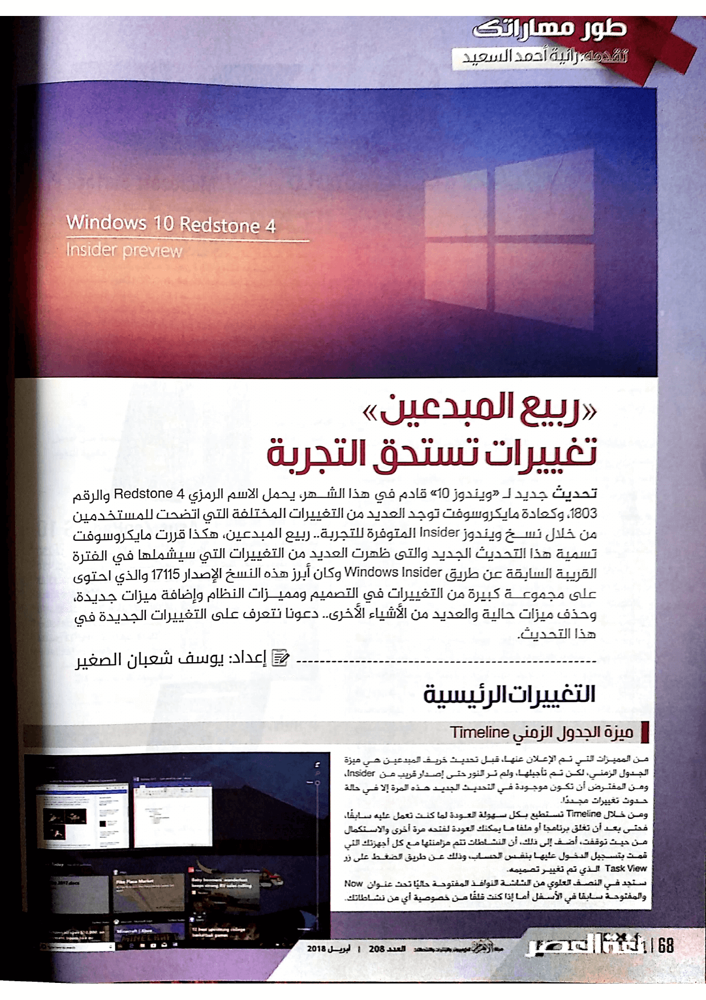

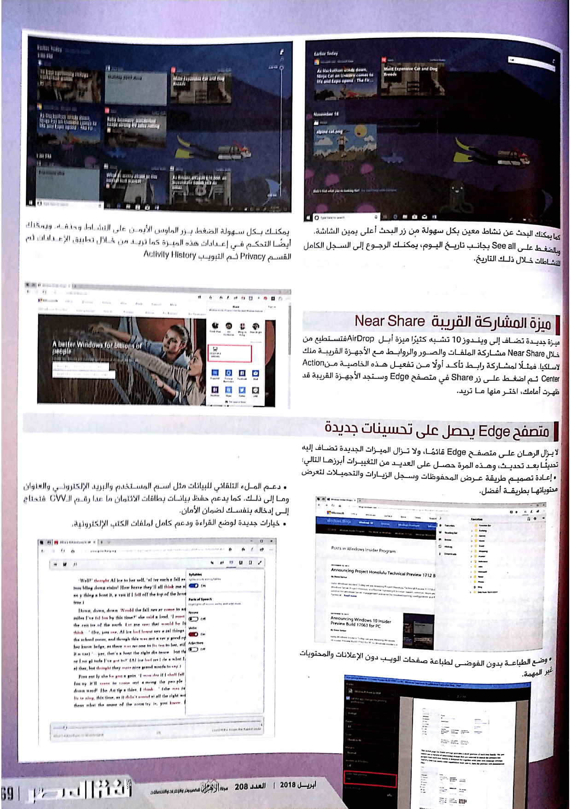

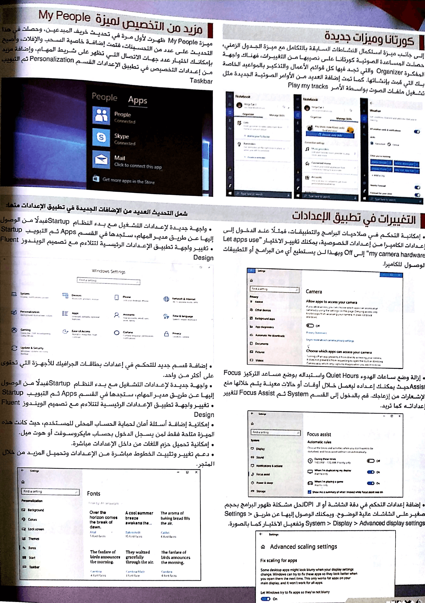

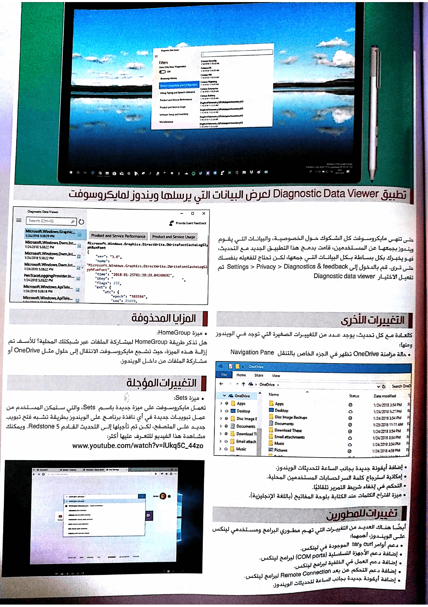

