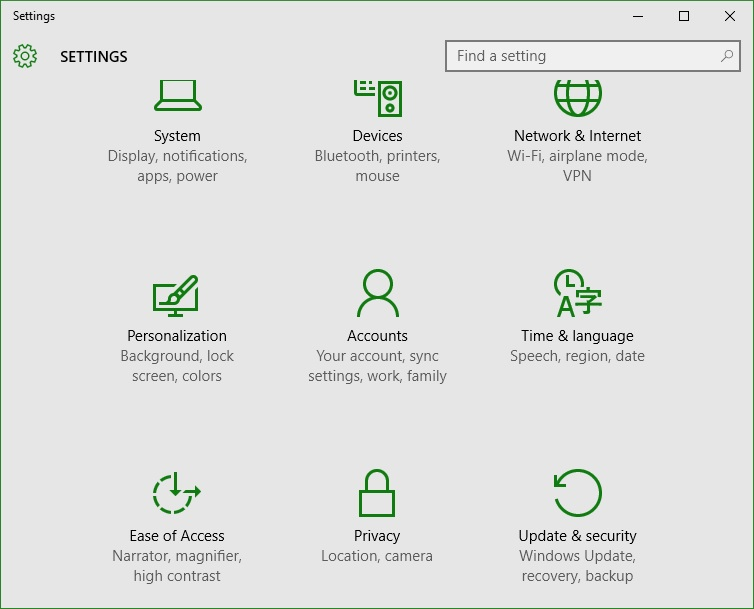
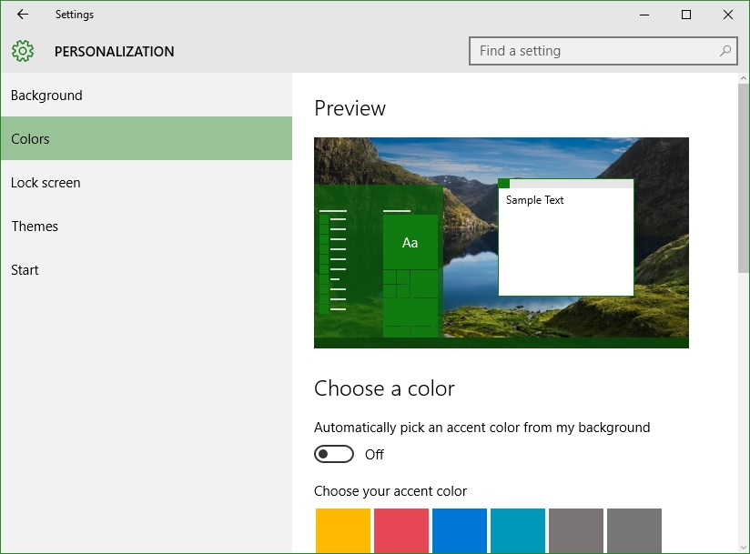
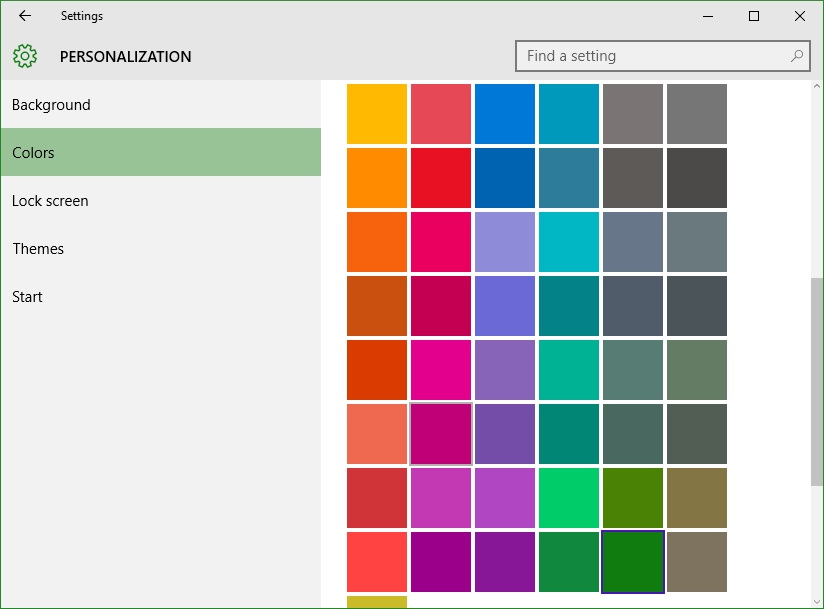
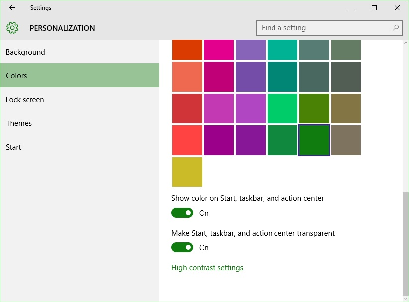
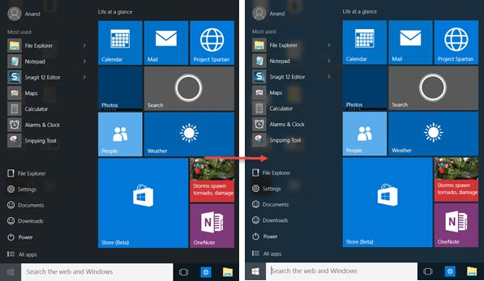

+++
title = "طريقة التحكم في مظهر قائمة البداية في ويندوز 10"
date = "2015-08-01"
description = "هل لاحظت عزيزي القارئ مدى اختلاف قائمة البداية في ويندوز عن أي نسخة ويندوز أخرى، فإذا كنت من الذين قاموا بالترقية إلى ويندوز 10، سأخبرك في درس اليوم بجميع أسرار التحكم في شكل قائمة البداية، إليك الطريقة."
categories = ["ويندوز",]
series = ["ويندوز 10"]
tags = ["موقع لغة العصر"]

+++

هل لاحظت عزيزي القارئ مدى اختلاف قائمة البداية في ويندوز عن أي نسخة ويندوز أخرى، فإذا كنت من الذين قاموا بالترقية إلى ويندوز 10، سأخبرك في درس اليوم بجميع أسرار التحكم في شكل قائمة البداية، إليك الطريقة.

**أولا: التحكم في لون قائمة البداية:**
1. قم بالدخول إلى تطبيق الإعدادات ثم إلى قسم Personalization.

2. انتقل إلى التبويب Colors، ثم قم بتعطيل الاختيار “Automatically pick an accent color from my background”.

3. قم باختيار اللون الي تريده من مجموعة الألوان التي أمامك.

**ثانيا: إضافة مظهر الشفافية إلى قائمة البداية:**

- من التبويب Color أيضا ستجد الاختيارين “Show color on Start, taskbar, and action center” و “Make Start, taskbar, and action center transparent” قم بتفعيلهم.

- بعد تطبيق التغييرات ستجد قائمة البداية قد أصبحت كما بالصورة.

---
هذا الموضوع نٌشر باﻷصل على موقع مجلة لغة العصر.

http://aitmag.ahram.org.eg/News/21626.aspx