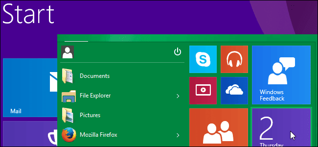
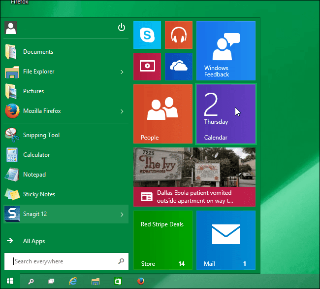
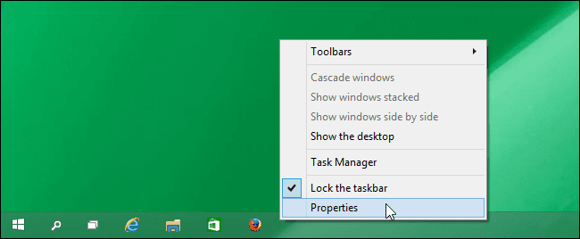
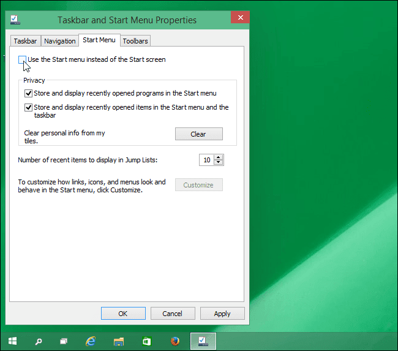
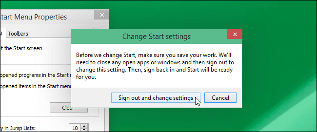
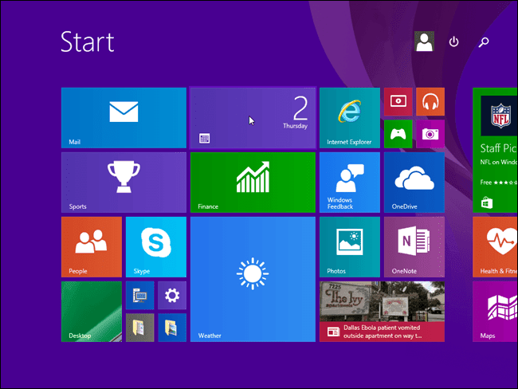

+++
title = "إرجاع شاشة البداية بدلًا من قائمة البداية فى ويندوز 10"
date = "2014-10-07"
description = "يختلف ويندوز 10 عن ويندوز 8/8.1 في أنه يقوم بشكل افتراضى باستخدام قائمة البداية عند الضغط على زر Start، كما أنه يتيح إمكانية التغيير واستخدام شاشة البداية القديمة من خلال تغيير بعض اﻹعدادات."
categories = ["ويندوز",]
tags = ["افهم تكنولوجيا"]
series = ["ويندوز 10"]

+++

 يختلف ويندوز 10 عن ويندوز 8/8.1 أنه يقوم بشكل افتراضى بتعيين قائمة البداية عند الضغط على زر Start، بينما يمكنك التبديل بينهما كما تشاء من خلال اﻹعدادات.
يظهر شكل القائمة كما بالصورة:

ولمن يرغب فى اظهار شاشة البداية بدلا من قائمة البداية عند الضغط على زر Start إليك الخطوات:

1. اضغط بزر الفأرة الأيسر على أى مكان فارغ فى شريط المهام ثم اختر Properties.

2. انتقل الى التبويب Start Menu ثم قم بازالة العلامة عن Use the Start menu instead of the Start screen ثم اضغط OK.

3. تظهر لك هذه الرسالة التى تخبرك أنه لتطبيق التغييرات يجب تسجيل الخروج من الويندوز وتسجيل الدخول مرة أخرى. إذا كنت مستعدا اضغط Sign out and change settings وإذا أردت أن تنتظر قليلا أترك النافذة مفتوحة أو اضغط Cancel ثم قمت بتسجيل الخروج وإعادة الدخول متى شئت.

4. الآن عندما تضغط على زر Start ستظهر شاشة البداية كما بالصورة:

---

هذا المقال نشر باﻷصل على مدونة افهم تكنولوجيا ويمكن الإطلاع عليه [هنا](https://efhamtechnology.blogspot.com/2014/10/start-screen-10.html).
