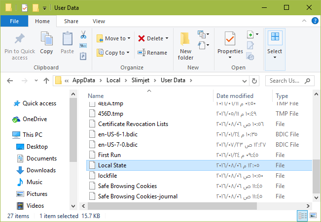
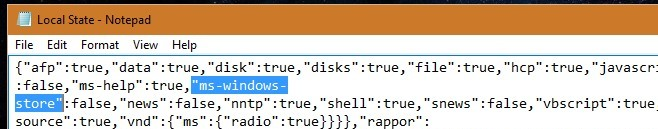
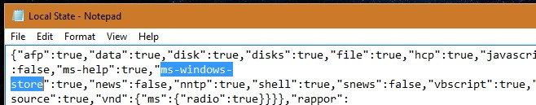

+++
title = "كيفية منع جوجل كروم من فتح روابط متجر ويندوز 10"
date = "2016-09-26"
description = "يقوم جوجل كروم في ويندوز 10 بفتح أي رابط من روابط تطبيقات المتجر تلقائيا، وقد يكون هذا التصرف مزعجا لبعض المستخدمين، اليكم طريقة ايقافه."
categories = ["ويندوز",]
series = ["ويندوز 10"]
tags = ["موقع لغة العصر"]
images = ["images/0.png"]
+++

يقوم جوجل كروم في ويندوز 10 بفتح أي رابط من روابط تطبيقات المتجر تلقائيا، وقد يكون هذا التصرف مزعجا لبعض المستخدمين، اليكم طريقة ايقافه.

1. قم بالدخول إلى هذا المسار.

`C:\Users\user name\AppData\Local\Google\Chrome\User Data`

2. ستجد ملف اسمه Local State قم بفتحه بواسطة Notepad.

3. قم بالبحث عن "ms-windows-store":false.

4. الآن غيرها إلى "ms-windows-store":true.

---
هذا الموضوع نٌشر باﻷصل على موقع مجلة لغة العصر.

http://aitmag.ahram.org.eg/News/63770.aspx