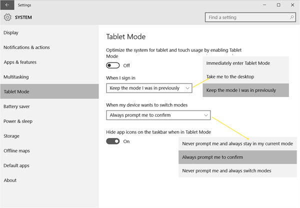

+++
title = "الإعدادات المتقدمة لوضع التابلت في ويندوز 10"
date = "2015-07-21"
description = "تحدثنا في الدرس السابق عن ال Tablet Mode ومميزاته وطريقة تفعيله، وفى درس اليوم ستنابع اكتشافه وسنكشف جميع أسراره ونتعرف على جميع الإعدادات المتقدمة لوضع التابلت في ويندوز 10"
categories = ["ويندوز",]
series = ["ويندوز 10"]
tags = ["موقع لغة العصر"]

+++

تحدثنا في الدرس السابق عن ال Tablet Mode ومميزاته وطريقة تفعيله، وفى درس اليوم ستنابع اكتشافه وسنكشف جميع أسراره ونتعرف على جميع الإعدادات المتقدمة لوضع التابلت في ويندوز 10.

1. قم بفتح تطبيق الإعدادات، ثم انتقل الى القسم System وبعدها التبويب Tablet Mode.

2. ستجد الإعدادات كما بالصورة:

- On or Off the Tablet mode: إذا كنت تستخدم جهاز كمبيوتر مكتبي PC فهذا الاختيار افتراضيا يكون Off، إذا قمت بتحويله إلى On سيتم تفعيل وضع التابلت.
- When I sign in: عن طريق هذا الاختيار تستطيع تحديد الوضع الذي سيستخدمه الويندوز عندما يفتح.
- When my devices wants to switch modes: يفضل أن تختار Always prompt me to confirm ليقوم الويندوز بتنبيهك عندما يطلب أحد البرامج تبديل الأوضاع.
- Hide app icons on the taskbar when in Tablet Mode: وهو الاختيار الخاص بإخفاء أيقونات شريط المهام عند تفعيل وضع التابلت.

هكذا تكون قد تعرفت على جميع أسرار وضع التابلت في ويندوز 10، لا تنسى أيضا أنه يمكنك استخدامه على أي PC أيضا!

---
هذا الموضوع نٌشر باﻷصل على موقع مجلة لغة العصر.

http://aitmag.ahram.org.eg/News/20698.aspx