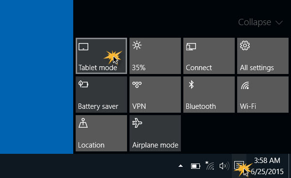
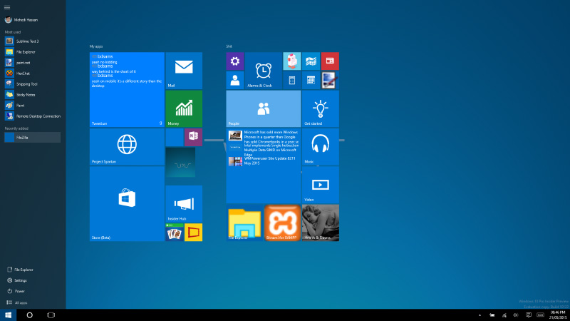

+++
title = "تعرف على وضع التابلت في ويندوز 10"
date = "2015-07-20"
description = "من المميزات الجديدة التي جاء بها ويندوز 10 وضع التابلت أو Tablet Mode وهو وضع مخصص لأجهزة اللاب توب التي لديها شاشة تعمل باللمس، في درس اليوم ستنعرف على Tablet Mode ومميزاته وطريقة تفعيله"
series = ["ويندوز 10"]
categories = ["ويندوز",]
tags = ["موقع لغة العصر"]
images = ["images/2015-635730109504351242-435.jpg"]

+++

من المميزات الجديدة التي جاء بها ويندوز 10 وضع التابلت أو Tablet Mode وهو وضع مخصص لأجهزة اللاب توب التي لديها شاشة تعمل باللمس، في درس اليوم ستنعرف على Tablet Mode ومميزاته وطريقة تفعيله.

عند قيامك بتفعيل وضع Tablet Mode فإن الويندوز يقوم بالتبديل إلى شاشة البداية بدلا من قائمة البداية، كما يقوم بتشغيل جميع البرامج والتطبيقات في وضعية full Screen، أيضا يقوم بإضافة أزرار التنقل في شريط المهام، والعديد من التغييرات الأخرى.

## طريقة تفعيل وضع Tablet Mode:

1. اضغط على أيقونة الإشعارات الموجودة بجانب الساعة على شريط المهام، ثم اختر Tablet Mode، سيقوم الويندوز في أقل من ثانية بالتبديل إلى وضع التابلت.

2. ستجد الواجهة قد أصبحت كما بالصورة:
إذا أردت إلغاء تفعيل هذا الوضع بنفس الطريقة السابقة كما لو أنك تقوم بقفل الواي فاي.

---

هذا الموضوع نٌشر باﻷصل على موقع مجلة لغة العصر.

http://aitmag.ahram.org.eg/News/20629.aspx