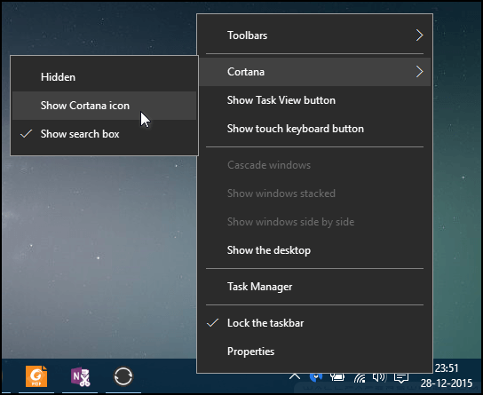
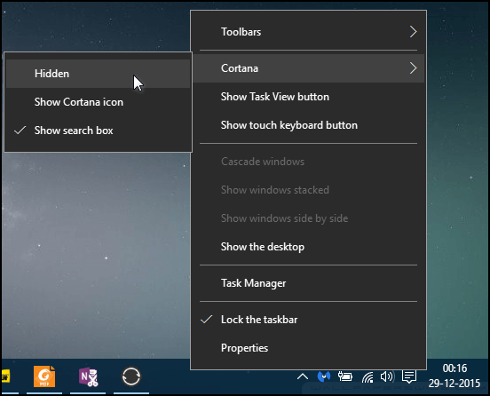
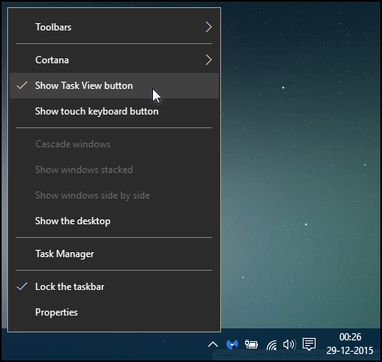
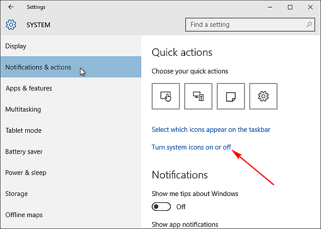
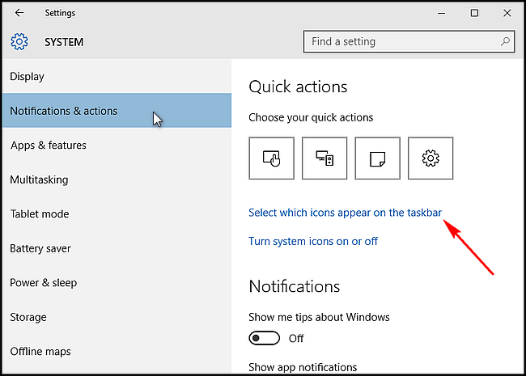
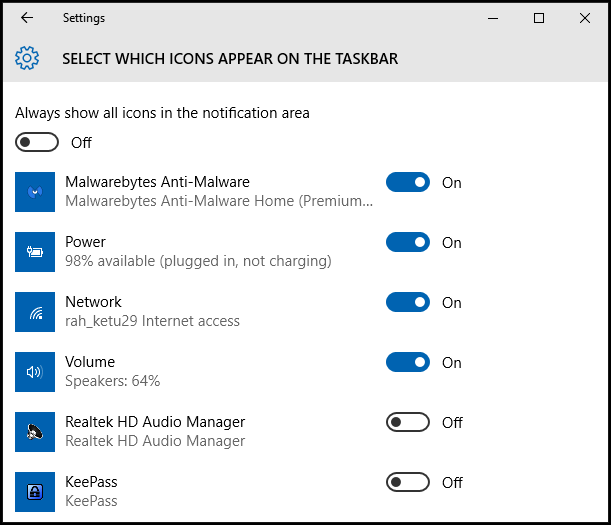

+++
title = "كل طرق تخصيص شريط المهام في ويندوز 10 (1)"
date = "2016-01-22"
description = "شريط المهام في ويندوز 10 لا يختلف كثيرا عن الإصدارات السابقة ولكنه يوفر أزرار إضافية مثل زر البحث وزر، في درس اليوم ستتعرف عزيزي القارئ علي كل طرق تخصيص شريط المهام في ويندوز 10"
categories = ["ويندوز",]
series = ["ويندوز 10"]
tags = ["موقع لغة العصر"]

+++

شريط المهام في ويندوز 10 لا يختلف كثيرا عن الإصدارات السابقة ولكنه يوفر أزرار إضافية مثل زر البحث وزر، في درس اليوم ستتعرف عزيزي القارئ علي كل طرق تخصيص شريط المهام في ويندوز 10.

**1-** **التحكم في** **Cortana:**

يوفر الويندوز اختصارا لتشغيل المساعدة الصوتية Cortana بدون الحاجة لفتح الزر الخاص بها من شريط المهام وهو الاختصار "WIN + C "، وبالتالي يمكنك حذف زر Cortana من شريط المهام لتوفير المزيد من الأماكن.

قم بالضغط بزر الماوس الأيمن علي شريط المهام ثم من قائمة Cortana اختر Show Cortana icon بهذا سيتم تحويل مربع البحث/ Cortana إلى أيقونة صغيرة كما بالصورة.

ولإخفائها من شريط المهام اضغط بزر الماوس الأيمن علي شريط المهام ثم من قائمة Cortana اختر Hidden.

**2-** **إزالة زر** **Task View:**

كما تعلم عزيزي القارئ فإن وظيفة هذا الزر هو عرض مصغرات للنوافذ المفتوحة كما يمكنك أيضا من انشاء سطح مكتب وهمي جديد ولكن الاختصار "WIN + Tab " يقوم بنفس الوظيفة، فيمكنك أن تحذف زر Task View وتوفير أماكن لعرض المزيد من الأيقونات.

اضغط بزر الماوس الأيمن علي شريط المهام ثم قم بإلغاء تفعيل Show Task View button Show Task View button.

**3-** **إخفاء أيقونات النظام من** **System Tray:**

هناك العديد من الأيقونات بجانب الساعة يمكنك التحكم فيها من تطبيق الإعدادات:

افتح تطبيق الإعدادات ثم القسم System ثم التبويب Notifications & actions ستجد رابط Turn system icons on or off اضغط عليه.

قم بإلغاء تفعيل الأيقونات التي لا تحتاجها كما بالصورة.

**4-** **إخفاء أيقونات التطبيقات من** **System Tray:**

بنفس الطريقة السابقة افتح تطبيق الإعدادات ثم القسم System ثم التبويب Notifications & actions ستجد رابط Select which icons appear on the taskbar اضغط عليه.

قم بإلغاء تفعيل الأيقونات التي لا تحتاجها كما بالصورة.

---

هذا الموضوع نٌشر باﻷصل على موقع مجلة لغة العصر.

http://aitmag.ahram.org.eg/News/41879.aspx
