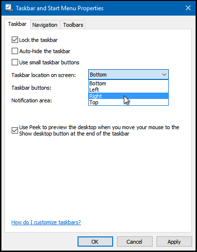

+++
title = "كل طرق تخصيص شريط المهام في ويندوز 10 (2)"
date = "2016-01-23"
description = "تحدثنا في درس الأمس عن الجزء الأول من  كل طرق تخصيص شريط المهام في ويندوز 10 والذي تضمن 4 طرق، نتابع في هذا الدرس استعراض باقي الطرق"
categories = ["ويندوز",]
series = ["ويندوز 10"]
tags = ["موقع لغة العصر"]
images = ["images/2016-635891605339350868-935.png"]
+++

تحدثنا في درس الأمس عن الجزء الأول من " كل طرق تخصيص شريط المهام في ويندوز 10" والذي تضمن 4 طرق، نتابع في هذا الدرس استعراض باقي الطرق.

**5- تغيير مكان شريط المهام:**

المكان الافتراضي لشريط المهام هو الجزء السفلي من الشاشة، لكن يمكنك تغييره عن طريق الضغط بزر الماوس الأيمن على أي مكان فارغ من شريط المهام ثم اختيار Properties.

من الاختيار Taskbar location on screen اختر المكان الذي تريد ظهور شريط المهام به ثم اضغط Apply.

**6- تفعيل خاصية الاختفاء التلقائي لشريط المهام:**

اضغط بزر الماوس الأيمن على أي مكان فارغ من شريط المهام ثم اختر Properties.

قم بتفعيل خاصية Auto-hide the taskbar ثم اضغط Apply.

**7- تصغير حجم الأيقونات على شريط المهام:**

اضغط بزر الماوس الأيمن على أي مكان فارغ من شريط المهام ثم اختر Properties.

قم بتفعيل خاصية Use small taskbar buttons ثم اضغط Apply.

**8- تغيير لون وشفافية شريط المهام:**

قم بفتح [تطبيق الإعدادات]() ثم القسم Personalization.

من التبويب Colors قم بتفعيل الخاصية Show color on Start, taskbar, and action center ثم اختر اللون الذي تريده لشريط المهام.

لتفعيل ميزة الشفافية شغل الاختيار Make Start, taskbar, and action center transparent.

**9- تغيير حجم شريط المهام:**

اضغط بزر الماوس الأيمن على أي مكان فارغ من شريط المهام ثم قم بإلغاء تفعيل اختيار Lock taskbar، بعد ذلك قم بتغيير حجم الشريط كما تريد.

يتبع في الدرس القادم..

---
هذا الموضوع نٌشر باﻷصل على موقع مجلة لغة العصر.

http://aitmag.ahram.org.eg/News/41926.aspx