+++
title = "كل طرق تخصيص شريط المهام في ويندوز 10 (3)"
date = "2016-01-24"
description = "تحدثنا في درس الأمس عن الجزء الثاني من  كل طرق تخصيص شريط المهام في ويندوز 10 والذي تضمن 5 طرق، نتابع في هذا الدرس استعراض باقي الطرق"
categories = ["ويندوز",]
series = ["ويندوز 10"]
tags = ["موقع لغة العصر"]
images = ["images/2016-635892336876704298-670.png"]
+++

تحدثنا في درس الأمس عن الجزء الثاني من " كل طرق تخصيص شريط المهام في ويندوز 10" والذي تضمن 5 طرق، نتابع في هذا الدرس استعراض باقي الطرق.

**10- إضافة مجلدات إلى شريط المهام:**

قم بالضغط بزر الماوس الأيمن على سطح المكتب ثم اختر New > Shortcut.

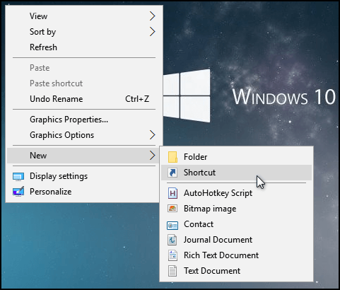

اضغط Browse واختر المجلد الذي تريد اضافته ثم اضغط Next.

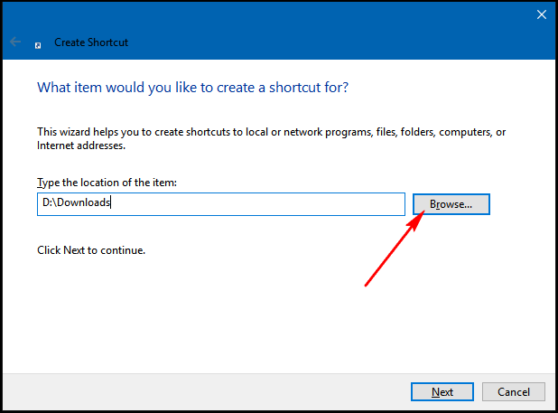

قم بكتابة Explorer ثم مسافة قبل المسار كما بالصورة، بعدها اضغط Next.

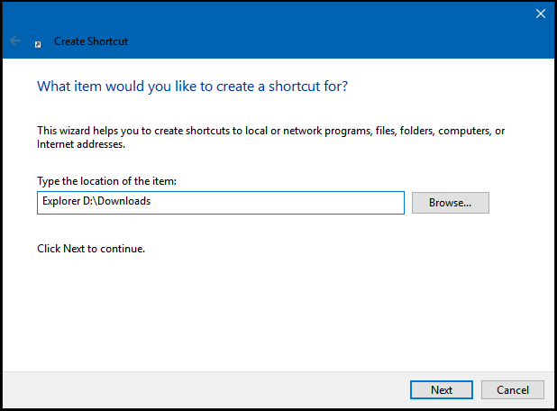

ادخل اسم المجلد واضغط Finish.

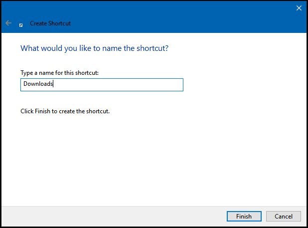

الآن قم بسحب وافلات المجلد إلى شريط المهام، تستطيع أيضا تغيير الأيقونة عن طريق بالضغط بزر الماوس الأيمن على الاختصار واختيار Properties، من التبويب Shortcut اضغط على Change Icon، اختر الأيقونة واضغط Apply.

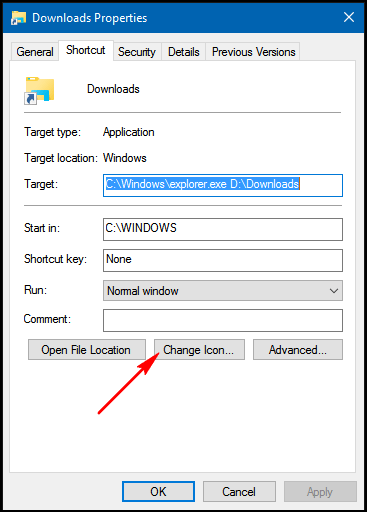

**11- تفعيل ميزة النظرة الخاطفة** **The Peek:**

هذه الخاصية وجدت مع ويندوز 7 ولكن لا يزال بإمكانك عزيزي القارئ استخدامها في ويندوز 10 عن طريق بالضغط بزر الماوس الأيمن على شريط المهام واختيار Properties.

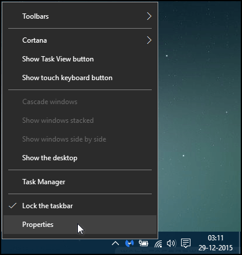

قم بتفعيل ميزة Use peek to preview the desktop when you move your mouse to the Show desktop button at the end of the taskbar واضغط OK.

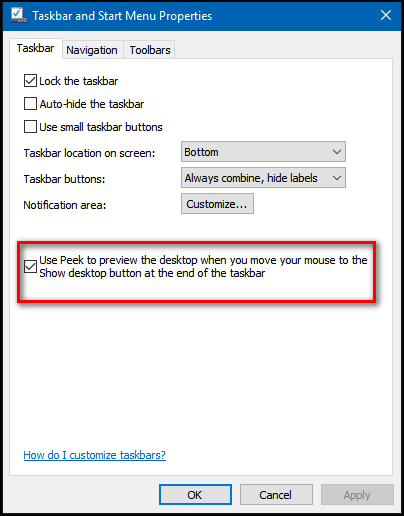

**12- اظهار تسميات أيقونات شريط المهام:**

اضغط بزر الماوس الأيمن على شريط المهام واختر Properties.

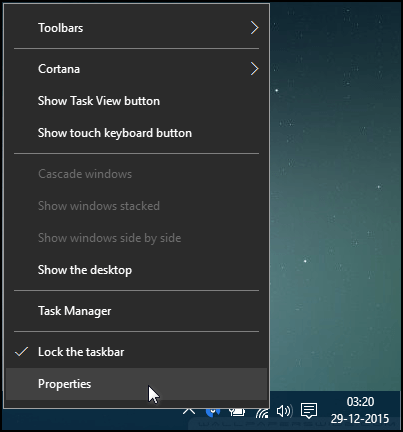

من القائمة المنسدلة Taskbar buttons اختر Combine when taskbar is full أو Never combine ثم اضغط Apply.

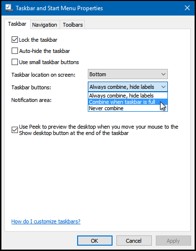

**13- إضافة شريط جديد إلى شريط المهام:**

اضغط بزر الماوس الأيمن على شريط المهام ثم من قائمة Toolbars اختر New toolbar.

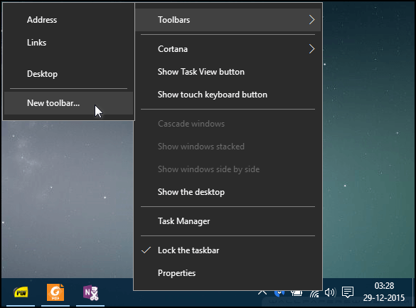

اختر مكان المجلد.

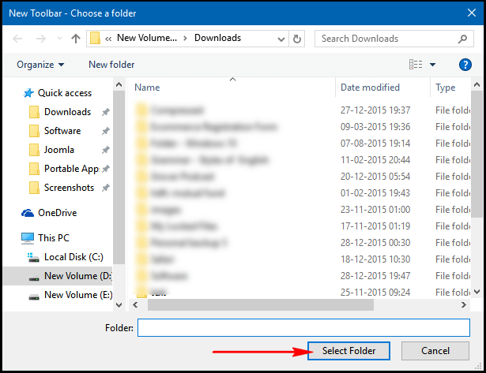

سيظهر لك الشريط على يسار الساعة.

**14- تثبيت ملف أو مجلد في قوائم الانتقال السريع لشريط المهام:**

كل ما عليك هو سحب الملف أو المجلد الذي تريد تثبيته إلى البرنامج الذي يقوم بتشغيله كما بالصورة.

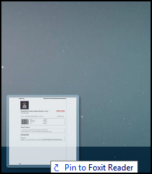

ولإلغاء التثبيت اضغط على البرنامج بزر الماوس الأيمن ثم أيقونة التثبيت.

---
هذا الموضوع نٌشر باﻷصل على موقع مجلة لغة العصر.

http://aitmag.ahram.org.eg/News/41981.aspx