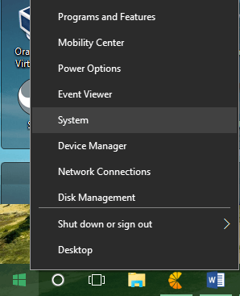
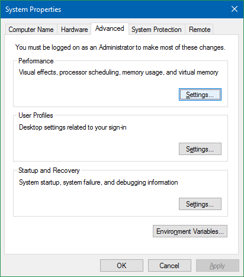
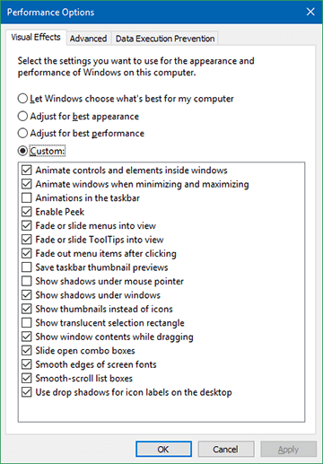

+++
title = "حيلة لزيادة سرعة استجابة شريط المهام في ويندوز 10"
date = "2016-01-21"
description = "بعض مستخدمي ويندوز 10 واجهتهم مشكلة بطء استجابة شريط المهام عند الضغط عليه بزر الماوس الأيمن، في درس اليوم أقدم لهم حل بسيط لزيادة سرعة استجابة شريط المهام."
categories = ["ويندوز",]
series = ["ويندوز 10"]
tags = ["موقع لغة العصر"]

+++

بعض مستخدمي ويندوز 10 واجهتهم مشكلة بطء استجابة شريط المهام عند الضغط عليه بزر الماوس الأيمن، في درس اليوم أقدم لهم حل بسيط لزيادة سرعة استجابة شريط المهام.

1- اضغط بزر الماوس الأيمن علي علامة Start ثم اختر System.

2- من الجانب الأيسر من الشاشة اختر Advanced system settings.

3- انتقل إلى التبويب Performance ثم اضغط الزر Settings....

4- قم بإزالة العلامة من "Animations in Taskbar" ثم اضغط Apply.

---

هذا الموضوع نٌشر باﻷصل على موقع مجلة لغة العصر.

http://aitmag.ahram.org.eg/News/41817.aspx
