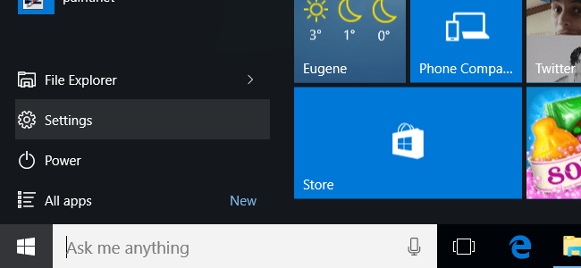
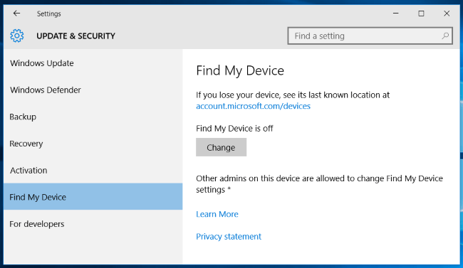
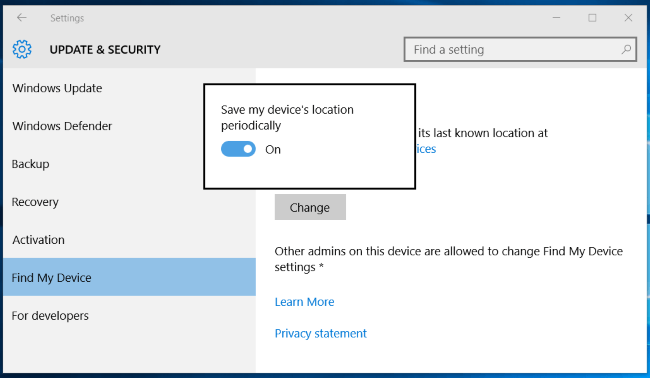
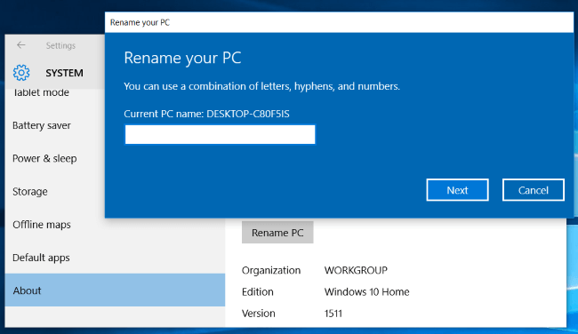
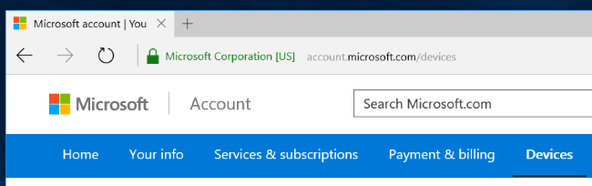
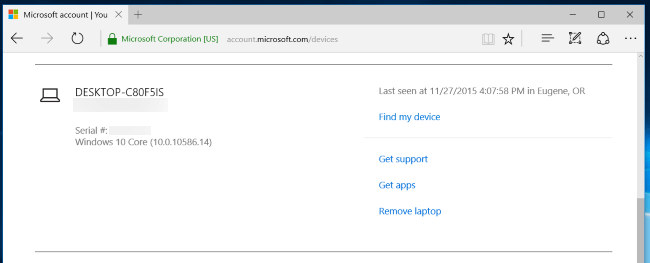
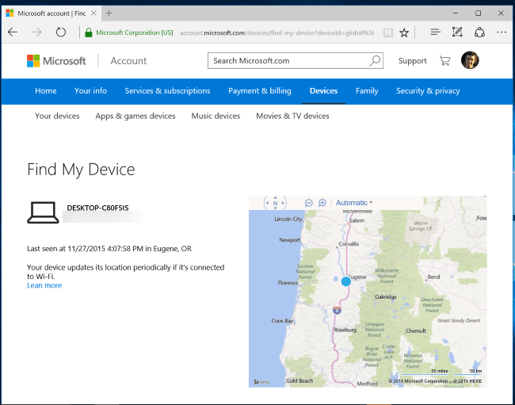

+++
title = "كيف تتعقب جهازك المفقود أو المسروق في ويندوز 10؟"
date = "2016-01-20"
description = "مع قدوم تحديث نوفمبر 2015 لويندوز 10 أضاف معه ميزة مفيدة جدا لتعقب أجهزة اللاب توب أو التابلت عن طريق ال GPS، اليك عزيزي القارئ طريقة تفعيلها واستخدامها"
categories = ["ويندوز",]
series = ["ويندوز 10"]
tags = ["موقع لغة العصر"]

+++

مع قدوم تحديث نوفمبر 2015 لويندوز 10 أضاف معه ميزة مفيدة جدا لتعقب أجهزة اللاب توب أو التابلت عن طريق ال GPS، اليك عزيزي القارئ طريقة تفعيلها واستخدامها.

**أولا: تفعيل ميزة** **Find My Device:**

يجب أن تستخدم حساب مايكروسوفت لتتمكن من تفعيل هذه الميزة حيث أنك ستقوم بتسجيل الدخول إلى حساب مايكروسوفت من الويب لتتمكن من تعقب جهازك.

1- قم بالدخول إلى تطبيق الإعدادات ثم القسم Update & security.

2- اختر التبويب Find My Device ستجدها معطلة كما بالصورة.

3- اضغط على الزر Change وقم بتفعيل الاختيار Save my device’s location periodically.

**ثانيا: اختيار اسم لجهازك:**

ستحتاج إلى تغيير اسم جهازك الى اسم خاص بك لتتمكن من تحديده فيما بعد.

**ثالثا: تعقب الجهاز المفقود:**

1- قم بفتح هذا الرابط من أي متصفح <https://account.microsoft.com/devices>.

2- قم بتسجيل الدخول بحساب مايكروسوفت الخاص بك (نفس الموجود على جهازك).

3- ستجد قائمة بالأجهزة المقترنة بالحساب بجانبها تاريخ آخر مشاهدة واختيار Find my device لتحديد الموقع الجغرافي للجهاز.

4- اضغط Find my device وانتظر حتى يظهر الموقع.

 سيظهر الموقع الحالي للجهاز إذا كان مفتوحا ومتصلا بالإنترنت، وأخر موقع مسجل للجهاز إذا كان غير متاح حاليا.

---
هذا الموضوع نٌشر باﻷصل على موقع مجلة لغة العصر.

http://aitmag.ahram.org.eg/News/41751.aspx