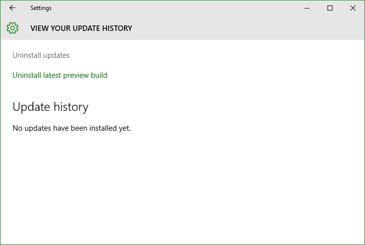

+++
title = "تعلم ويندوز 10.. طريقة إزالة تثبيت التحديثات يدويا"
date = "2015-10-09"
description = "ليست جميع التحديثات التي تطلقها مايكروسوفت متساوية؛ فبعض الحديثات قد تتسبب في عمل مشاكل وخاصة المميزات التجريبية التي يتم إطلاقها من الحين للآخر، في درس اليوم ستتعرف عزيزي القارئ على طريقة بسيطة تمكنك من إزالة تثبيت أي تحديث لا تريده"
categories = ["ويندوز",]
series = ["ويندوز 10"]
tags = ["موقع لغة العصر"]

+++

ليست جميع التحديثات التي تطلقها مايكروسوفت متساوية؛ فبعض الحديثات قد تتسبب في عمل مشاكل وخاصة المميزات التجريبية التي يتم إطلاقها من الحين للآخر، في درس اليوم ستتعرف عزيزي القارئ على طريقة بسيطة تمكنك من إزالة تثبيت أي تحديث لا تريده.

1. قم بفتح تطبيق الإعدادات.

2. قم بالدخول إلى القسم Update & Security.

3. اضغط على Advanced Options.

4. قم باختيار View your Update history.

5. ستظهر لك نافذة جديدة بها كافة تفاصيل التحديثات التي قام ويندوز بتثبيتها.

6. لإزالة تثبيت أي منها قم بالضغط بزر الفأرة الأيمن على التحديث ثم اختر Uninstall.

---

هذا الموضوع نٌشر باﻷصل على موقع مجلة لغة العصر.

http://aitmag.ahram.org.eg/News/36938.aspx
